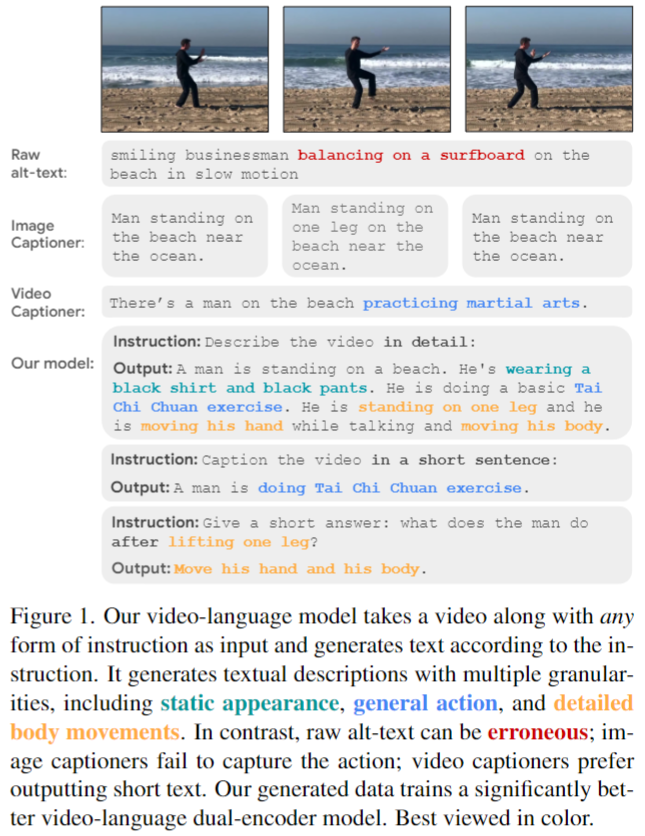
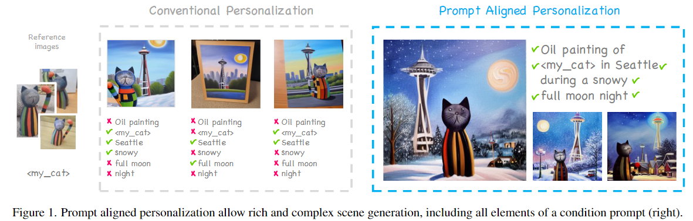
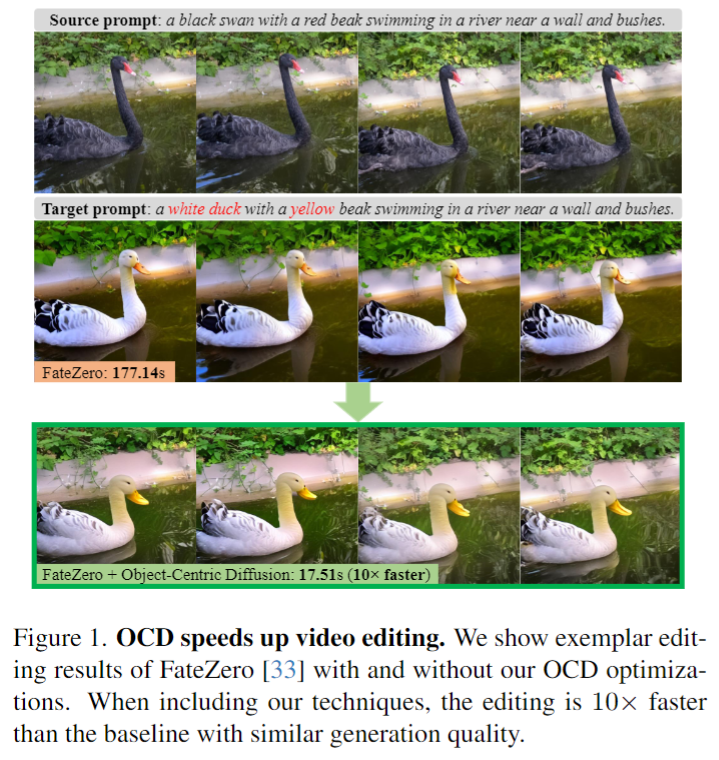
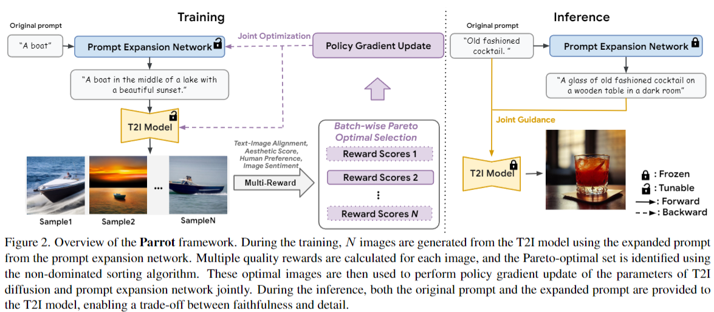
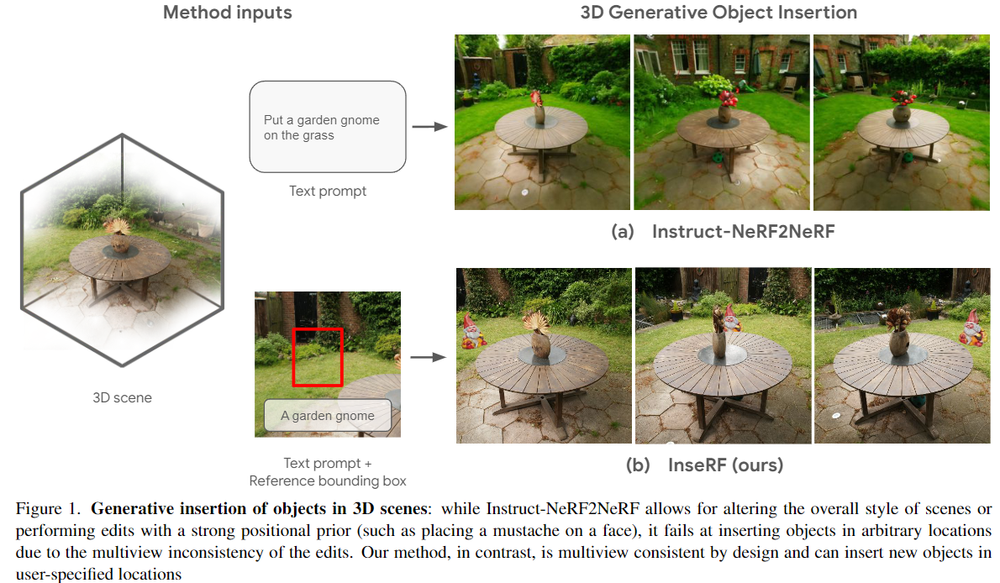
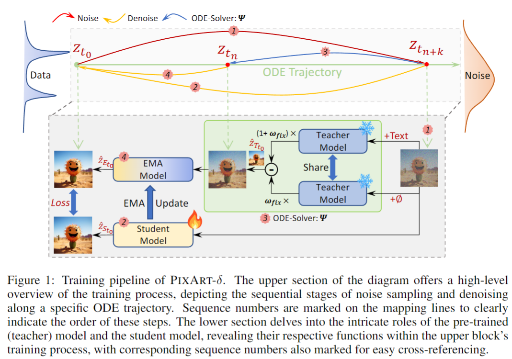

## Distilling Vision-Language Models on Millions of Videos

#Video
#video_understanding

  

这篇论文试图解决的主要问题是视频语言模型（Video-Language Models, VLMs）在缺乏大规模高质量视频文本数据的情况下如何进行有效训练和改进.

## PALP: Prompt Aligned Personalization of Text-to-Image Models

#定制化

  

这篇论文试图解决的问题是现有文本到图像模型在个性化图像生成方面的局限性。具体来说，作者指出，内容创作者通常希望使用个人化的主题创建图像，这超出了传统文本到图像模型的能力。此外，他们可能希望生成的图像包含特定的地点、风格、氛围等。现有的个性化方法可能会在个性化能力和与复杂文本提示的一致性之间做出妥协，这种权衡可能会妨碍用户提示的实现和主题的忠实度。为了解决这个问题，作者提出了一种新的方法，即提示对齐个性化（prompt-aligned personalization），专注于单个提示的个性化方法，以提高文本对齐性，并使图像能够更好地与用户期望的提示保持一致。

## Object-Centric Diffusion for Efficient Video Editing
#video_editing

  

这篇论文提出了一种名为Object-Centric Diffusion（OCD）的新方法，用于提高基于扩散的视频编辑的效率。

##  Parrot: Pareto-optimal Multi-Reward Reinforcement Learning Framework for Text-to-Image Generation

#text2img

  

总结来说，这篇论文旨在通过提出一种新的多奖励强化学习框架Parrot，来解决T2I生成中图像质量提升的问题，特别是在美学、人类偏好、文本-图像对齐和图像情感等方面。同时，它还解决了提示扩展与T2I模型的联合优化问题，并提出了一种方法来防止在提示扩展后忘记原始输入提示。

## InseRF: Text-Driven Generative Object Insertion in Neural 3D Scenes
#scene_editing_3D
#scene_text_generation

  

这篇论文旨在解决在3D场景中一致性地插入新对象的问题。具体来说，它提出了一种名为InseRF的方法，该方法基于用户提供的文本描述和2D边界框在参考视图中生成新对象。InseRF的目标是在不需要显式3D信息作为输入的情况下，实现可控制的、3D一致的对象插入。

## PIXART-δ: Fast and Controllable Image Generation with Latent Consistency Models
#image_generation

  

这篇技术报告介绍了PIXART-δ，这是一个文本到图像合成框架，它通过集成潜在一致性模型（Latent Consistency Model, LCM）和类似ControlNet的模块来提升图像生成的速度和控制能力。