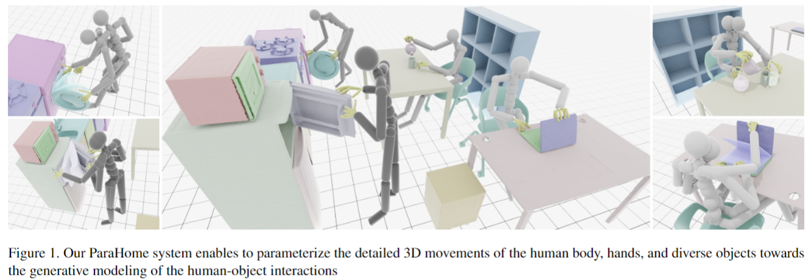
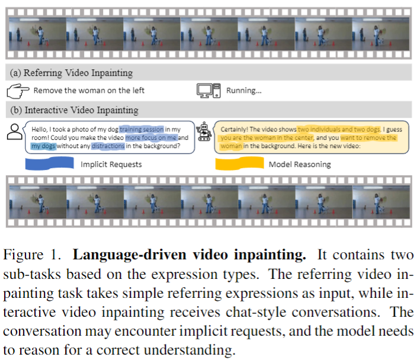
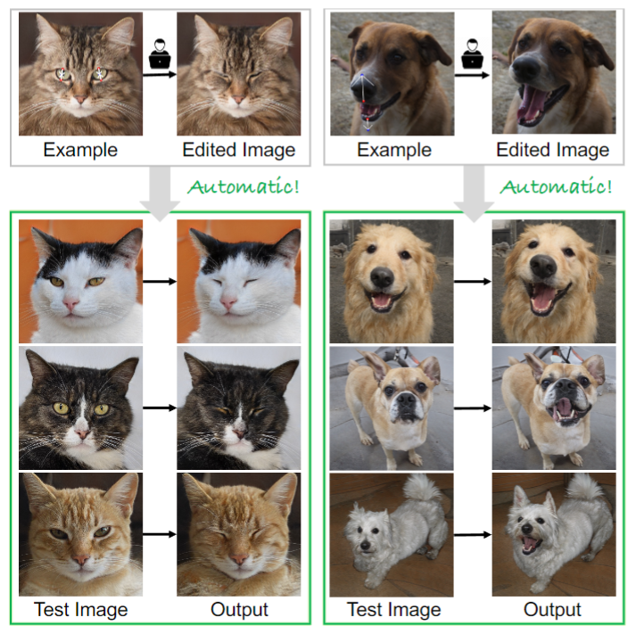
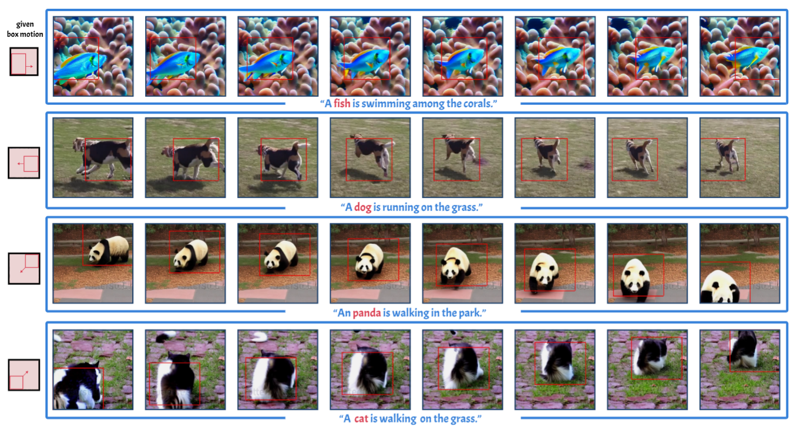
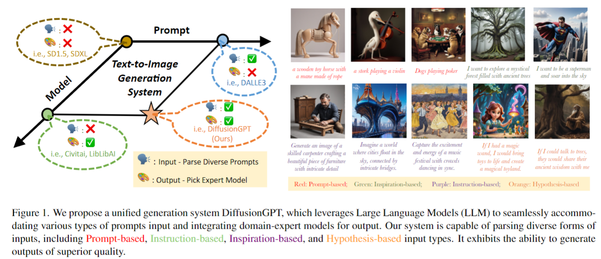
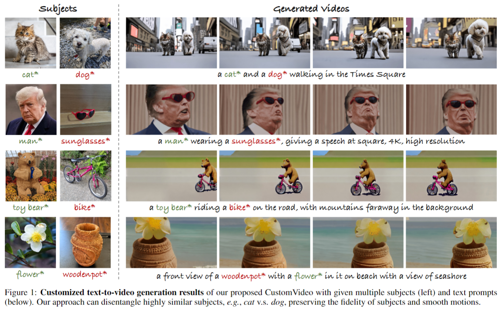

## ParaHome: Parameterizing Everyday Home Activities Towards 3D Generative Modeling of Human-Object Interactions
#interaction

  

可以看看interaction的种类，辅助想一下idea。

## Towards Language-Driven Video Inpainting via Multimodal Large Language Models
#video_editing
#video_inpaint

  

这篇论文试图解决视频修复领域中的传统问题，即如何通过自然语言指令来引导视频修复过程，而不是依赖于手动标记的二进制遮罩。这种方法克服了传统视频修复方法的局限性，这些方法通常需要手动标注遮罩来识别需要修复的区域，这个过程既耗时又劳动密集。论文提出了一种新的基于扩散模型的语言驱动视频修复框架，这是第一个端到端的基线模型，用于理解和执行复杂的基于语言的修复请求

## Edit One for All: Interactive Batch Image Editing

#image_editing

  

论文通过使用StyleGAN作为编辑媒介，提出了一种新的方法来实现这一目标。它包括两个主要步骤：（1）建模用户在示例图像对中的编辑，以便它可以被转移到新的图像上；（2）控制编辑的程度，以确保所有编辑后的图像具有相同的最终状态。

## Motion-Zero: Zero-Shot Moving Object Control Framework for Diffusion-Based Video Generation
#video_generation

  

这篇论文试图解决的问题是在视频生成领域中，如何对视频中移动物体的运动轨迹进行精确控制。具体来说，论文提出了一个名为Motion-Zero的零次拍摄（zero-shot）移动物体轨迹控制框架，旨在实现对预训练视频扩散模型（pre-trained video diffusion models）生成的视频中物体运动轨迹的控制。

## DiffusionGPT: LLM-Driven Text-to-Image Generation System     

#image_generation

  

这篇论文试图解决的主要问题是当前文本到图像生成系统在处理多样化输入时的局限性。具体来说，现有的系统通常面临以下两个主要挑战：

模型限制：虽然稳定的扩散模型（如SD1.5）展示了对各种提示的适应性，但在特定领域的表现不佳。相反，领域特定的模型（如SD1.5+Lora）在特定子领域内能够产生极端的生成性能，但缺乏多样性。

提示约束：在稳定扩散模型的训练过程中，文本信息通常由描述性陈述组成，例如标题。然而，在实际应用中，用户可能会遇到各种类型的提示，包括指令和灵感。当前的生成模型在处理这些多样化的提示类型时，很难达到最佳的生成性能。

为了解决这些问题，论文提出了DiffusionGPT，这是一个统一的生成系统，利用大型语言模型（LLM）无缝地处理各种类型的提示，并集成领域专家模型。DiffusionGPT通过构建基于先验知识和人类反馈的领域特定模型树（Tree-of-Thought, ToT），并在输入提示时解析提示并指导模型树选择最合适的模型，从而放松了输入约束并确保了在不同领域内的卓越性能。此外，还引入了优势数据库（Advantage Databases），其中模型树通过人类反馈得到丰富，使模型选择过程与人类偏好保持一致。

## CustomVideo: Customizing Text-to-Video Generation with Multiple Subjects

#Video_Customization

这篇论文试图解决的问题是多主体引导的文本到视频（Text-to-Video, T2V）生成。具体来说，论文提出了一个名为CustomVideo的框架，它能够根据文本提示和多个主题（subjects）生成保持身份（identity-preserving）的视频。这个框架旨在处理多个对象同时出现在视频中的场景，并且确保这些对象能够被清晰地区分和识别。

  
