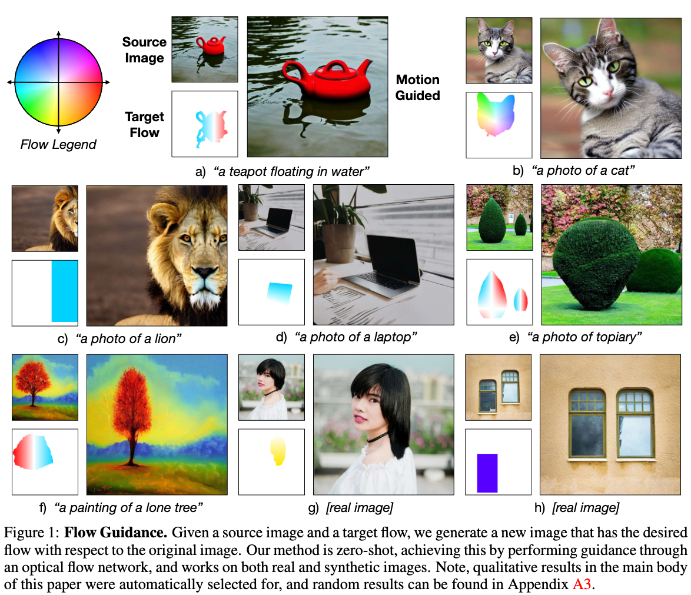
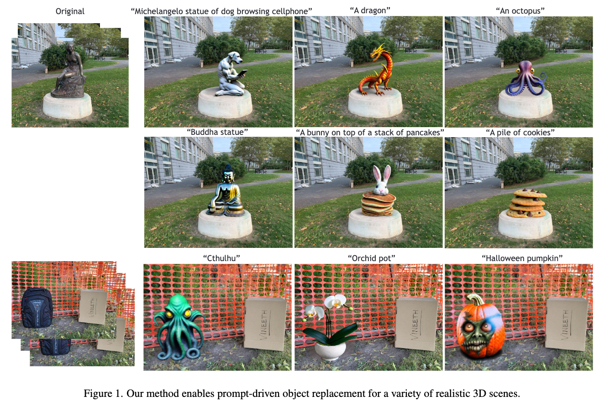
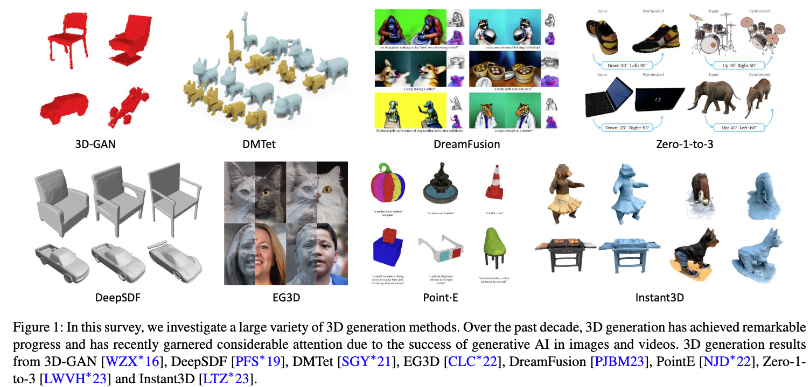
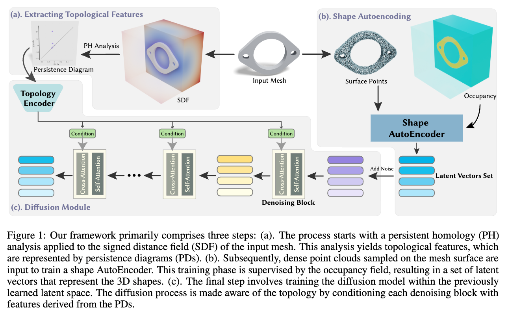
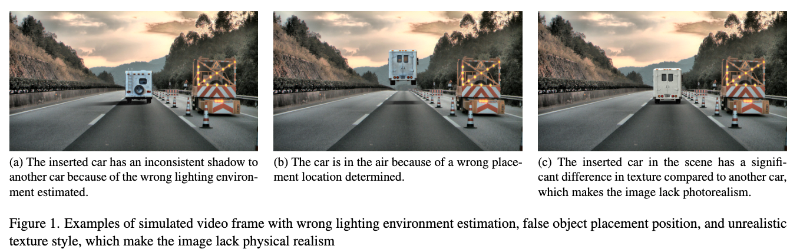

## Motion Guidance: Diffusion-Based Image Editing with Differentiable Motion Estimators
#image_editing
#paper_idea

  

这篇论文试图解决的问题是如何使用扩散模型（diffusion models）精确编辑图像中的物体布局、位置、姿态和形状。尽管扩散模型能够基于文本描述生成令人印象深刻的图像，并且可以通过扩展模型允许用户在相对粗糙的尺度上编辑图像，但现有方法在精确编辑图像结构方面仍然存在困难。为了解决这个问题，论文提出了一种名为“运动引导”（motion guidance）的技术，这是一种零样本（zero-shot）技术，允许用户指定密集且复杂的运动场（motion field），指示图像中每个像素应该如何移动。通过这种方式，用户可以更精细地控制图像编辑过程。

## ReplaceAnything3D:Text-Guided 3D Scene Editing with Compositional Neural Radiance Fields
#_3d生成
#scene_editing_3D

  

这篇论文介绍了ReplaceAnything3D（RAM3D），这是一个文本引导的3D场景编辑方法，它允许用户通过自然语言提示来替换场景中的特定对象。

## Advances in 3D Generation: A Survey
#survey_3D

  

这篇论文《Advances in 3D Generation: A Survey》旨在综述和探讨3D内容生成领域的最新进展。

## Topology-Aware Latent Diffusion for 3D Shape Generation
#_3d生成

  

这篇论文试图解决的问题是如何在3D形状生成过程中引入拓扑特征，以创建具有高多样性和特定拓扑特性的3D形状

##  Anything in Any Scene: Photorealistic Video Object Insertion

#scene_editing_3D
#paper_idea

  

这篇论文试图解决的问题是如何在现实世界的视频场景中，以高度逼真的方式插入任何物体。

