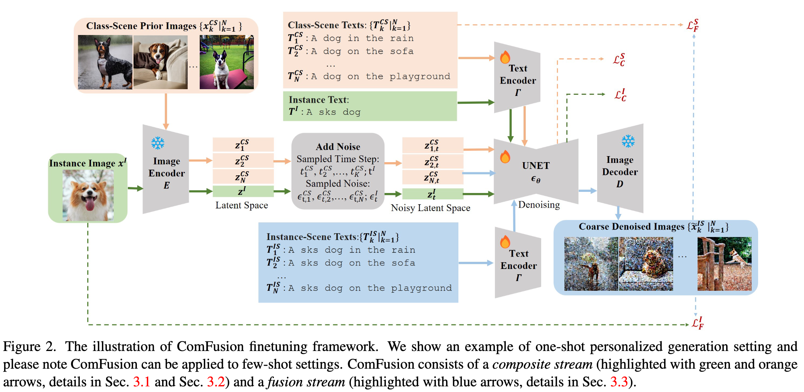

## FiT: Flexible Vision Transformer for Diffusion Model

#DiT

  

这篇论文试图解决的问题是现有扩散模型（如Diffusion Transformers）在处理超出其训练域的图像分辨率时面临的挑战。具体来说，这些模型在生成具有任意分辨率和宽高比的图像时存在局限性，因为它们通常将图像视为固定分辨率的静态网格。为了克服这些限制，论文提出了Flexible Vision Transformer（FiT），这是一个专为生成具有任意分辨率和宽高比的图像而设计的变换器架构。FiT通过将图像视为动态大小的令牌序列，实现了灵活的训练策略，从而在训练和推理阶段轻松适应不同的宽高比，促进了分辨率泛化并消除了由图像裁剪引入的偏差。

## Direct Consistency Optimization for Compositional Text-to-Image Personalization

#定制化

 

这篇论文试图解决的问题是如何在文本到图像（Text-to-Image, T2I）扩散模型中实现个性化图像生成，同时保持与原始预训练模型的一致性。具体来说，论文关注以下几个关键问题：

个性化图像生成的一致性：当T2I模型在少量个人图片上进行微调（fine-tuning）时，虽然能够生成与参考图片高度一致的视觉内容，但仍然难以合成原始预训练模型中可能的不同场景或风格的图像。

知识遗忘和概念崩溃：在低样本微调过程中，模型可能会忘记预训练模型的知识（如无法在已知风格中合成特定主题），或者将背景概念错误地融入到主题中，导致生成的图像缺乏多样性和创造性。

图像-文本对齐：在微调过程中，模型可能会过度适应少量参考图片，导致生成的图像与文本提示之间的对齐度降低，即图像内容与文本描述不再紧密相关。
 

## ComFusion: Personalized Subject Generation in Multiple Specific Scenes From Single Image

#定制化
#paper_idea

  

这篇论文主要解决的问题是，当前的定制化生成方法无法适应文本中指定的各种场景，有的时候只能保证concept是正确的，但是无法保证生成的图像是符合场景的。

## Visual Concept-driven Image Generation with Text-to-Image Diffusion Model

#多概念
#定制化

  

这篇论文试图解决的问题是如何在文本到图像（Text-to-Image, TTI）扩散模型中实现个性化的多主体生成，特别是当涉及到多个相互作用的概念时。具体来说，论文面临的挑战包括：

多主体生成：在现有的TTI模型中，生成具有复杂交互的多个主体（如人物）的能力有限。这些模型通常能够生成单一主体在各种场景下的形象，但在处理多主体场景（例如，两个角色互动）时表现不佳。

概念纠缠：在尝试从单一图像中提取多个概念时，如何有效地分离和学习这些概念是一个挑战。这包括从同一图像中提取主体和背景，或者处理风格上的差异（例如，游戏渲染风格与真实照片风格）。

用户参与度：现有的方法通常需要用户提供额外的草图界面来指定概念的掩模，这增加了用户的负担。论文旨在减少这种用户参与，同时仍然能够学习到解耦的概念。