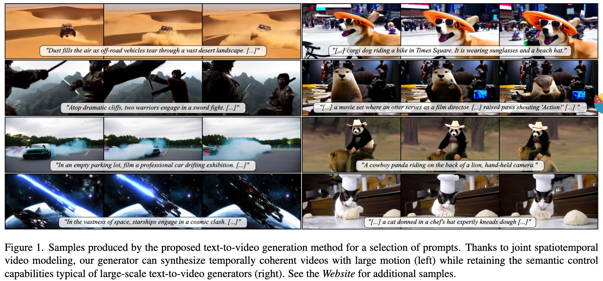
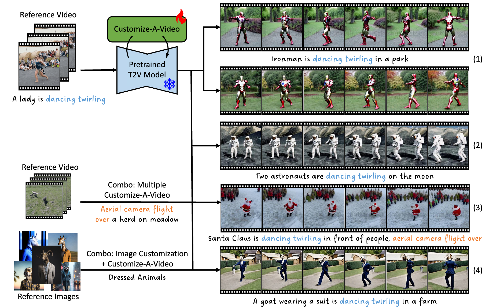

## GeneOH Diffusion: Towards Generalizable Hand-Object Interaction Denoising via Denoising Diffusion

#diffusion_应用

这篇论文试图解决的问题是手-对象交互（Hand-Object Interaction, HOI）去噪问题。具体来说，研究者们面临的挑战是如何处理包含交互噪声的HOI序列，这些噪声可能包括不自然的手部姿势、错误的手-对象空间关系以及不一致的手-对象时间关系。目标是从一个错误的交互序列中提炼出正确的手部轨迹，以生成一个视觉上真实且无噪声的交互序列。这个问题在实际应用中非常重要，因为它涉及到游戏、虚拟现实、机器人技术以及人机交互等领域。

## Snap Video: Scaled Spatiotemporal Transformers for Text-to-Video Synthesis

#Video
#video_generation
#DiT

  

这篇论文试图解决的主要问题是如何在文本到视频（text-to-video）合成领域中生成高质量、时间上连贯且具有复杂运动的视频内容。具体来说，论文提出了以下几个挑战：

视频内容的高度冗余性：与图像相比，视频内容在连续帧之间具有高度的时间冗余。直接将图像生成模型应用于视频生成可能会降低运动的真实性、视觉质量和可扩展性。

现有模型的局限性：现有的大规模文本到视频生成模型主要基于U-Net架构，这种架构在处理视频时需要对每一帧进行完整的前向传播，导致计算开销巨大，限制了模型的可扩展性。

运动建模的挑战：视频帧之间的空间和时间冗余内容适合进行压缩处理。学习并操作压缩后的视频表示，并联合建模空间和时间维度是实现高质量视频生成的必要步骤。

为了应对这些挑战，论文提出了Snap Video，这是一个以视频为中心的模型，它通过以下方式系统地解决了上述问题：

扩展EDM（Evolved Diffusion Model）框架，以考虑空间和时间冗余像素，并自然支持视频生成。

提出了一种新的基于Transformer的架构，该架构在训练时比U-Net快3.31倍，在推理时快约4.5倍，这使得能够有效地训练具有数十亿参数的文本到视频模型。

通过联合空间和时间视频建模，生成具有更高质量、时间一致性和运动复杂性的视频

## Customize-A-Video: One-Shot Motion Customization of Text-to-Video Diffusion Models

#Video_Customization
#paper_idea

  

篇论文提出了一个名为Customize-A-Video的方法，旨在解决单次拍摄运动定制（one-shot motion customization）的问题。具体来说，它旨在实现以下几个目标：

运动定制：从单个参考视频中学习运动特征，并将其适应到新的主体和场景中，同时保持空间和时间上的多样性。

空间与时间信息的分离：在训练过程中，区分空间信息（如外观、纹理、场景等）和时间信息（如运动），以便更准确地捕捉和定制运动。

扩展性：提出的方法可以轻松扩展到各种下游任务，如自定义视频生成和编辑、视频外观定制以及多种运动组合，支持即插即用（plug-and-play）的方式。

最小化输入要求：与需要复杂提示工程的方法不同，Customize-A-Video仅通过文本提示即可实现运动定制，降低了输入要求。

论文通过引入Temporal LoRA（T-LoRA）模块和Appearance Absorber模块，以及一个分阶段的训练和推理流程，来实现上述目标。这种方法允许在保持运动准确性的同时，为生成的视频引入动态性和吸引力。

## Place Anything into Any Video

#video_editing

这篇论文介绍了一个名为Place-Anything的创新系统，它允许用户仅凭一张照片或文本描述就能将任何对象插入到任何视频中。