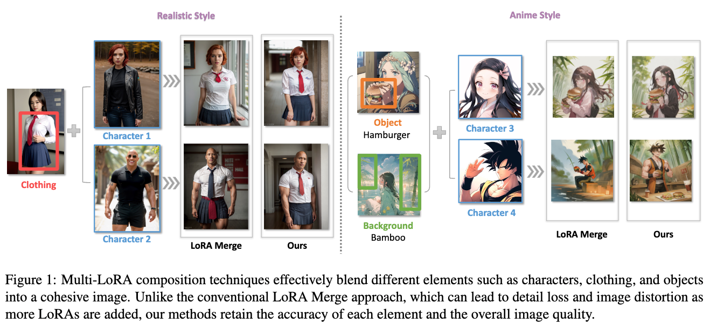
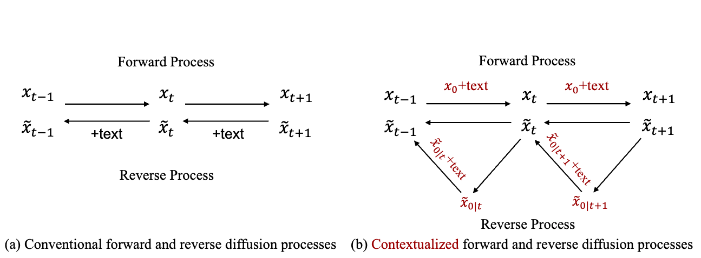

## Multi-LoRA Composition for Image Generation
#image_generation
#lora

  

这篇论文试图解决的问题是如何有效地组合多个Low-Rank Adaptation (LoRA) 模型以生成复杂的图像。在文本到图像的生成模型中，LoRA 被广泛用于精确渲染生成图像中的特定元素，如独特的字符或风格。然而，现有的方法在整合多个LoRA时面临挑战，尤其是当需要集成的LoRA数量增加时，这限制了复杂图像的创作。论文从解码中心的角度研究多LoRA组合，并提出了两种无需训练的方法：LORA SWITCH 和 LORA COMPOSITE，以改善图像合成的连贯性和质量。

## Cross-Modal Contextualized Diffusion Models for Text-Guided Visual Generation and Editing
#diffusion_guidance
#diffusion_改进

  

这篇论文试图解决的问题是现有文本引导的视觉扩散模型在正向（forward）和反向（reverse）过程中对文本-视觉关系的处理不一致，这可能导致在视觉合成结果中无法精确传达文本语义。具体来说，现有的模型通常在正向过程中不使用文本条件，而在反向过程中依赖文本条件进行去噪和样本生成，这种不一致性限制了条件扩散模型的潜力。此外，这些模型通常忽略了跨模态上下文（cross-modal context），即文本和视觉模态在扩散过程中的交互和对齐，这可能限制了视觉合成结果中文本语义的精确表达。

为了解决这些问题，论文提出了一种新的跨模态上下文化的扩散模型（CONTEXTDIFF），通过在正向和反向过程中引入文本条件和视觉样本之间的交互和对齐，将这种跨模态上下文传播到所有时间步，从而适应它们的轨迹，促进跨模态条件建模。论文还将这种上下文化扩散推广到DDPMs和DDIMs，并提供了理论推导。通过在文本到图像生成和文本到视频编辑这两个具有挑战性的任务中进行评估，论文证明了CONTEXTDIFF模型在语义对齐方面显著提高了性能，并在定量和定性评估中均优于现有扩散模型。