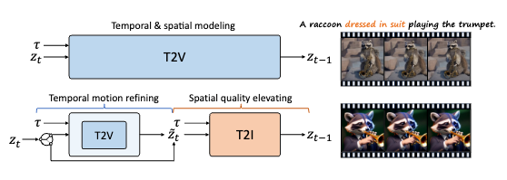
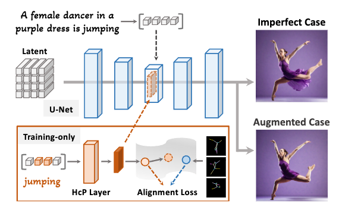
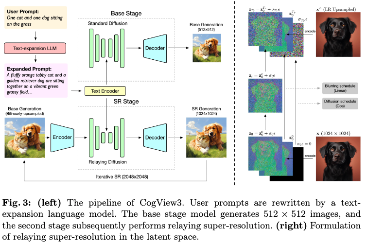
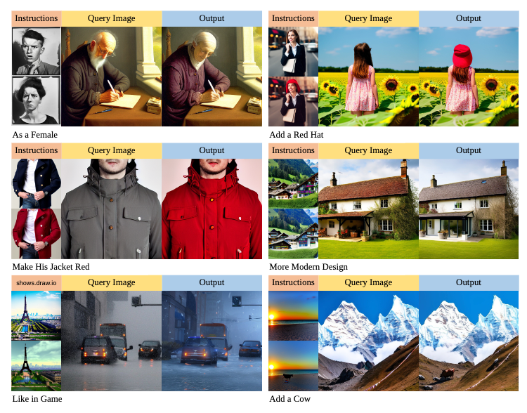
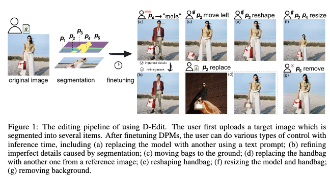

## VideoElevator: Elevating Video Generation Quality with Versatile Text-to-Image Diffusion Models

#Video

  

这篇论文提出了一个名为VideoElevator的方法，旨在解决现有文本到视频（Text-to-Video, T2V）扩散模型在生成视频质量、帧质量和文本对齐方面相较于文本到图像（Text-to-Image, T2I）扩散模型存在的差距

## Towards Effective Usage of Human-Centric Priors in Diffusion Models for Text-based Human Image Generation

#human
#image_generation

  

这篇论文试图解决的问题是在文本到图像（Text-to-Image, T2I）生成领域中，尤其是基于文本提示生成人类图像时，现有扩散模型（diffusion models）在生成准确人类解剖结构方面的挑战。具体来说，这些挑战包括：

不完美的人体结构渲染：生成的图像中常常出现不自然的体态或肢体比例失调的问题，如图1所示的不完美案例。

对人类结构的粗略泛化：扩散模型在生成图像时，往往强调对多样化数据的泛化，而忽视了对人类结构细节的关注。

额外条件的依赖：现有的方法通常通过在图像生成阶段微调模型或添加额外的控制（如人体中心先验，例如姿势或深度图）来解决这个问题，但这增加了生成过程的复杂性，并限制了直接从文本提示生成多样化图像的能力。

## CogView3: Finer and Faster Text-to-Image Generation via Relay Diffusion

#image_generation

  

这篇论文提出了CogView3，这是一个创新的级联框架，旨在提高文本到图像扩散生成的性能。

## InstructGIE: Towards Generalizable Image Editing
#image_editing

  

这篇论文试图解决的问题是图像编辑方法的泛化能力不足。尽管最近的图像编辑技术，特别是基于去噪扩散模型的方法，取得了显著进展，但这些方法在处理训练数据集之外的特定指令时，往往难以生成令人满意的结果。这是因为现有的模型无法准确模拟条件分布空间中的所有可能样本，导致编辑性能在很大程度上依赖于训练数据集，缺乏优越的泛化能力。为了提高图像编辑的泛化能力并改善合成图像的质量，论文提出了一个名为InstructGIE的图像编辑框架，该框架通过增强上下文学习能力和统一语言指令来提升模型的泛化鲁棒性。

## An Item is Worth a Prompt: Versatile Image Editing with Disentangled Control

#image_editing

  

这篇论文试图解决的问题是如何在保持原始图像信息的同时，实现对由扩散模型（diffusion models）生成的图像进行精确和多样化的编辑。具体来说，论文针对以下两个挑战：

直接编辑文本提示（text prompts）导致的问题：由于扩散模型通常在描述性文本标题上进行预训练，直接编辑文本提示中的词汇通常会导致生成完全不同的图像，这违反了图像编辑的要求。

现有编辑方法的局限性：现有的图像编辑方法通常考虑引入空间掩模（spatial masks）来保留未编辑区域的身份，但这些掩模通常被扩散模型忽略，导致编辑结果不和谐。

## Sora as an AGI World Model? A Complete Survey on Text-to-Video Generation

#survey_video
#Video

这篇论文提供了对文本到视频生成技术的全面调查，特别是关注了从传统的生成模型到最新的Sora模型的转变。它试图解决的问题包括：

技术框架和演变路径：分析文本到视频生成模型的技术框架和它们随时间的演变，以便更好地理解这些模型的工作原理和改进方向。

可扩展性和泛化能力：探讨这些模型在处理不同类型和复杂度的视频内容时的可扩展性和泛化能力，以及它们在实际应用中的潜力。

实际应用：讨论文本到视频生成技术在不同行业（如市场营销、教育和电影制作）中的应用，以及这些技术如何帮助用户更高效地创建内容。

评估指标：介绍和分析用于评估文本到视频生成模型性能的评估指标，包括视觉质量、文本-视觉一致性和人类感知。

技术限制和伦理问题：识别当前模型在处理多实体、因果关系、物理交互、对象比例和尺度理解以及对象幻觉等方面的局限性，并讨论这些局限性可能带来的伦理和社会问题。

未来发展方向：提出针对数据集、评估指标和用户中心的评估系统的未来研究方向，以改善模型性能并使其更加可靠和实用。

AGI世界模型：探讨Sora模型作为人工通用智能（AGI）世界模型的可能性，以及它在模拟和理解物理世界方面的潜力和挑战。

总的来说，这篇论文旨在为文本到视频生成领域提供一个全面的技术回顾，同时为未来的研究和应用提供指导和启发。