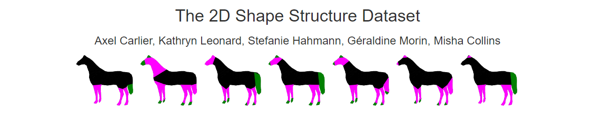
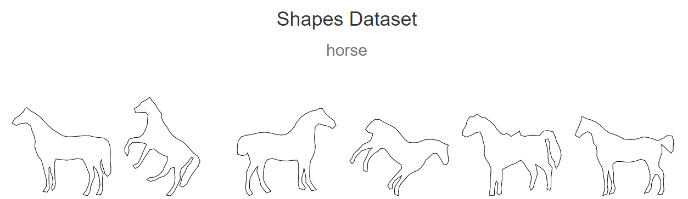

# **DDL之前还需要做的事情**

* 思考论文核心
* 论文调研，查清楚最相关的文献，总结归类
* 实验推进
  * ~~目前完成了基本的实验效果~~
  * ~~需要查找相关数据集~~
  * ~~定义下游任务~~
  * ~~确定比较baseline和SOTA方法~~
  * ~~确定定量评估指标和评测方式~~
  * ~~确定接下来要做的实验~~
* 论文写作
  * 先写Related Work
  * 后写Introduction
  * 之后写Method
  * 然后写实验
  * 最后写结论和摘要

* 当前的问题：
  * appearance inversion 有的时候会出现在背景上，需要解决
    * 如果文本直接指定纯色背景可以吗？

---

## **思考论文核心**

* one-shot learning
  * 只需要一张图像，就可以实现子属性的学习 **VS** P+等工作需要多张图像
* 子属性的学习和反转非常快，单张A40，对于单张图像，只需要3-5min，要比Prospect和P+快3-5倍。

---

## **论文调研，查清楚最相关的文献，总结归类**

* **目标：**
   * ~~找到最相关的文章~~
   * 找到次相关的文章
   * 找到方法比较类似或者接近的文章
   * 分类总结
   * ~~找到需要比较的方法~~

* **相关论文整理**
  * 图像定制化
    * 通常的定制化工作总结
    * 子属性的学习和定制化
      * Concept Decomposition for Visual Exploration and Inspiration
      * ProSpect: Prompt Spectrum for Attribute-Aware Personalization of Diffusion Models
      * P+: Extended Textual Conditioning in Text-to-Image Generation
      * MATTE：An Image is Worth Multiple Words: Multi-attribute Inversion for Constrained Text-to-Image Synthesis （Adobe+印度三哥做的）
      * Break-A-Scene: Extracting Multiple Concepts from a Single Image（将场景中的不同事物分解出来，并不是子属性）
  * Examplar-based Image Manipulaton
    * 这里要总结一些，因为我们毕竟也是从视觉example出发，来生成图像的工作。
  * Diffusion Unet结构解析相关的论文
    * **没找到相关的论文**
  * 综述类
    * State of the Art on Diffusion Models for Visual Computing，2023.10.11

* **需要比较的方法**
  * 子属性的方法
    * Prospect
    * P+
    * ~~MATTE 没有开源，不比较~~
  * 定制化的一般方法
    * E4T (Baseline)
    * Dreambooth
    * CustomDiffusion
    * 原始的Stable Diffusion

*** 测试数据**
  * Appearance 图像
    * 自行收集
      * 动物
      * 物体
        * bone toy
      * 纹理图
        * 树皮
        * 豹纹
      * 等等
    * 现在能用的
      * Prospect 所用数据中的material 图像
      *   
  * Shape 图像
    * 自行收集
      * 可以根据 https://2dshapesstructure.github.io/dataset.html 链接中得类别去搜索图像
      * 动物
      * 用户随机指定mask
      * 等等
    * 现在能用的
      * 2D shape structure Dataset
      *   
      *   

---

## **实验推进**

* **下游任务确定**
  * 给定自然图像，实现appearance和shape的inversion
  * 给定纹理图例如树皮，豹纹实现appearance的inversion
  * 给定任意shape，例如认为指定的mask，实现内容的生成
  * 能否实现两个属性的组合？

* **确定比较的baseline和其他SOTA方法**
  * 定性比较
    * E4T（baseline）
    * Stable Diffusion（原始模型）待定
    * Prospect
    * P+
  * 定量比较
    * shape一致性
      * mask IoU
    * Appearance 一致性
      * DINO 相似度
    * 文本-图像之间的相似度
      * CLIP

* **确定接下来要做的实验**
  * UNet Encoder和Decoder 关注属性分析实验
  * 收集新的数据，跑对比实验（包括E4T，Prospect，P+）
    * 定性
    * 定量
  * 跨类别的appearance inversion实验
    * rock->horse/cat/dog/building  
  * 自定义shape的Shape Inversion实验
  * 复杂文本+多物体的实验 比如 a dog in the appearance of *a, it is sitting on the grass
  * 消融实验
    * 去掉teacher encoder
    * 待设计

---

## **数据收集**
* shape数据收集：基于2D shape structure Dataset中的类别，收集不同shape的数据
  * 基本shape
    * 三角、正方形
  * 抽象形状
    * 五角星、心形
  * 动物类别
    * 四肢动物
      * 跳跃的狗
      * 站立的马
      * 奔跑的老虎
      * 坐着的狼
    * 水下动物：
      * 游泳的鱼
    * 飞翔动物：
      * 飞翔的鸟
  * 城市建筑
    * 基于现代建筑参考shape，生成 a old building
  * 交通工具
    * car
  * 水果蔬菜
    * 苹果-->橙子
  * 人脸？
    * 青年男人的脸型-->old man
    * 跳舞的人，得到跳舞的狗？
  * 日常用品
    * 椅子
  * 多个物体？
    * 一个跳跃狗和一个站立猫 -- 》 一个跳跃的猪和一个站立的马
* appearance数据收集
  * 豹纹
  * 黑白斑点
  * 条状斑马，虎纹
  * 撞色
  * 纯色
  * 树皮纹理
  * 岩石纹理
  * 布料

---

## **测试文本**

* Appearance Inversion
  * rock
    * a horse in the appearance of *a, grazing peacefully in the farm
    * a building in the appearance of *a, standing prominently on the main street.
  * rock1
    * a horse in the appearance of *a, grazing peacefully in the farm
    * a building in the appearance of *a, standing prominently on the main street
    * a T-shirt in the appearance of *a

* Shape Inversion
  * 五角星
    * a plush toy in the shape of *m
  * 三角形
    * a block toy in the shape of *m
    * a marble in the shape of *m
    * a cherry cake in the shape of *m