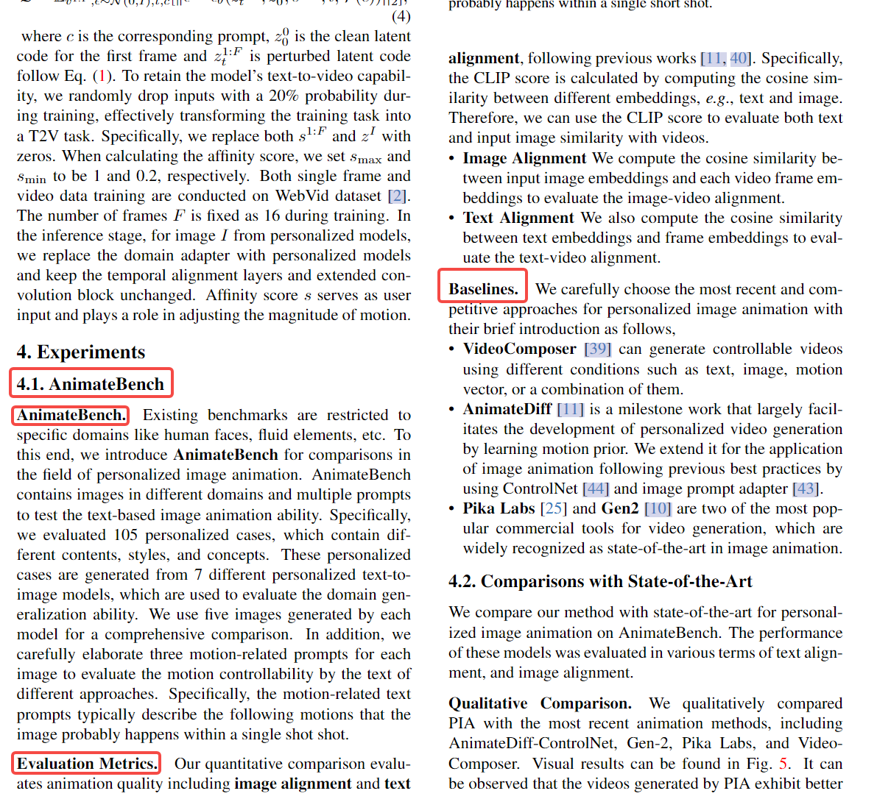

Overview应该包括内容：
* benchmark的基本信息
* 比较的baseline包括：
  * prospect和P+
* 我们采用的指标
  * 原始的指标和我们新设计的指标

目前还没有专门用于评估shape和appearance属性定制化的数据集，为了更好的推动属性定制化的发展和公平对比，我们提出了一个Subconcept benchmark。它由多张类别的图像组成，包括动物，建筑，人类等。这个benchmark可以用来做子属性定制化的定性和定量评估。

  

这篇论文的结构还挺不错的。