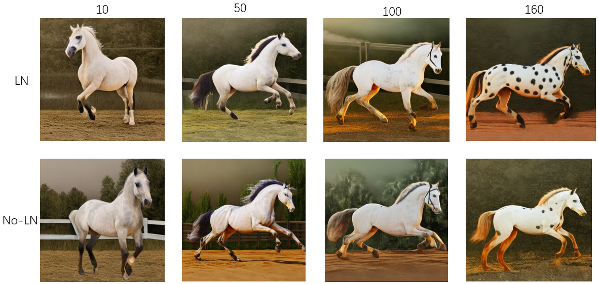
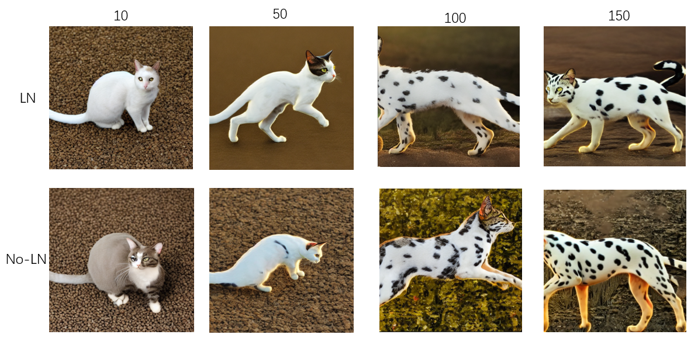

## LayerNorm的作用？

实验设置：
* dotdog 
* 添加LayerNorm
  * 1
* 不添加LayerNorm
  * z_work-exp-appearance-leopard-diffmse-no-LN_2023-12-04-21.52
* leopard 
  * 添加LayerNorm
  * 不添加LayerNorm
    * z_work-exp-appearance-dog-diffmse-no-LN_2023-12-04-21.56
* 测试文本：
  * dotdog
    * a cat in the appearance of *a
    * a horse in the apperance of *a
  * leopard
    * a cat in the appearance of *a
    * a dog in the appearance of *a

## dotdog实验

  
  

## leopard实验