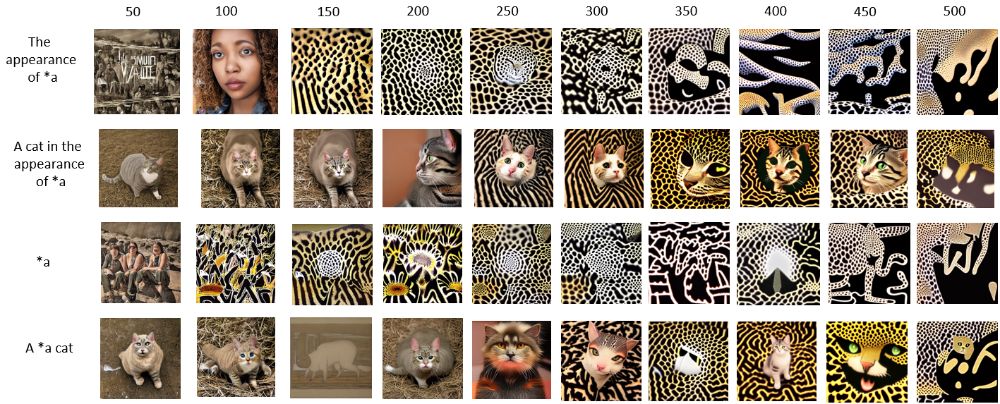
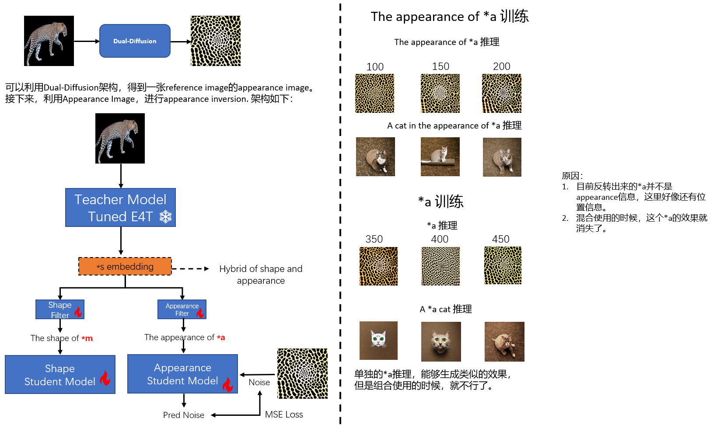
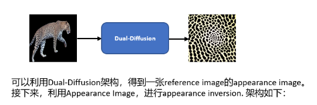
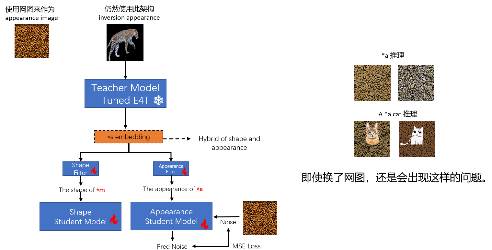
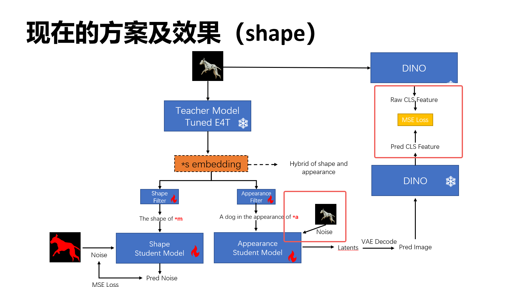
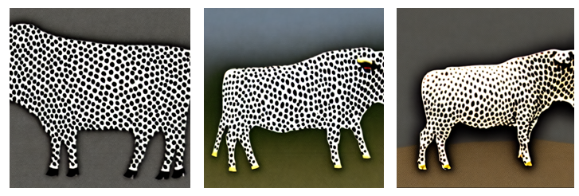
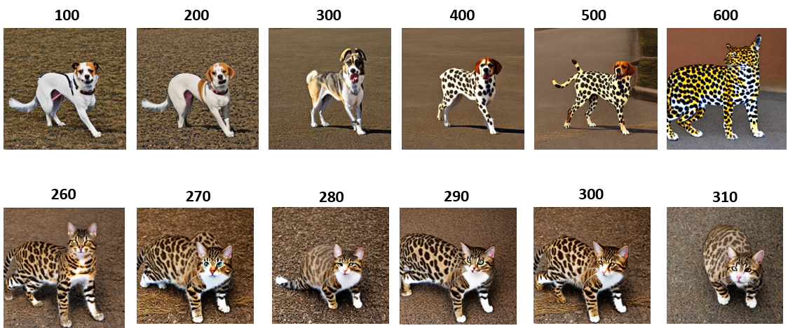
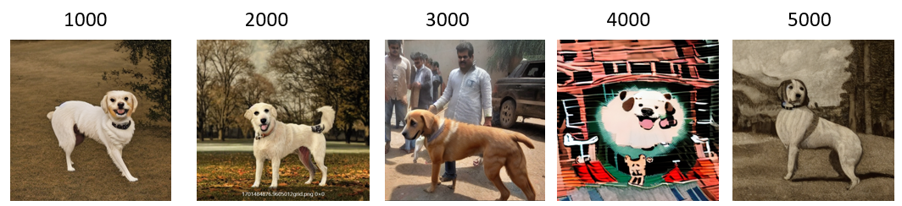

## **实验验证思路**

**实验细节简介：**

我们使用leopard图像作为reference图，然后训练Student Appearance Inversion模型。训练的固定文本prompt为“the appearance of *a”。 训练和推理所用的leopard图像均已剔除了背景，防止干扰。然后我们分别测试了以下四个prompt，查看生成的图像结果。

目前采用的方式是，Student输入纯噪音，然后希望其能够生成DINO视角下的appearance信息。

* the appearance of *a的生成结果
* a cat in the appearance of *a的生成结果
* *a的生成结果
* a *a cat的生成结果

  

可以从上图发现：
* inversion的信息，确实包含了appearance，但是还包含了很多其他的信息，比如pose，位置信息。这就说明，DINO视角下的appearance信息并不一定是最纯净的。

但是，通过这个实验，我们也有收获，那就是我们可以得到一张表示这个reference图像的appearance图像。那接下来，我是否可以利用这个appearance图像，进行inversion

---

按照上述红字要求，我们也进行了实验。发现没有效果。

  

我们目前怀疑的原因主要如下：
1. appearance信息不对，即使我们有了一张显示的appearance图像，但是这张图象生成的时候可能就引入了一些不好prior。比如位置信息
   
**现在比较疑惑的是，为什么组合起来使用的时候，*a的效果一点都没有了。？**
* 可能是文本引导的问题？
* **还有一种是in the appearance of *a 学到的并不是appearance信息，而是另一种模式信息，当你使用a cat in the appearance of *a的时候，几乎所有图像的猫头都在中心位置，所以说这种模式信息的应用是没问题的，只是目前我们提取的appearance 信息是不对的。**

## 总结：
从结果来分析，目前所有生成的猫在位置，尤其是头的位置，都有着相同的模式。同时从豹纹图生成的结果来看，中间区域也是比较亮的，恰好猫的头多数出现在这里。因此：
* **我们将inversion的信息，应用到下游生成任务上是没问题。**
* 但是问题是，**我们没能很好inversion我们想要的信息，也就是appearance信息。**
  
---

~~也就是说，我们目前的利用Student生成一张appearance image可能是不正确的。这里可能天然就包含了某种不好的prior，因此导致后续的生成的cat基本都很类似~~

  

如何验证这一点：选取了一张网上的豹纹图像，进行appearance inversion。

  

但是我们发现即使更换了网图，还是会出现这样的问题。那就说明，并不是由于appearance图像的问题造成的。还是我们在拥有了appearance image的时候，**使用teacher-student这种架构在学习的时候，学习的方式不对**。

## 总结：
其实从上述的实验及实验结果来看，我们大概可以得出这样的结论：
* *a 如果作为文本使用，可以得到对应的appearance效果
* 但是*a 和其他文本一起使用的时候，却不行。

**我已经分析出原因了：**

因为我们使用的是Student Model也就是UNet的所有参数finetuning，这个极容易引起网络的过拟合，然后我们这里使用的是豹纹图，这就导致最后Student UNet只能生成豹纹图，也就是过拟合到了豹纹图。那这个时候你在用其他文本作为条件，你会发现生成图像的底部都是豹纹。这就是过拟合了。

---

基于我们新的理解，实际上我们的Student Model，有点类似于Custom-Diffusion。只不过我们的初始*a embedding，是从teacher embedding projection过来的。此外我们学习的目标是子属性。因此，我们微调了下架构：

  

在这里我们还是输入原图，然后文本是 a dog in the appearance of *a。但是我们希望损失约束建立在DINO CLS特征上。此处我们选择finetuning全部的Student Unet参数。

我们测试了猎豹--》公牛的效果：

  

可以发现，这是有效果的。只不过给人的感觉就是模型过拟合了。得到的图像非常假，但是猎豹的斑点确实是学到了。

**因此，这个过拟合现象，其实也在说明，当前的方案应该是可行的。我们需要找到一个合适的finetuning范围和拟合状态。**

实验如下：

## 优化 K，V [a dog in the appearance of *a] 输入，输出图像和原图像建立DINO CLS loss （running） 

**文件夹：debug_update_K_V_2023-12-01-21.05**

Appearance Student Model 输入是inference 图像加噪。

  

## 优化K，V，*a 噪音输入，输出图像和原图像建立DINO CLS loss （running）
debug_update_K_V_*a_noise_2023-12-01-22.06

效果和下面的实验结果类似，也无法实现appearance的inversion和利用。

## 优化K，V，损失为重建损失(Custom Diffusion) （running）
debug_update_K_V_custom_diffusion_2023-12-01-22.16

  

可以发现，如果输入是leopard，并且文本是a leopard in the appearance of *a. 并且使用CsutomDiffusion的方式学习。微调KV，我们发现，这个\*a学不出来。而且无法应用到其他测试种类，比如dog。

## 优化 K，V [a photo of the appearance of *a] 输入，输出图像和原图像建立DINO CLS loss （running）

没有效果。

---

**现在需要分析以下，为什么inference图是leopard，然后输入文本是a dog/cat/bull in the appearance of *a。**

为了验证和分析具体是什么起了作用，我们设置了以下四个实验：

* 去掉DINO Loss，改用重建损失

* 去掉teacher model
  

* **去掉leopard图像，改用noise输入**
  * work-exp-noise-input

没有效果。

* **将输入文本改成a *a leopard , 更新 KV，使用DINO CLS loss进行学习**
  * work-exp-dog2leopard
  * 有效

永远记住目前是过拟合的方式，别忘了去找一般化的解法：

还需要做的实验：

* 优化KV，然后leopard导出图baopwen输入，文本是the appearance of *a 或者 *a

- [x] 优化K，V，随意一张dog图输入，文本是a dog in the appearance of *a ，验证是否leopard图不是必须的 (running)
  - [x] 目前的实验结果来看，你输入的图像是什么，最终生成的图像就是什么。也就是说输入图像比重很大。然后DINO CLS loss。

* Student Model使用的是Teacher model的权重进行初始化实验？

* 使用Custom Diffusion训练inversion leopard appearance？
  * 不行

---
## **现阶段的故事如何讲？**

与其他Sub-Concept Inversion的工作不同，我们的核心是如何从预训练好的Inversion Model中提取Sub-Concept，这个做法无须人工划分时间阶段，也无需人为指定网络层级。并且每个属性的优化都能在3min中内得到。

我们的做法是：
* 首先我们假设一个预训练好的Inversion模型，应该已经包括了物体的shape和appearance信息，但是这些信息是hybrid sub-concept信息，我们要做的是如何从extracting这些信息
* 我们设计了一个Teacher-Student架构，预训练好的E4T作为Teacher Model，然后我们为每个Sub-Concept分别设置一个SD model作为student models。
* 然后我们为每个Sub-Concept Student Model，分别设置监督信号，要求在对应的文本提示下，进行学习。
  * 对于Shape Concept，我们采用了Mask作为输入，然后希望Student Model能够重建这个Mask。
  * 对于Appearance Concept，我们很难找到显式的表示，因此，我们提出了一个高效的基于Inversion的Appearance图像生成方法。 能够在1min左右得到一张inference图像的appearance图像。
  * 基于得到的Appearance图像，我们加噪输入给Student model，然后输入提示文本，得到Appearance concept的inevrsion。

* 将upblock解冻
* 多个文本输入至student model
* DINO target 图像做数据增强。
* VICO的架构是否可以用一下

* in the style of *a 实验有效。
  * work-exp-bull-aug-style-diffmse_2023-12-04-10.59
* 同上条件，改成appearance
  * work-exp-appearance-diffmse_2023-12-04-14.00
    * 实验有效
  
上述实验，我们**在MLP中添加了LN归一化**，同时把**预训练的时候的domain_class_token设置成了正确的leopard**，发现效果就好了。这说明，**E4T提取的*s，也很依赖文本类别的输入**。

* 上述实验的基础上，需要尝试的想法：
  * 添加DINO Loss
    * dotdog : 
    * leoaprd：work-exp-appearance-dogdot-diffmse-dinoloss_2023-12-04-18.43 **待测试**
  * 设置对比学习，远离shape embedding，接近于appearance等（BLIP可以描述一下）
  * 解决现在过拟合的程度
    * 查看定制化领域的经典解法即可

* 如果输入的是斑点狗，然后预训练类别改成dog。效果会怎么样？
  * work-exp-appearance-dogdot-diffmse_2023-12-04-18.48,**还是有效果**

* 验证当前有效果的原因是什么？
  * LayerNorm的作用？
    * [[02_Projects.2023_SubConcept_Inversion.Experiments.Appearance_inversion_LayerNorm的作用、]]
  * Lr的原因吗？

* 既然LayerNorm能提高质量，那么请继续设计更好的MLP+layerNorm结构？

* appearance的效果会出现在背景区域？思考如何解决？
  * *a的作用区域不对？

* zip-Lora的思路
  * 查看一下微调的所有KV参数，都是必须的吗？如果不是，那也可以减少参数量进行微调

