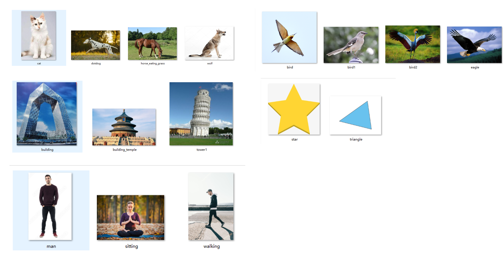
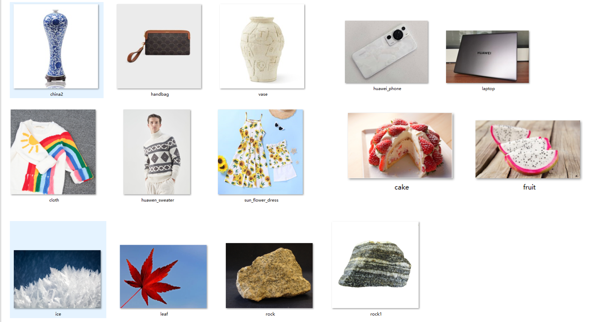

## Subconcept benchmark V0版本

2024年1月3日13:24:00, 整理好了当前的benchmark v0版本，主要的信息包括：

* Shape Inversion Benchmark
  * 16张图

  

* Appearance Inversion Benchmark
  * 14张图
  

## 定量测试

对于每个参考图，测试5个text，每个text生成30张图像。
* shape： 16 \* 5 \* 30 = 2400 张图像
* appearance：14 \* 5 \* 30 = 1800 张图像

采用指标：

* CLIP I-T相似度
* DINO appearance 相似度
* Shape Mask IoU

