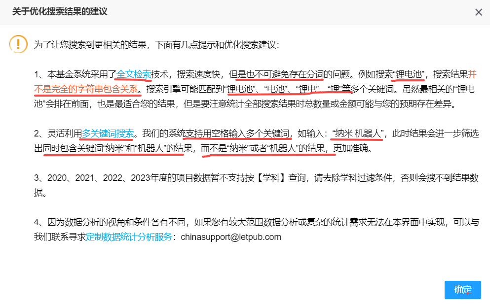
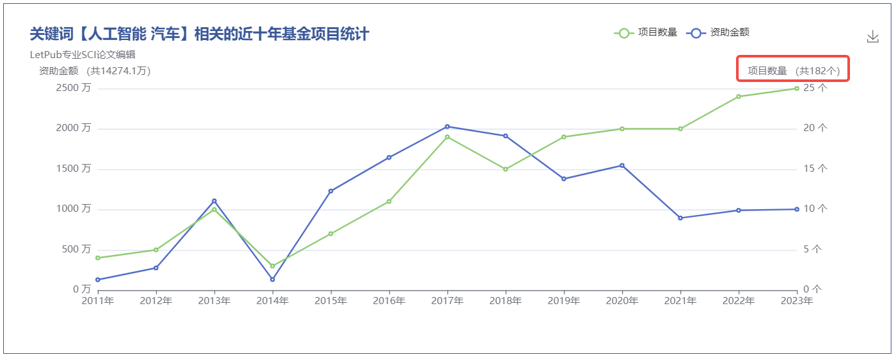
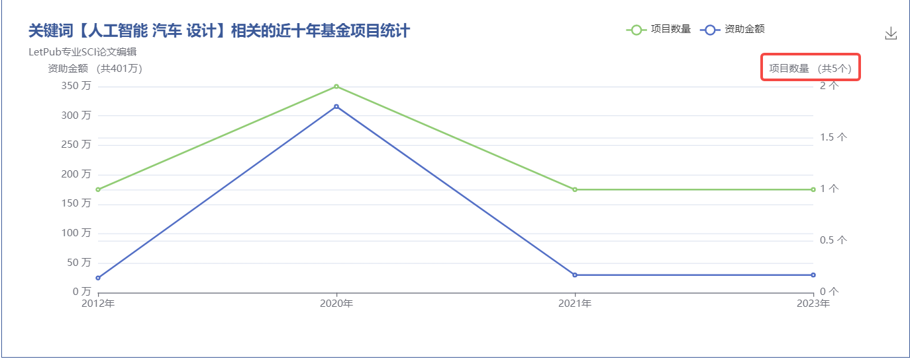
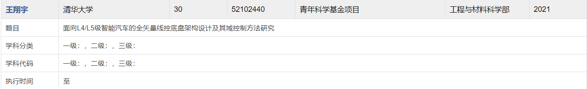
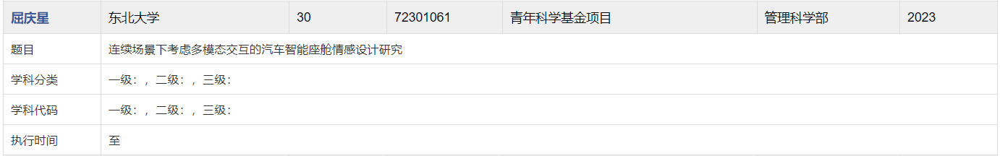
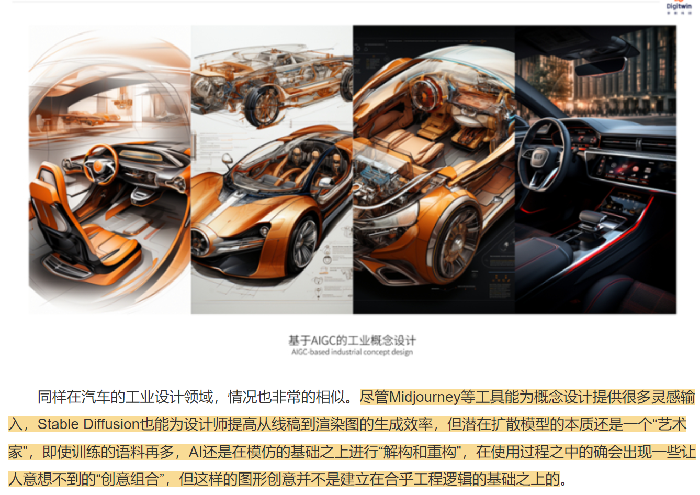
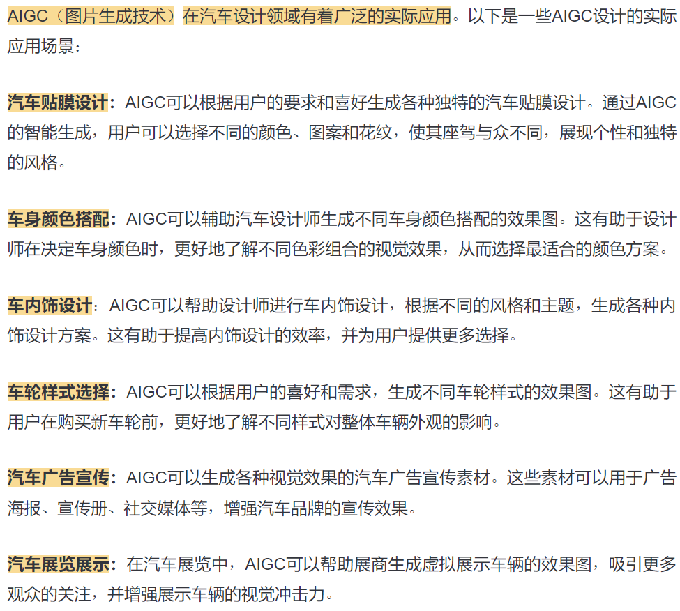
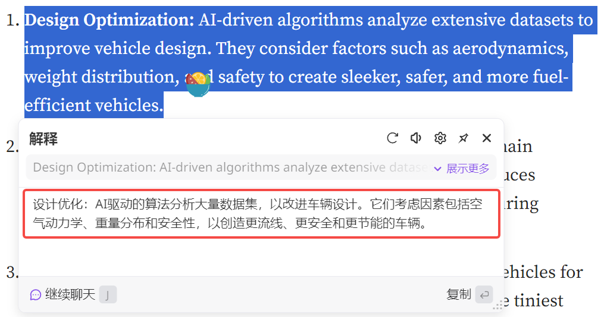
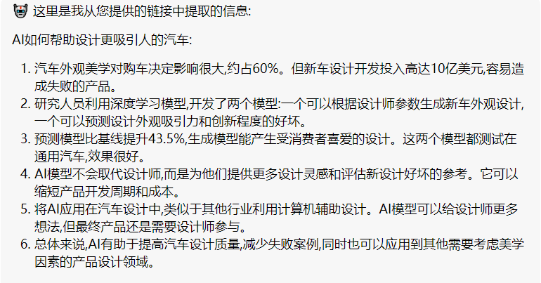

## **相关信息记录**

### **背景相关**

* AIGC+汽车相关
* 侧重“**可实现的**”、“**满足工业设计标准和需求**”的汽车**图像**、**3D数据**的**表征**、**理解**和**生成**
* 围绕**多模态、可控、细粒度、高质量**这些关键词

### **调研工具**
* [letpub](https://www.letpub.com.cn/?page=grant&name=&person=&no=&company=&addcomment_s1=662&addcomment_s2=914&addcomment_s3=915&money1=&money2=&startTime=2001&endTime=2016&subcategory=&searchsubmit=true&submit.x=61&submit.y=21)

### **调研思路**
* Letpub 搜索关键字，看一下其他人做了什么
* 基于上述结果，我们可以做什么
* 结合兰薇老师的已有成果，筛选一下
* 搜索现有英文论文，综述，思考技术手段是什么

## **调研资料记录**

### **letpub基金记录**

**Letpub搜索规则：**

  

**Query1 ：**
使用**人工智能+汽车**关键词查询，时间跨度为**2015-2023**：

  

* 共返回162条基金记录
* 分析其题目，发现这些基金主要关注如下topic：
  * **智能汽车技术与控制**：车辆动力学建模、控制方法、底盘系统控制、电动汽车集成控制、多模式自适应巡航系统等。
  * **人机共驾与驾驶行为**：人机交互、驾驶员操纵能力、人机共驾风险分析、驾驶风格自学习、驾驶行为特性等。
  * **环境感知与感知技术**：视觉感知、路况预测、多模态感知、车辆环境精细感知、深度融合与动态建模等。
  * **安全与容错控制**：智能安全、故障诊断、容错控制、虚假数据注入攻击下的控制、安全性与可靠性等。
  * **能源管理与优化**：能量管理、电动汽车全局功率预测与分配策略、能效评估、动力电池系统优化控制等。
  * **网联技术与交通优化**：网联汽车群体决策、交通流优化、智能网联汽车影响研究、多车道路段混合交通规划等。
  * **技术创新与系统评估**：技术创新网络治理、新能源汽车采纳与扩散研究、智能化对安全、节能减排及缓解拥堵影响评估等。
  * **数据处理与算法应用**：基于深度学习的视觉认知与控制、数据融合与多源信息处理、智能算法在电动汽车中的应用等。
  * **电子系统与通信安全**：汽车电子系统安全、网络攻击下的故障诊断、智能汽车信息安全等。
  * **辅助系统与底盘技术**：ADAS智能感知、悬架系统控制、智能轮胎力最优分配控制等。

**与汽车工业设计相关的基金几乎没有。**

---

**Query2：** 使用**人工智能 汽车 设计**关键词查询，时间跨度为**2015-2023**：

  

共返回4条基金记录，下面是相关基金信息截图：

* 面向L4/L5级智能汽车的**全矢量线控底盘架构设计**及其域控制方法研究
  *   

* 连续场景下考虑多模态交互的**汽车智能座舱情感设计**研究
  *   

关注**智能座舱**、**底盘设计**。

---

## AIGC+汽车设计 新闻资讯

* [丰田推出生成式AI工具：输入文字指令可自动设计汽车外形](https://tech.ifeng.com/c/8QnTrb8yoIl)
  * 2023.06.21新闻
  * 该工具的用途“并非完全取代人类设计师，完全自主设计出一辆新车”，而是在生成图像时根据设计师的要求来完成草案。比如考虑到底盘尺寸、风阻系数等因素，这些因素对新车的燃油经济性、操控性、安全性乃至是否符合人体工学都会产生影响。
  * 丰田的设计师仅需输入关键字“流畅线条”或“SUV 造型”，以及“低风阻”等工程学方面的要求，该工具即可根据要求自动生成一些样图，辅助设计师完成设计
  * 尽管目前 AIGC 经常被用作设计师的灵感，但它在实际汽车设计中，仍然无法处理的复杂工程和安全因素

* [ICONA INSIGHT | AIGC世代的设计新范式](https://chejiahao.autohome.com.cn/info/13554142)
  *   

* [神采PromeAI，设计师的高效创作搭子](https://xueqiu.com/6541651700/258431773)
  *   

英文blog：

* [AI-Powered Design and Manufacturing](https://medium.com/bestai/ai-in-the-automotive-industry-the-effect-and-its-future-with-automobiles-eeb21057818d)、
  * 介绍的很笼统
  *   

* [Artificial intelligence can help design more appealing cars](https://mitsloan.mit.edu/ideas-made-to-matter/artificial-intelligence-can-help-design-more-appealing-cars)
  * 很笼统
  *   

---

理解+生成+故障检测

* 从特定图像中获取灵感？
---

针对汽车造型设计的全流程：

* 前期（概念设计）
  * 创意启发
    * 文本引导的粗糙草图生成

* 中期（详细设计）

* 后期（生产准备）

---
马老师要点记录：

* 线稿图，彩色图像，辅助设计师。
* 多模态 文本引导 通用prompt 通用方法 面相造型设计的不同阶段 还是每个阶段特定设计方法。

