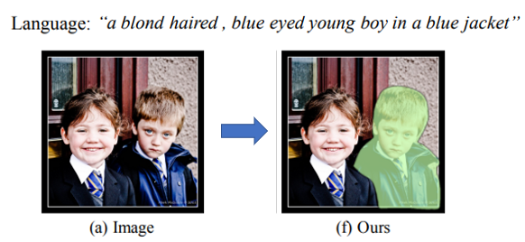

**研究题目：语言和场景图联合指导的室内场景多物体分割**

**研究背景：**

**Referring Image Segmentation**已成为图像分割中的前沿研究方向。它是一种语义分割任务的变体，它的目标是根据**自然语言指代（referring expressions）来分割图像**。
这种方法**要求根据一句话或短语，通常是自然语言描述或指代，来定位并分割图像中的对象**。如下图所示：

  

然而，当前的大多数方法针对的还是简单的自然场景（物体种类少、空间关系简单）。针对**复杂室内场景中的多物体**情况，当前方法可能存在**对空间关系理解不足**的问题。特别是**在多物体之间复杂的空间排列与关联下**，现有方法的准确性和鲁棒性可能受到挑战。

**研究动机：**

本研究旨在解决Referring Image Segmentation在**复杂室内场景中多物体分割**方面的挑战。通过**引入场景图结构化信息**，**提高模型对多物体之间空间关系的理解能力**，以实现更准确、更全面的图像分割。

