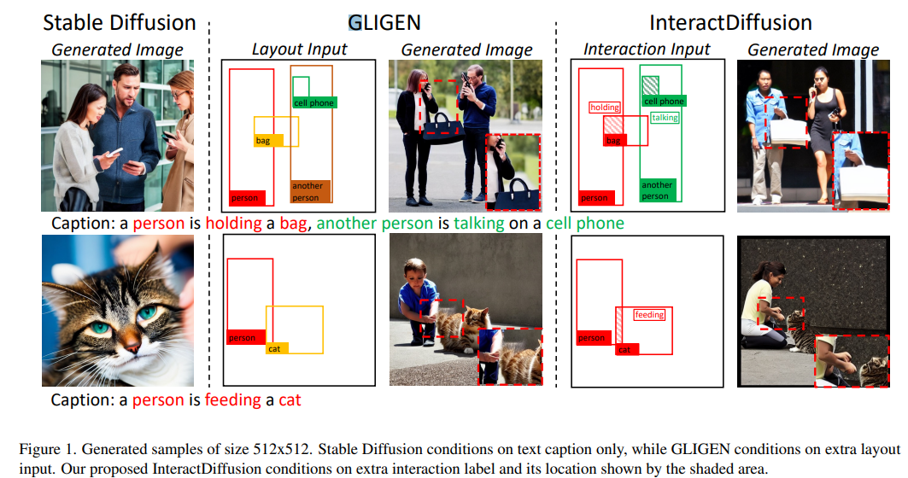
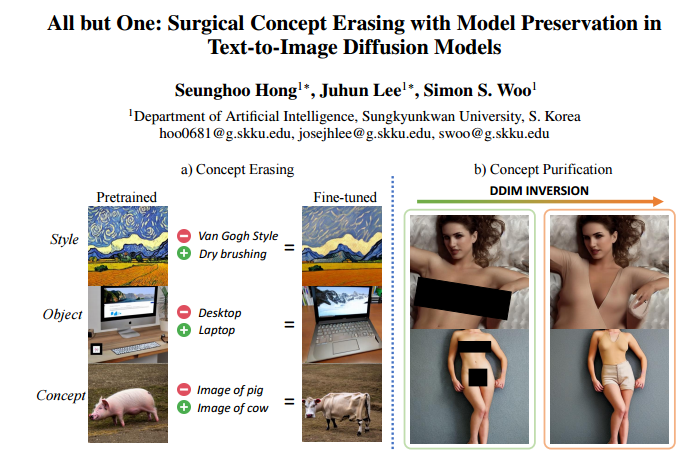
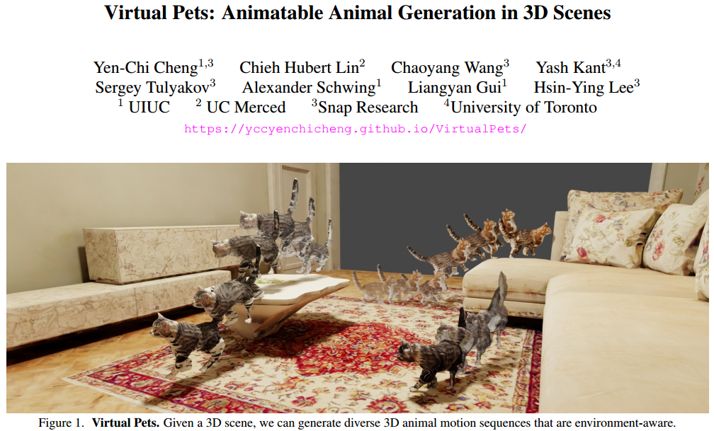
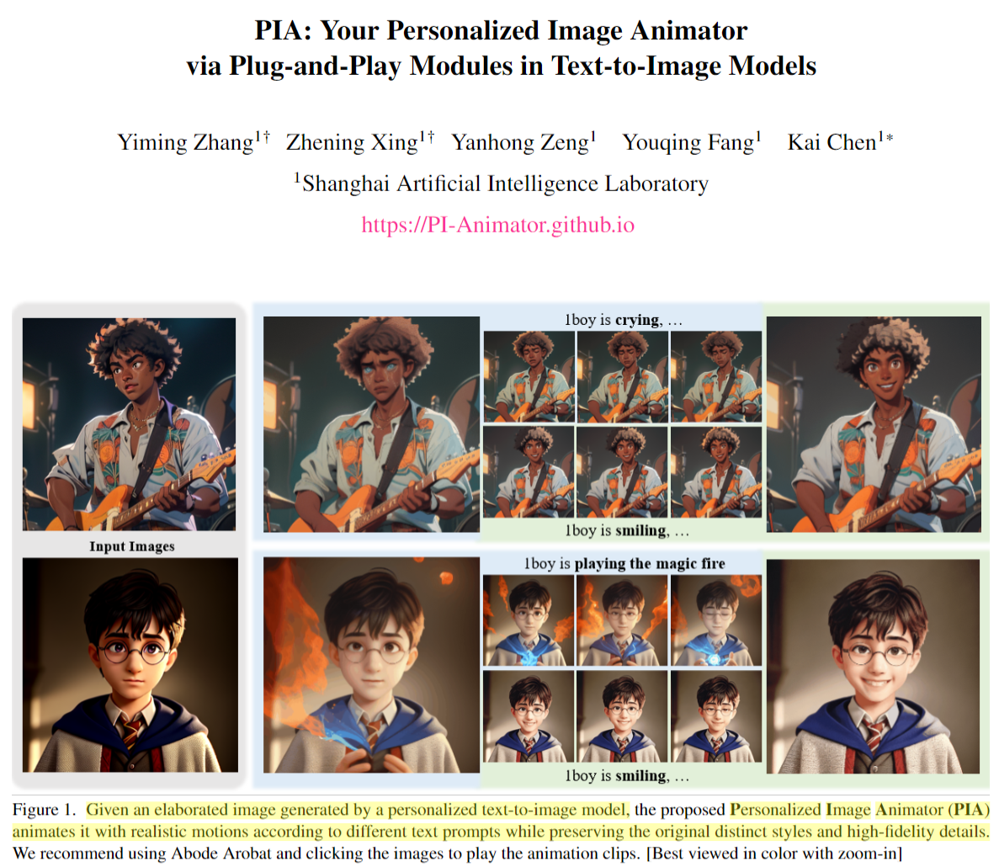

## **基于文本或者引入更多的控制，生成更加复杂的自动驾驶视频数据**
#自动驾驶
#video_generation
#Video
* 灵感来源：
  * Panacea: Panoramic and Controllable Video Generation for Autonomous Driving
  *   

* 详细描述：
  * 如上图，这个工作只是能够生成简单的左右方向，以及季节、天气等简单的视频数据。但是对于自动驾驶来说，还有一些更复杂的数据需要生成。比如**长尾数据中的少数样本，多车拥堵数据，路口拥堵数据，车祸场景数据，障碍场景数据等等。**

不过我最近也看到了中科院发布的工作，[[Drive-WM|04_Resources.05_行业新闻.20231202-机器之心-驶向未来，首个多视图预测+规划自动驾驶世界模型来了]], 这个工作可以生成高质量的视频，同时还能实现很多控制，比如文本修改天气，方向和速度，稀有场景、行人生成和前景编辑。

## **用户给定参考图像，反转图像内容，替换原视频中的内容**

#Video
#video_generation
#Video_edit

比如原视频是一段狗在走路，用户提供的是一匹马的图像，我是否可以修改视频成马在走路呢？

StyleCrafter: Enhancing Stylized Text-to-Video Generation with Style Adapter
  

收到了这篇工作的启发，不过这篇工作是做style的。我们想做identity和content。

可以参考PhotoSwap这篇工作：PHOTOSWAP: Personalized Subject Swapping in Images

## 关注interaction的视频、图像、场景的生成

#interaction

这里指的interaction主要就是人在现实生活中一些动作，注意并不是单一的motion，而是和物体之间的主被动关系，比如a people hold a cup 或者一个人削苹果，目前的生成方法，对于hold或者削这些动词应该都不敏感、不准确，生成的质量也一般。

除了人之外，物体和物体之间的interaction，比如猫在玩球（这个可能已经被做了）。

此外，人在复杂场景下的interaction，也可以考虑。

二级想法：

* 可以在identity保持和interaction结合起来做，比如定制化加interaction。
* 依托文章：
  * InteractDiffusion: Interaction Control in Text-to-Image Diffusion Models
  *   

* 做动词的textual inversion
  * Revision 只是做了介词的inversion，但是对于hold，或者eat这样的动词，Revision能够实现么？

* 可以在视频模态上，做interaction
  * 其实就是把InteractDiffusion拓展到video。

* 2023年12月22日10:02:25补充
  * 能否制作一个专门关注interaction的数据集，然后做很好总结interaction的种类，用以支撑interaction的生成和编辑。
  * 这个数据集可以是image，也可以是video，同时最好是支持多种模态，比如文本，关系图，图像等

## 关于Instruct指导的图像编辑
#image_editing
#Instruction_following

之前有人开发了InstructPix2Pix，使用指令来完成图像的编辑。那么基于指令的图像子属性的的编辑，或者基于指令的视觉子概念的学习以及应用编辑，是不是可以做一下？

比如给定一张参考图像，我很喜欢这张图像的风格或者布局或者结构，对于用户来说只需要使用指令去表达希望提取什么属性，比如"Extracting the layout of the image"。第二步，用户希望将其应用到目标图像的编辑上，用户接着给出第二个指令“Applying the layout into the target image”。

## 给定参考图像，如何删减图像元素或者擦除图像属性
#概念擦除

当人们对目标图像或者生成图像中，不满意的地方进行编辑时，多都是基于mask的形式。人们大多关注的是如何加东西、我能不能做减东西？
* 比如减去不满意的属性

受启发的文章如下：

  

## 符合场景要求的视频编辑

比如给定一个场景，我想在这个视频场景中添加一些事物。比如给定一个living room。我希望增加一只猫从沙发跳到了地板。

受启发的文章：

  

## 给定参考图，且子属性可控的单张静态图像动画生成

给定一张参考图像，用户可能只是对当前参考图像的子属性感兴趣，希望从图像上提取该目标属性，然后使用文本驱动生成一张子属性可控的定制图像的动画。

受启发的工作：
*   

## 给定多张参考图，做Human-centric Interaction-enhanced multiple object 定制化生成：

比如给一张人的照片，给一张狗的照片，给一张苹果的照片，然后输入文本“一个人一边吃苹果，一遍遛狗。” 我们希望生成符合上述描述的图像，并且Interaction一定要准确！

