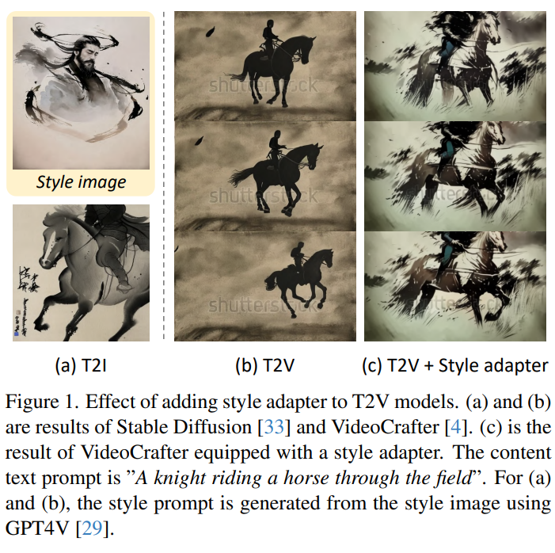

## **基于文本或者引入更多的控制，生成更加复杂的自动驾驶视频数据**
#自动驾驶
#video_generation
#Video
* 灵感来源：
  * Panacea: Panoramic and Controllable Video Generation for Autonomous Driving
  *   

* 详细描述：
  * 如上图，这个工作只是能够生成简单的左右方向，以及季节、天气等简单的视频数据。但是对于自动驾驶来说，还有一些更复杂的数据需要生成。比如**长尾数据中的少数样本，多车拥堵数据，路口拥堵数据，车祸场景数据，障碍场景数据等等。**

不过我最近也看到了中科院发布的工作，[[Drive-WM|04_Resources.05_行业新闻.20231202-机器之心-驶向未来，首个多视图预测+规划自动驾驶世界模型来了]], 这个工作可以生成高质量的视频，同时还能实现很多控制，比如文本修改天气，方向和速度，稀有场景、行人生成和前景编辑。

## **用户给定参考图像，反转图像内容，替换原视频中的内容**

#Video
#video_generation
#Video_edit

比如原视频是一段狗在走路，用户提供的是一匹马的图像，我是否可以修改视频成马在走路呢？

StyleCrafter: Enhancing Stylized Text-to-Video Generation with Style Adapter
  

收到了这篇工作的启发，不过这篇工作是做style的。我们想做identity和content。

可以参考PhotoSwap这篇工作：PHOTOSWAP: Personalized Subject Swapping in Images

