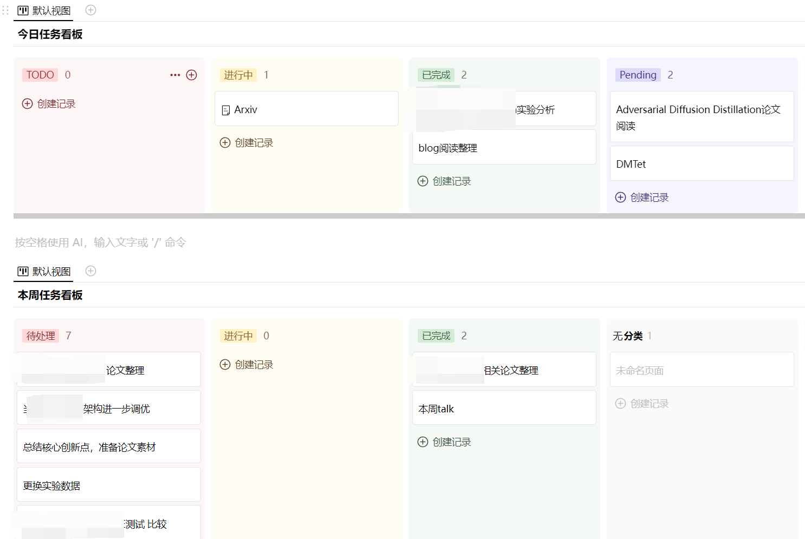

## **随时记录想法**

* 手机端：WPS便签app, 微信小程序
* 电脑端：WPS便签

## **任务看板**

* FlowUs 看板视图

  

## **收集整理Arxiv**

## **知识笔记沉淀**

## **论文阅读工具**

* PDFGear
* UPDF
* youtube+chatgpt+具体prompt，总结论文

## **公众号阅读神器**
* 微信公众号文章浏览器打开，选择自己感兴趣的内容
* 然后使用chrome插件**copy-as-markdown** 右键复制

## Windows良心软件
* 磁盘分析工具：
  * WizTree