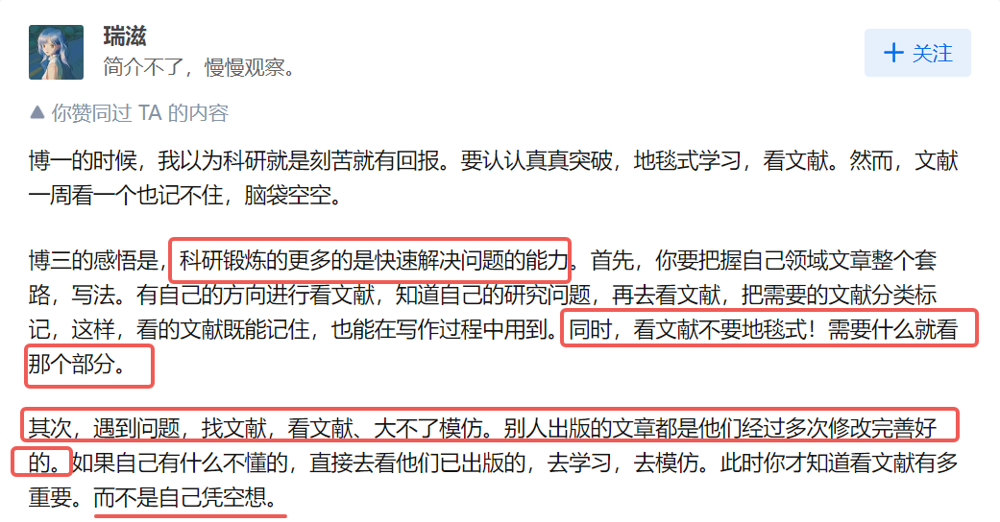

## **刻苦不等于高效科研**

原链接：https://www.zhihu.com/question/621912340/answer/3308865761

  

## 科研思路
* **旧问题：从代码出发，测试当前某类方法的共性问题，设计解法去解决问题：**
  * 我发现很多文章，比如Compositional Inversion for Stable Diffusion Models这篇工作，大概率是从当前算法的测试结果来看，有哪些问题这些方法做不了，然后去解决这些问题。光看论文的话，就会让人感觉很多问题都被做了。所以还是要从代码出发，大量测试，找到这些方法的共性问题。然后解决。
    * 这些文章还包括，从ControlNet出发，发现其问题，然后改进的工作：
      * FineControlNet: Fine-level Text Control for Image Generation with Spatially Aligned Text Control Injection
      * Local Conditional Controlling for Text-to-Image Diffusion Models
    * 其实这就说明，我们一定要从代码实践出发，发现问题，然后总结规律，解决问题，形成论文。
* **新问题：提出新问题，找到可解得方案，迅速完成文章：**
  * 待补充

