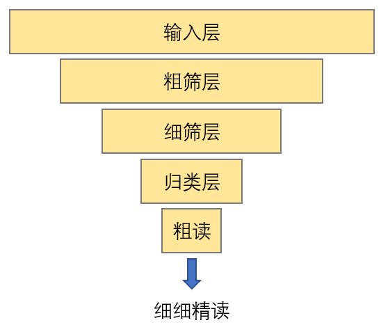
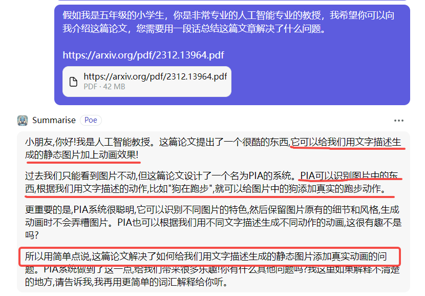
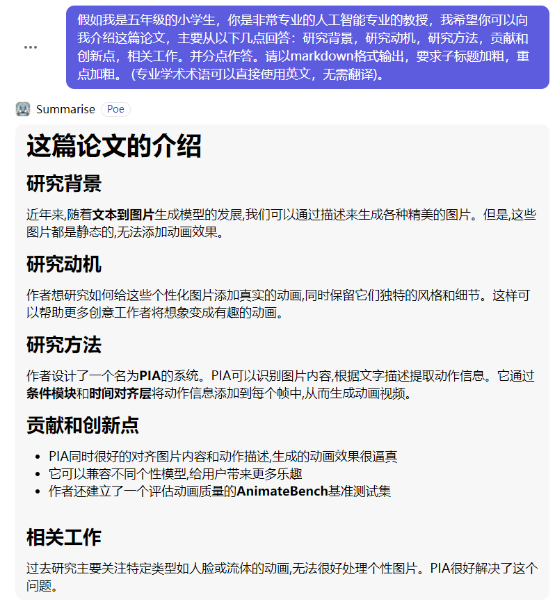
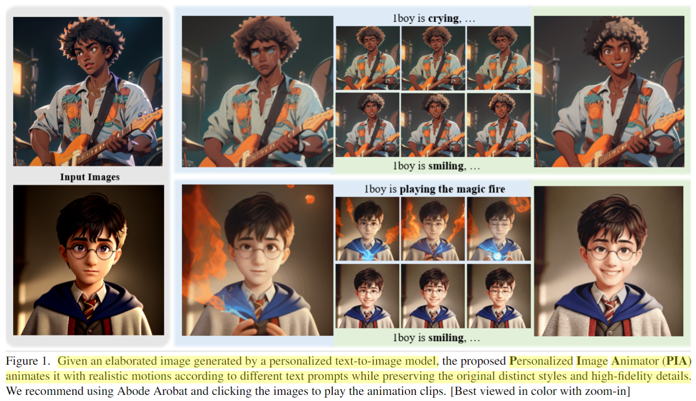
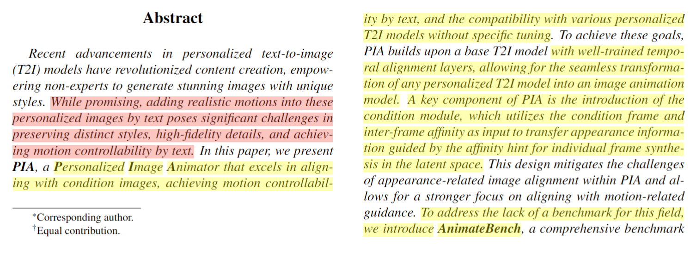
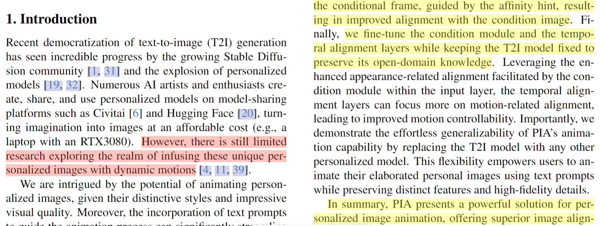
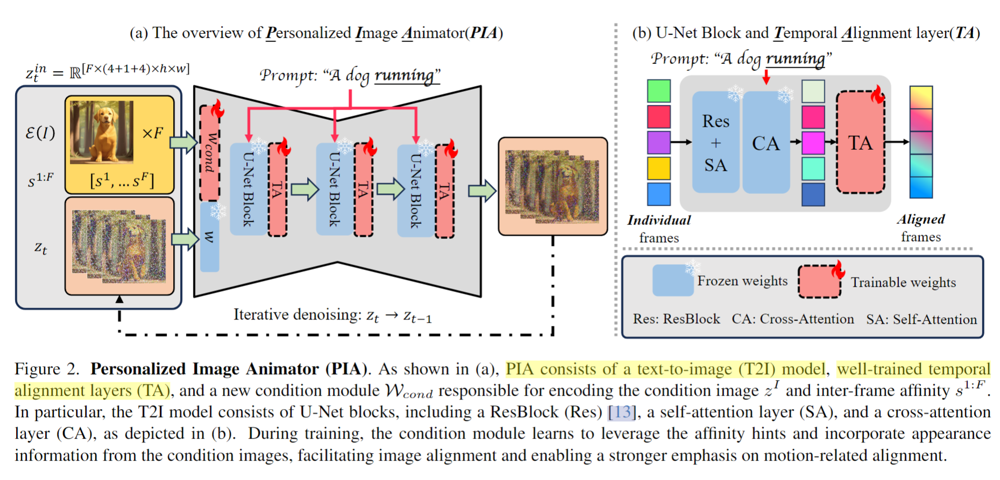

#! https://zhuanlan.zhihu.com/p/673798599
---
id: 2inf4xe80m1tq2c9lv0opxn
title: 论文走进来带出去-倒金字塔模型
desc: ''
updated: 1703316255135
created: 1703312239316
---

这篇文章用来记录自己，在面对浩如烟海的文献、卷上更卷的领域发展时，怎样**高效阅读文献**，**快速掌握论文脉络**，**顺利切入课题研究**的心得和经验。

> 注：本经验不一定适合所有人的科研方式，仅作为自我记录使用。

本人的研究领域是**智能内容创造**，主要关注**图像生成、图像编辑、视频生成、视频编辑**等。这四个小领域都是发展非常迅猛，短时间内的论文更新速度和数量非常惊人。面对这样发展势头，常规的论文阅读方法可能并不适合，如果我们按部就班的逐篇阅读，是不可能跟上领域的发展速度，进而也无法找到合适的科研问题。

经过长时间的思考和实践，我总结了一个适合自己的**倒金字塔模型**，这个模型专用于帮助我**快速浏览论文**，**过滤论文**，**找到重点论文**。

如下图所示：

  

接下来，我将每一层进行拆解：

---

## **输入层**

**输入层**其实就是**信息来源**，就我本人而言，输入层中得信息来源主要包括：
* Arxiv每日更新
* 知乎
* 公众号（量子位和机器之心）
* bilibili

**其中Arxiv每日更新的论文是最全面的，其他三个板块也都是基于Arxiv更新的论文进行内容的二次传播。**

对于知乎推荐的文章、bilibili更新的一些视频，以及公众号的发布文章，我采用的方式是**整理加记录**。我会直接将看到的帖子记录下来，形成自己的笔记，这样的好处是你会去学习和理解，而不会是只收藏。

比如大家可以看我的知乎专栏，我专门用来记录自己看到的公众号的文章。

https://www.zhihu.com/column/c_1712783492344135681

对于Arxiv的每日更新，则是重中之重。因为这涉及到每天你所感兴趣的领域的学者，他们发布的最新论文，科研的最新进展。

因此，Arxiv也需要每天坚持浏览（周六周日不需要），但是只是浏览是不行，需要对其进行筛选，找到对自己启发最大的那些文章。

那就需要倒金字塔模型的第二层---**粗筛层**。

---

## **粗筛层**

粗筛层就是对一篇文章进行快速地筛选，过滤掉一大部分的文章，做后续处理。

我推荐大家使用ChatGPT类的产品，外加定制一些专用的prompt进行过滤和筛选。以下是我的使用方式：

* **工具：**
  * [PDF助手](https://poe.com/Summarise)
  * new bing side bar
  * 等等

* **prompt：**
  * 假如我是五年级的小学生，你是非常专业的人工智能专业的教授，我希望你可以向我介绍这篇论文，您需要用一段话总结这篇文章解决了什么问题。

注意看，我们的提示是非常简单的提示，我们并不要求其给出非常详细的总结，我们只需要让他用最通俗的话，来向我们解释这篇工作做的事情。

如下图所示：

  

通过上述总结，我们就很清楚的知道了这篇文章做的事情。那我们就可以决定是否要过滤掉这篇论文。

如果你觉得对这篇论文做的事情，感兴趣，OK，那我们进入细筛层。

---

## **细筛层**

细筛层的原则是**利用更加详细的prompt和一定程度的人工阅读筛选论文**。

* **工具：**
  * [PDF助手](https://poe.com/Summarise)
  * new bing side bar
  * 等等

* **prompt：**
  * 假如我是五年级的小学生，你是非常专业的人工智能专业的教授，我希望你可以向我介绍这篇论文，主要从以下几点回答：研究背景，研究动机，研究方法，贡献和创新点，相关工作。并分点作答。请以markdown格式输出，要求子标题加粗，重点加粗。 (专业学术术语可以直接使用英文，无需翻译)。

  

如上图所示，我们能够获取到更加详细一些的内容，然后我们可以从其研究方法中看到，这篇论文的一些细节，包括贡献中他做的事情。

OK，根据这些信息，你觉得这篇文章，确实比较有意思。那就要及时对这篇论文进行归类。

--- 

## **归类层**

归类层的核心是**利用工具对论文进行分类和tag管理，避免乱糟糟降低查找和阅读效率。**

推荐工具：
* Zotero
* Readpaper

---

## **粗读**

接下来就是读论文，但是读论文也是要有技巧的，不要一股脑的扎入文献海洋中。

结合上述的信息，这时候你可以去看一下论文的**摘要、teaser图、introduction、方法图。**

  

  

  

  

等你读完这些部分之后，你就已经对这篇论文有了全局的理解了：
* 这篇论文处理的任务
* 这篇论文的动机
* 这篇论文做的事情
* 这篇论文的全局架构

因为你是在GPT给出的信息上，进行阅读。你的阅读会很快，基本不会超过10分钟，就能读完上述部分。读完之后，这个时候，就要去决定这篇论文我**是否需要细细精读**。

如何判断这篇论文是否需要细细精读？我个人的经验和看法是：
* 80%的论文都不需要细细精读
* 判断一篇论文是否需要精读跟你所处的科研阶段有关
  * 如果你是刚刚入门的选手，我并不推荐看的很细，应该先建立对整理领域的全局认知，然后找到你要做的问题之后，去精读这一部分的论文
  * 如果你正处于写代码，做实验阶段，时间和精力无法分出来。OK，那就用粗筛的方法，了解一下论文的故事，然后收藏好即可。
  * 如果你正处于实验难题迟迟无法解决，突然遇到了一篇相关的文章，那就需要细细精读了。
  * 如果你看到的文章对你很有启发，基于这篇论文，你突然有了新的idea，肯定要细细读了。

**以上，便是我的倒金字塔模型的使用方法和注意事项。仅为个人记录。请结合自身情况甄别使用。**