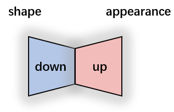
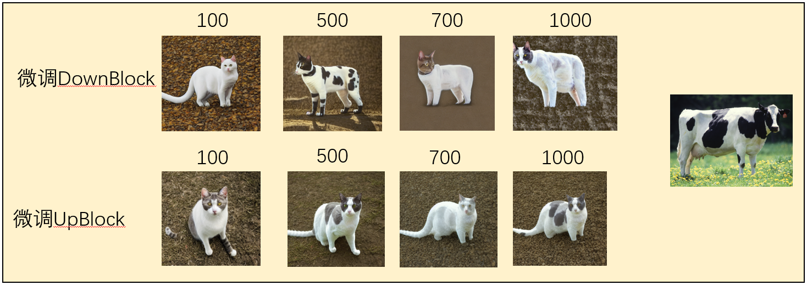
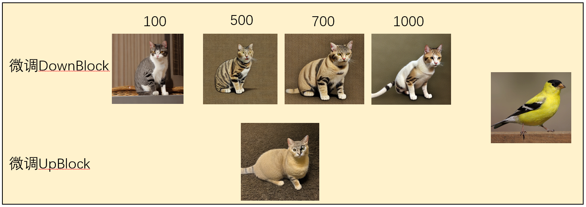
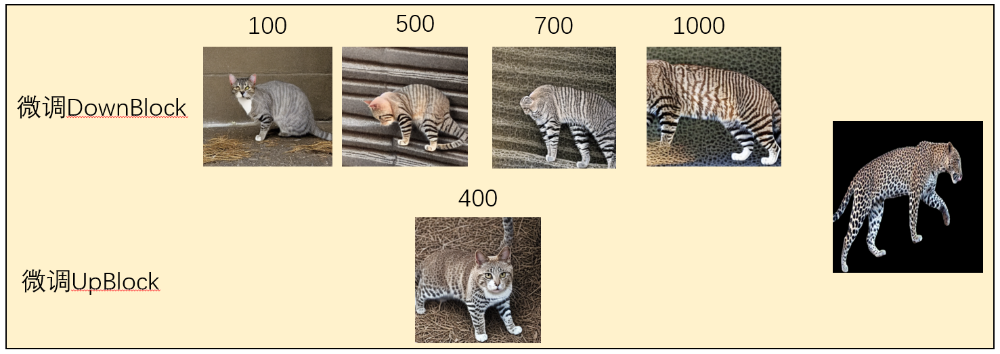
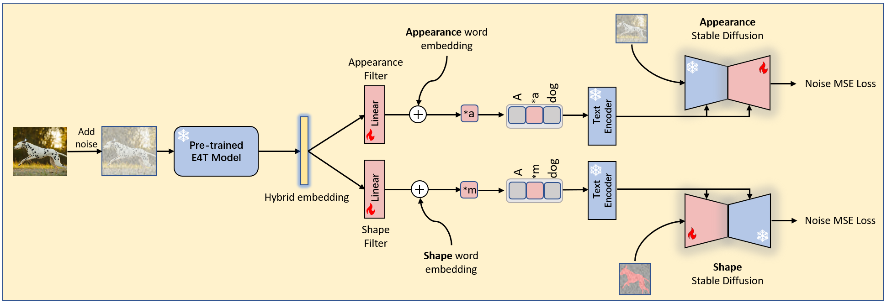
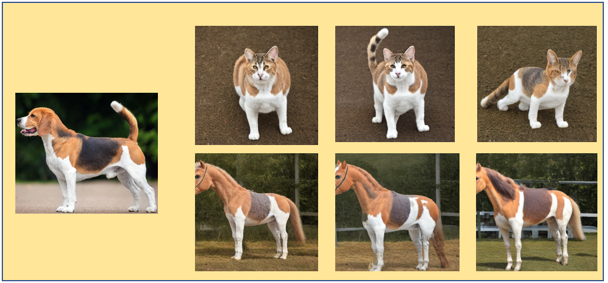
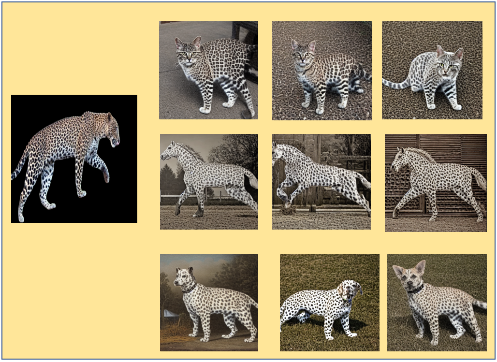
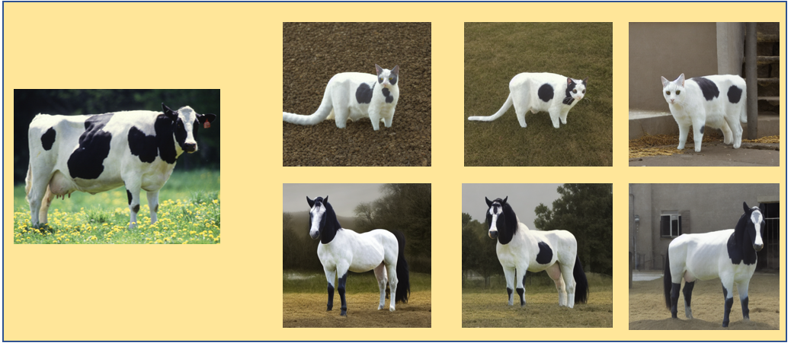
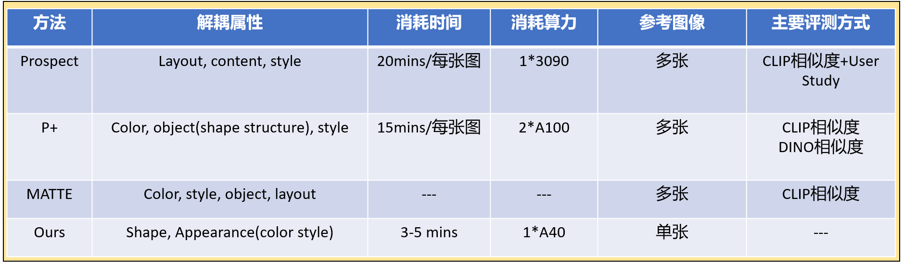
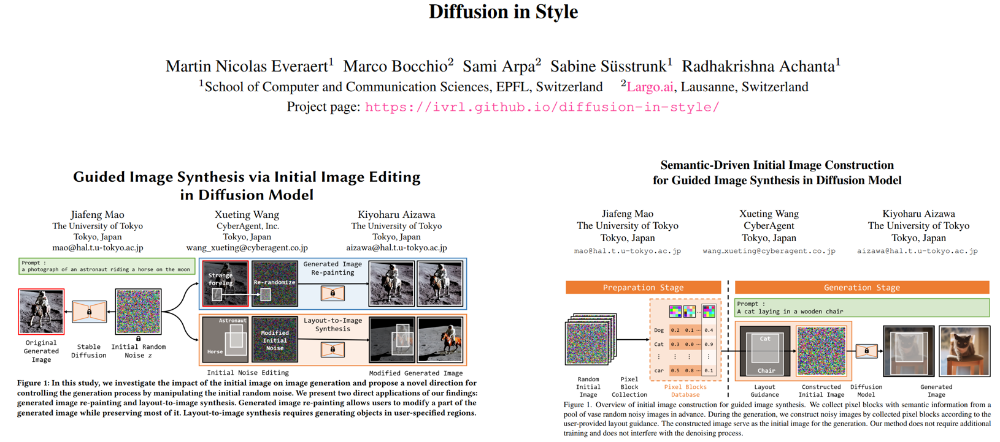

## **汇报大纲**
* 当前的解决方案
* 当前的初步结果
* 与相关工作的比较
* 下一步的优化方向

---

## **当前的解决方案**

### Insight
* Stable Diffusion中的UNet能够储存一张图像的所有信息，包括shape和appearance，但是这些信息分布在UNet的不同区域。**只要针对特定区域进行微调，即使仅给定一张图像，也可以学习到appearance和shape信息。**
* UNet中的**Down block**负责学习**shape和结构信息**
* UNet中的**Up block**负责学习**appearance和外观信息**

      

---

## **当前的解决方案**

### **实验验证**
* 输入一张reference图像，分别微调Down、Up blocks，然后输入测试文本a cat in the appearance of *a. 观察实验现象：

  

  

  

* 可以发现，**Down block**负责学习给定参考图像的**shape和结构信息**。
* **Up Block**负责学习给定参考图像的**appearance信息**。

### **方法架构**

  

---
## **当前的实验结果**

### **Appearance Inversion**

  

  

  

### **Shape Inversion**

* 待定

---

## **与相关工作的比较**

对于关注subconcept inversion或者学习的工作，主要是以下三篇工作：
* P+
* Prospect
* MATTE

详细的对比情况如下：

  

我们是第一个能够实现：

**在仅给定一张参考图像的情况下，实现appearance和shape子概念学习**

---

## **下一步的优化方案**

* **属性驱动的噪音初始化**
  * 有一些文章认为标准的高斯噪音，并不一定适合学习。**因此，设计特定属性分布的Noise可能更合适**
  *   

* **进一步减小过拟合的影响**
  * 

---

## 和马老师讨论记录
* Unet中的Encoder--》CNN Low level feature
* Unet中得Decoder--》恢复图像，细节信息
* 微调的是特定的网络模块或者layers
* 确定到shape和appearance
* 跨类别要大：
  * 如果给定奶牛，如果能够做到跨物种，跨类别的话，比如直接应用到椅子上。
  * 如果给定任意的mask，能否得到满足mask shape要求的生成图像 猫 狗

* 两个事情
  * 华为周三交流，为深入交流做准备，展示更多的结果 PPT，21号下周四下午2.15-4.00 , 扩展到5-6页，bkg，related work，limitation，method，results。
  * 我的文章，张轶博的文章，郑王的文章，1月份老师时间充裕，新加坡那个博后参与进来。和王浩的相关性比较大。

准备ECCV。需要帮手尽早引入。