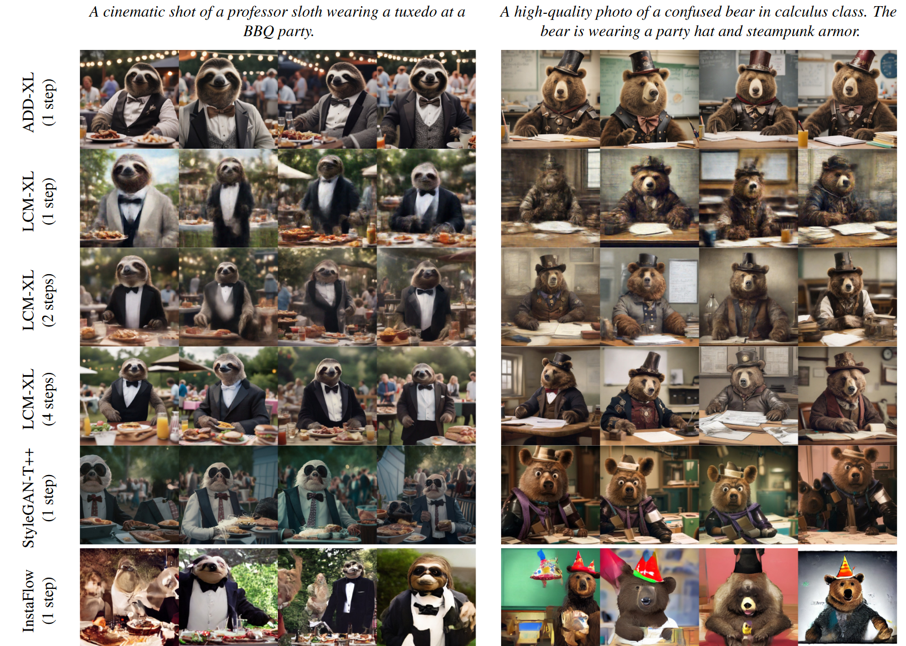

## In a word

本文是StableAI有一篇很好的工作。主要是通过引入对抗损失和teacher-student 蒸馏损失，实现了Stable Diffusion 1-4步推理，不仅速度快，而且生成图像质量也非常高。

  

## Motivation

本文的动机实际上很简单，就是Diffusion Model虽然生成图像质量很好，但是需要多次sampling多个时间步，因此，生成速度较慢，无法实现实时的图像生成。而GAN-based的方法生成速度很快，不需要多次迭代，但是生成的质量和Diffusion Model相比实际上还是有些差距的。

因此，作者想能否结合二者的优点，既能速度很快，又能获得很好地生成质量呢？

## Method

  

如上图所示，作者采用的方法非常简单直观。
* 首先作者构建了一个Teacher-Student模型。Teacher model就是正常的、需要多次迭代采样的SD模型，比如Stable Diffusion XL。Student model这里在模型大小上没有变化，还是SD，只不过相比于Teacher Model，其所用的时间步很少，只需要4步。
  * 正常的一张图像，经过加噪，由学生模型给出降噪结果，并解码出图像。
  * 这张图像将加噪，并输入至teacher模型，teacher模型给出其输出的图像。
  * 上述两张图像之间将计算MSE loss。这个蒸馏损失的作用就是将教师模型的高质量效果蒸馏给学生模型。
* 其次，作者构建了另一分支，也就是对抗损失分支。通过一个鉴别器，来对学生模型生成的图像和真实图像进行真假辨别。

以上就是方法的核心部分。通过上述的两个损失的约束，student model便可以以很少的步骤甚至是1步，就可以生成高质量的图像。

## Results

  

## Tags
#ADD
#Diffusion_加速
#teacher_student
