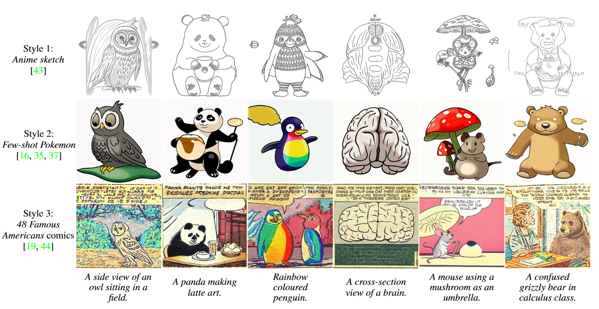
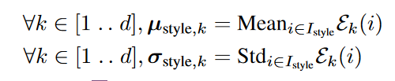
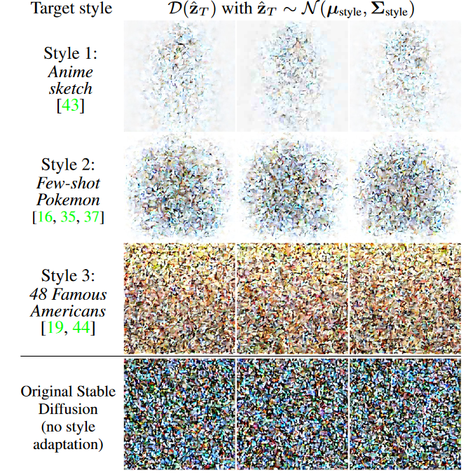
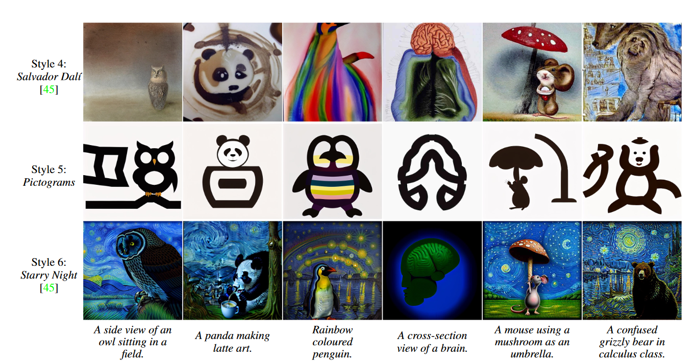

## In a word

  

这篇工作，作者发现了一个很有趣的现象，**初始的噪音分布是会影响style的学习的**。**如果能够设计一个style-aware的noise分布，将会大大加快style的学习**。

## Motivation

作者发现，现阶段的学习style的方法主要分为：
* Prompt engineering
  * 直接输入文本提示
* Textual Inversion
* Finetuning Stable Diffusion
* 或者是用梯度指导latents更新

但是上述的方式都会存在以下问题：
* style学习的不充分、不精确
* 计算资源消耗较大
* 微调模型会出现灾难遗忘

于是作者设计了一个新的方案，从初始噪音出发，加快学习速度，改善学习质量。

## Method

作者的方法非常简单，首先作者基于一个假设：他认为style的学习跟初始噪音分布有关系，如果是标准的0-1高斯分布的话，可能会阻碍目标style的学习。因此，作者设计了一个style-aware的噪音初始化方式。

* 如何构建style-aware的noise？
  * 非常简单，只需要选择一组target style图像，然后使用VAE encode，然后求解编码特征的均值和方差即可。此均值和方差将作为noise的初始化使用。
      
  * 然后基于此noise，微调Stable Diffusion即可。

感受一下这张图，可以发现作者设计的噪音和初始的噪音还是不一样的。
  

## Insight

噪音的初始分布很重要，我记得之前也有工作做了类似的事情。但是我在zotero中没找到，后续再找吧。
#TODO

## Results

  

## Tags

#噪音初始化
#style-image