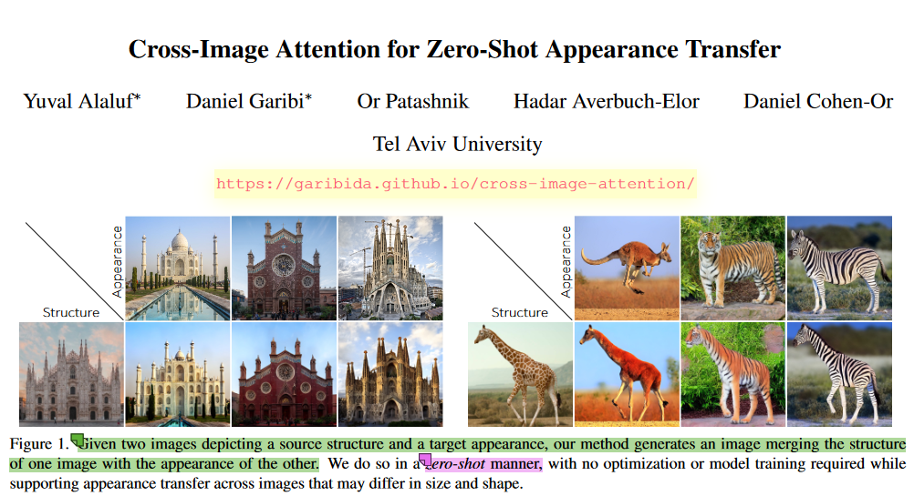
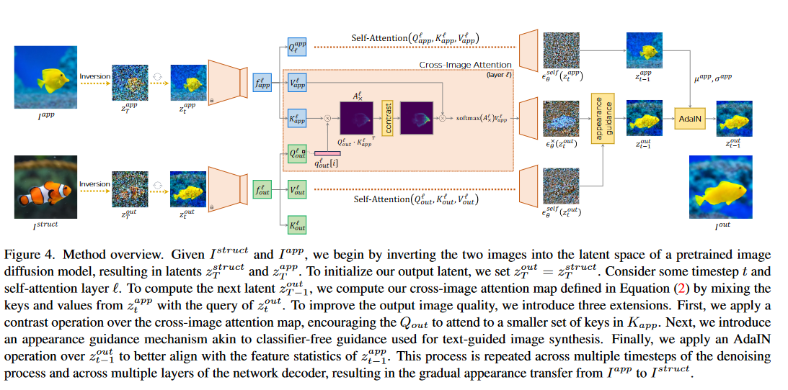
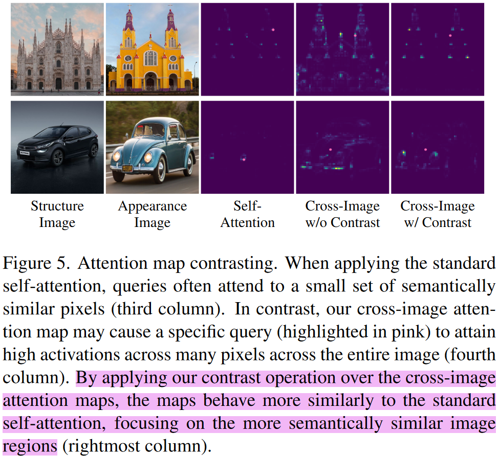
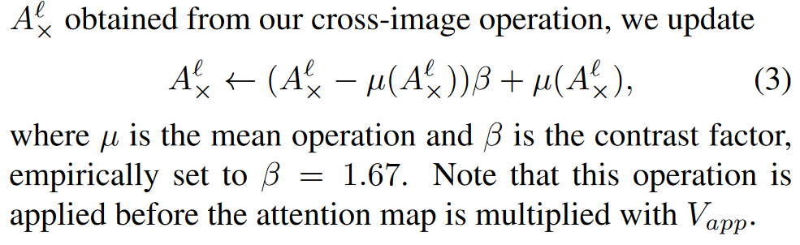
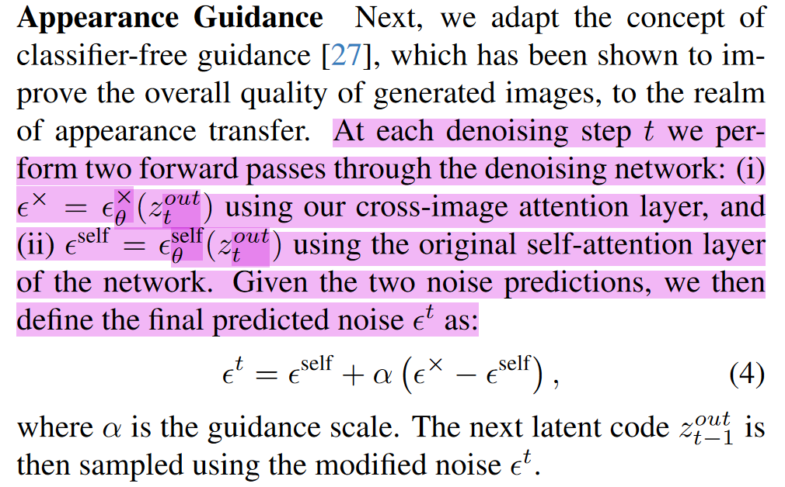
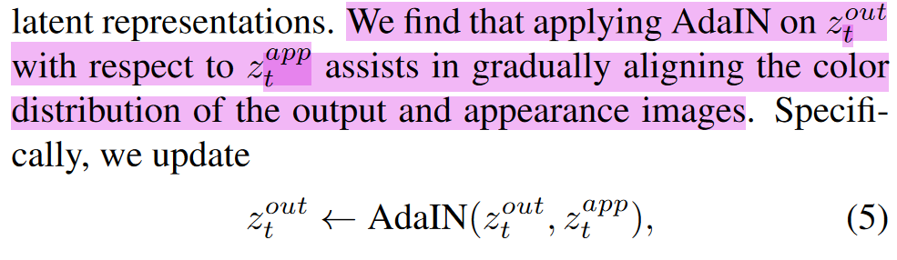

## In a word

本篇论文提出了Cross-Image Attention的方法来实现Zero-Shot的Appearance Transfer。
从实现的效果来看，模型的效果很鲁棒，对于不同size和shape的物体，或者是差别很大的cross-category都能得到很不错的效果。

  

## Motivation
总结来看，之前的工作都是需要训练一个非常复杂的generator。同时在做Appearance Transfer的时候，source和target的跨度不能太大。

我在[[Appearance Transfer发展历程|04_Resources.02_Paper.Notes.Image_Translation.Cross-Image Attention for Zero-Shot Appearance Transfer]]一文中，总结了这个领域的发展脉络。也算是动机之一。

## Method

  

最核心的内容，就是作者提出的Cross-Image Attention。这个东西是什么呢？请看下图：

  
我们简单总结一下，给定structure image和一个appearance image，我可以令K，V是Appearance Image，Q是structure image，然后他们做常规的Self-attention操作，可以发现，两张不同的图，长颈鹿和斑马的语义是能够对应起来的，比如脖子对脖子，腿对腿。

基于这个观察，作者就搞了Pipeline中的两个分支，上面的分支用来接收appearance target图，并得到K和V，注意这个KV是从appearance图像中提炼出来的，自然就能包含了外观信息。此外，下分支接收structure source 图像，得到Q，用来保持结构或者shape。

然后细节来看，作者是用cross-image attention替换了self-attention，替换的位置是在decoder的32\*32，64\*64 self-attention区域。

cross-image attention就是能够将appearance图的信息transfer到structure图上。但其实这一点有些效果，但也会带来一些伪影（伪影是指在生成的图像中，出现的一些与原始数据不一致的纹理、噪声或不自然的部分）。因此作者又做了三个component来提升效果。

我们依次来介绍一下：

---

**Attention Map Contrasting:**

  

由下图所示，作者发现cross-image attention通常会关注到全图的稀疏区域，而self-attention则是关注到很少的区域，因此作者认为是cross-image attention语义对应还不够好。也就是不够显著。
因此提出了Attention Map Contrasting方法：

  

**实际上上面式子就是对原始Attention Map的线性变换，这个式子的作用是将对原始矩阵 A 的每个元素减去均值后的结果进行放大，并再加上均值，从而使得矩阵 A*中的元素分布更加集中。**

---
**Appearance Guidance：**

这个component的出发点，就是令SD在降噪更新的时候，朝着目标appearance的方向去更新。有点类似于Classifier-free guidance。

  

---

**AdaIN**

> 自适应实例标准化（Adaptive Instance Normalization，AdaIN），将内容图像（content image）特征的均值和方差对齐到风格图像（style image）的均值和方差

实际上作者观察到得到的图像和输入图像之间存在着color distribution shift，正好AdaIN能够解决这个问题。

  

## Insight

1. **两个图之间的cross-attention，是能够得到语义上的对应关系的**
2. **基于MasaCtrl等论文的观察，SD中freeze住self-attention的K和V，就能够保持appearance不变。**

## Results
略

## More

**一些相关的文献工作：**

**Translation相关：**

* Diffusion self-guidance for controllable image generation.
* Diffusion-based image translation using disentangled style and content representation
* Enabling drag-style manipulation on diffusion models
* [[04_Resources.02_Paper.Notes.Image_Translation.Splicing ViT Features for Semantic Appearance Transfer]]

**SD相关:**

* Masactrl: Tuning-free mutual self-attention control for consistent image synthesis and editing
* Tokenflow: Consistent diffusion features for consistent video editing
* Infusion: Inject and attention fusion for multi concept zero-shot text-based video editing

**一些知识点：**
* Neural Style Transfer指的是全局的style学习和迁移
* semantic style Transfer 指的是在两个图像的语义相关区域之间进行Appearance的Transfer