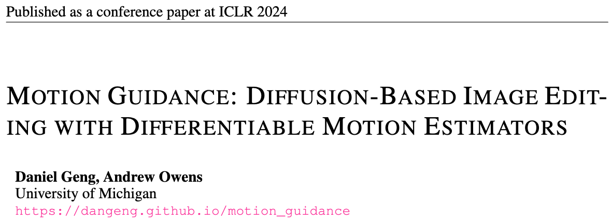
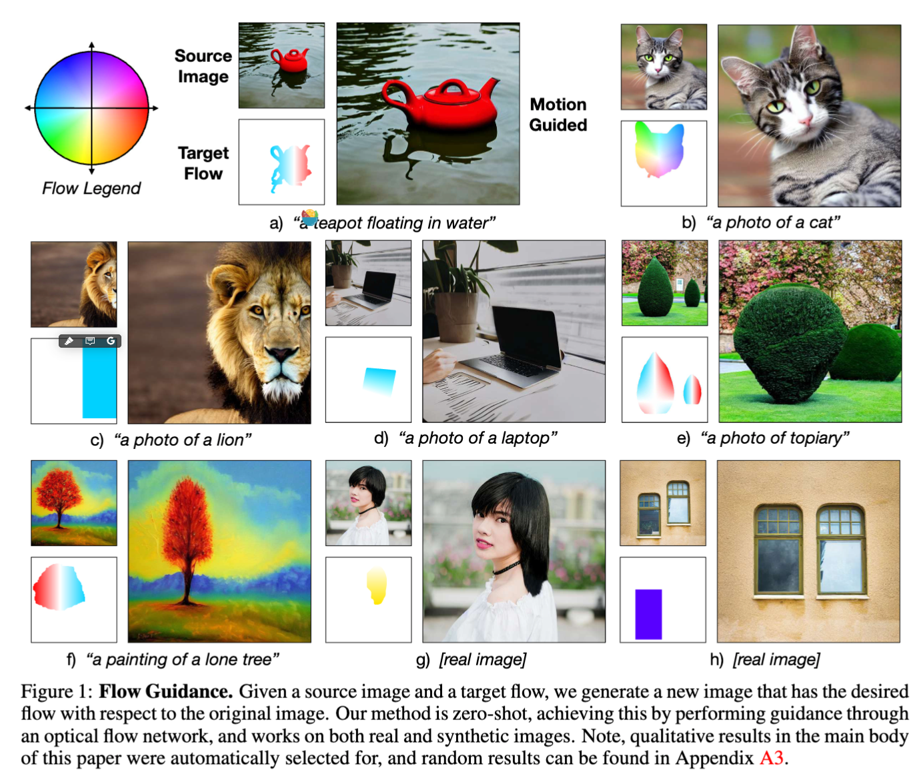
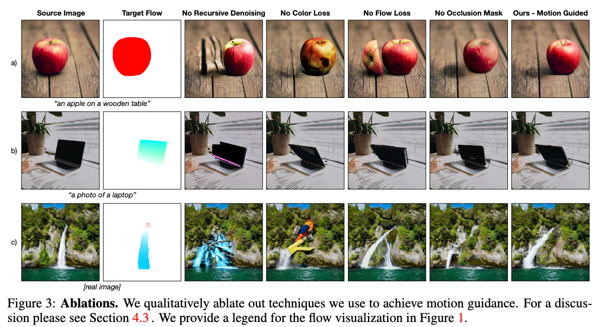
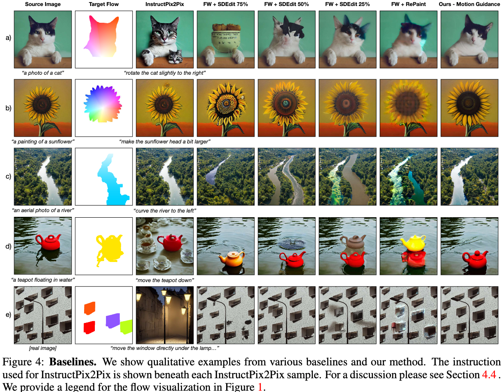

  

## In a word
这篇论文是ICLR2024 poster。本文主要是提出一种基于Motion Flow Guidance的图像编辑方法。通过给定一张输入图像和目标光流，然后根据光流信息编辑输入图像。可以实现物体的精确移动，part的精确编辑等效果。

## Motivation
* 当前的图像编辑方法大多数都只能够对整体的图像进行编辑，而不能精确移动物体的部分。
* 还有些方法依赖于Diffusion内部的特征表示，编辑不高效。
* 即使DragGan-based的方法可以实现一些基于点的编辑，但是他们都是基于单点的移动，无法实现复杂稠密的编辑。

因此，本文提出使用复杂稠密的光流作为指导，进行图像编辑。

## Method

方法非常简单，甚至连图都没画。一句话总结就是：**使用预训练好的光流估计器，估计输入图像和生成图像之间的光流，然后将预测光流信息和目标光流信息计算MSE loss，得到梯度信息，用于更新指导denoising 过程。**

相当于将Classifier guidance中的分类器替换成了光流估计器。

## Results

  
  
  

## Tags
#image_editing #motion_guidance

