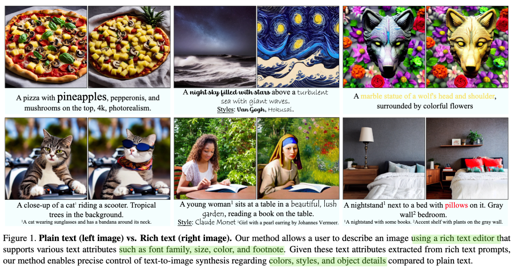
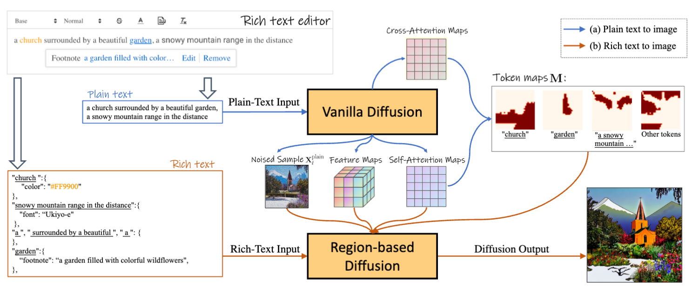
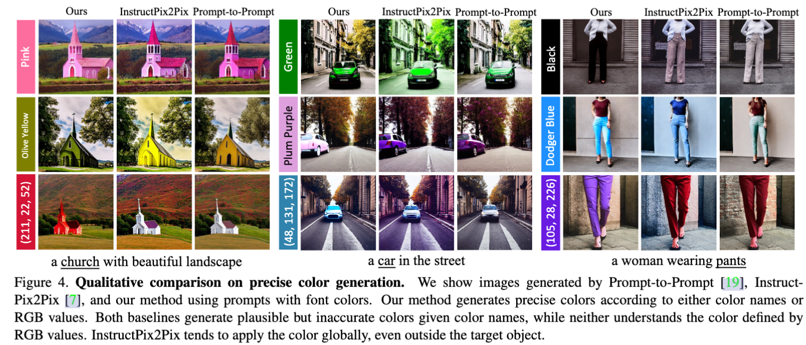
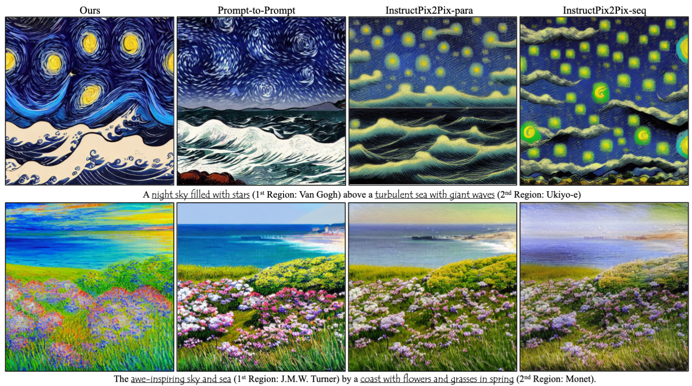
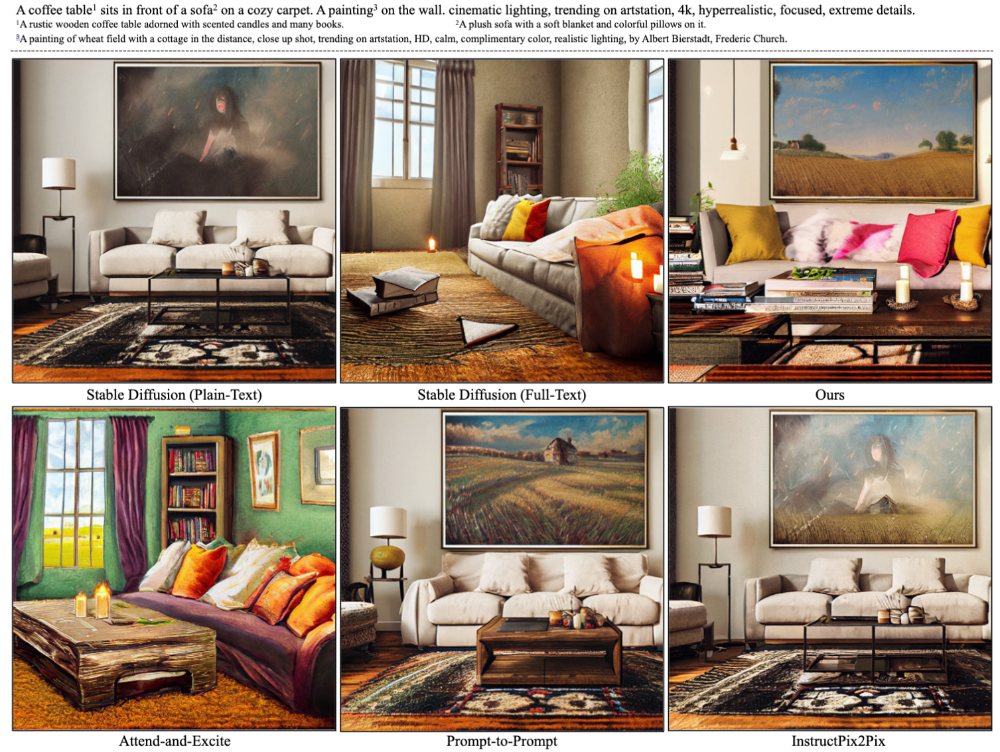
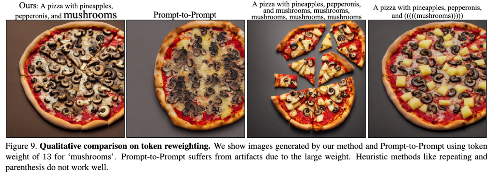
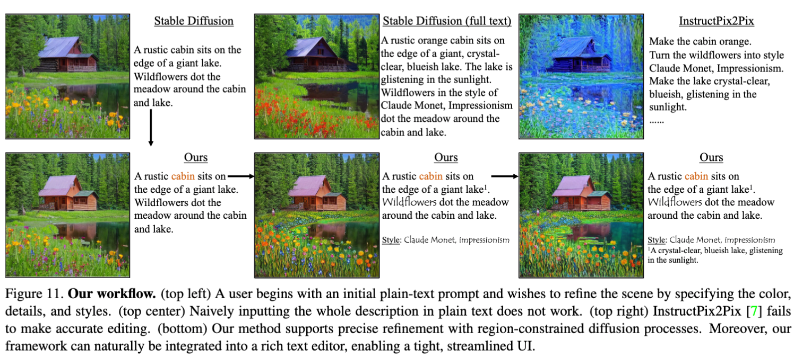

  

## In a word

这篇论文第一次提出了使用富文本来作为提示，驱动图像生成。最大的创新点就是提出了新的任务，衍生出很多的novel应用。这个任务是Rich-text-to-image generation，即从富文本中生成图像。富文本相较于传统的文本，可以更加丰富、更加丰富的表达信息。本文最关注的还是以下几点：

* 富文本可以自由设置**字体颜色**
* 富文本可以调整文本的**字体样式**
* 富文本可以**加粗文本**，来re-weight文本权重
* 富文本可以**写脚注**，从而提供更多的描述信息

## Motivation

大多数的图像生成方法使用的是朴素文本驱动图像生成，但是传统文本存在很多限制，例如描述不清晰等。因此，本文提出了使用富文本作为输入条件，驱动图像生成。

## Method

  

本文在技术上的创新并不大，总体方法的流程图如上所示。

* 首先用户可以输入富文本
  * 富文本会首先转成plain text。
  * 富文本还会转为json形式，主要用于保存attribute信息等。
* plain text将输入至Vanilla Diffusion模型中，主要的目的是得到初始图像对应的attention map，这里包括self-attention和cross-attention。然后利用谱聚类直接对self-attention map进行聚类，得到K个segments。这些segments将和文本tokens进行相似度匹配，得到每个text_span对应的attention mask。也就是spatial layout信息。
* 之后的问题就比较简单了，可以把整个文本，分解为单独区域的优化问题。
  * 因为每个区域目前都有文本对应，比如对于church，我们输入了RGB颜色，对话与garden，有footnote信息。
  * 对于每个区域，我们可以利用对应的文本信息，来优化该区域图像生成，这部分的优化技术其实就是利用Classifier-free guidance来指导更新Xt，也就是test-time optimization。
  * 唯一一点需要注意的是，颜色的学习，作者利用的是生成图像的RGB信息和给定的RGB之间的MSE loss来进行学习。

总体来说，本文提出了富文本引导的图像生成任务，但是整体的解决方法还是基于传统文本+辅助信息+test-time optimization，进行实现。但是富文本这个点，确实优化了人们的输入逻辑，同时也赋予了人们更多的灵活性和自由度。

## Results

  
  
  
  
  

## Tags
#text2img

