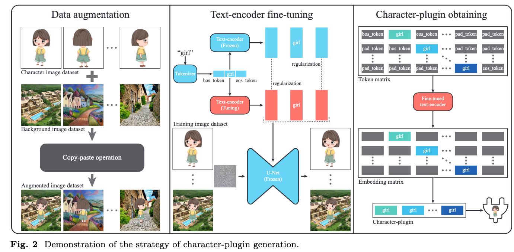

  

## In a word

本文提出了一个卡通人物形象连环画定制化生成方法。整体思路就是给定几张参考图，然后通过网络微调的方法（类似于custom-diffusion）实现概念的学习。之后提出一个提取character embedding的插件。之后利用layout的布局实现布局可控连环画生成。

## Motivation

之前的方法都需要利用T2I模型，在相应数据集上进行训练，这样的话training cost很高。另外，T2I模型生成的连环画往往比较生硬，不够连贯。

## Method

方法其实并不难，可以拆解为以下几步：

* 利用Custom Diffusion类似的架构去微调参考图，这样的话，微调结束之后，就可以得到当前参考图的概念。
* 第二步，作者提出了一个plugin，可以提取character embedding。这个插件的目的是，你可以用多个plugin，分别提取多个概念，然后直接把这些plugin插入到第一步的预训练模型中，可以实现多个概念的定制化。
* 第三步，利用layout的布局实现连环画的生成。这个步骤的核心就是利用layout信息和cross-attention map建立学习关系。

  

上图是Character-plugin的获取流程：
* 第一步利用chatGLM和SD生成很多背景图像，然后使用copy-paste的方式，就可以得到一些新的图像。
* 接下来就是微调Text encoder，使得模型可以提取出character embedding。
* 第三步是利用plugin提取character embedding。这一步是我不太理解的。作者通过逐个滑动character token的位置，得到了一个token matrix，然后把这个matrix输入至上一步微调好的text encoder中，得到多个Character token的embedding。这些embedding组成了plugin的表示。
  * 其实这样的做法，相当于要为每个Character只需要微调一个text encoder。之后，而对于plugin的获得，只是多个不同位置character token embedding的组合。可能这样做能带来更多的信息量。

  

上图就是如何利用plugin embedding和layout 指导SD推理。
* 首先，利用layout信息，可以得到每个token的cross-attention map。然后利用layout直接修改这些cross-attention map。
* 然后，利用plugin embedding，可以得到每个token的embedding。然后用对应的plugin embedding直接替换对应的character embedding。
* 最后，利用SD推理。

## Results

  

  

  

## Tags

#连环画 #卡通人物形象 #Story_Generation