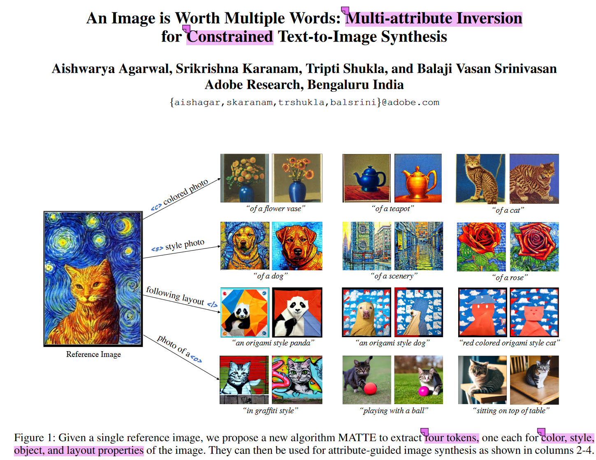
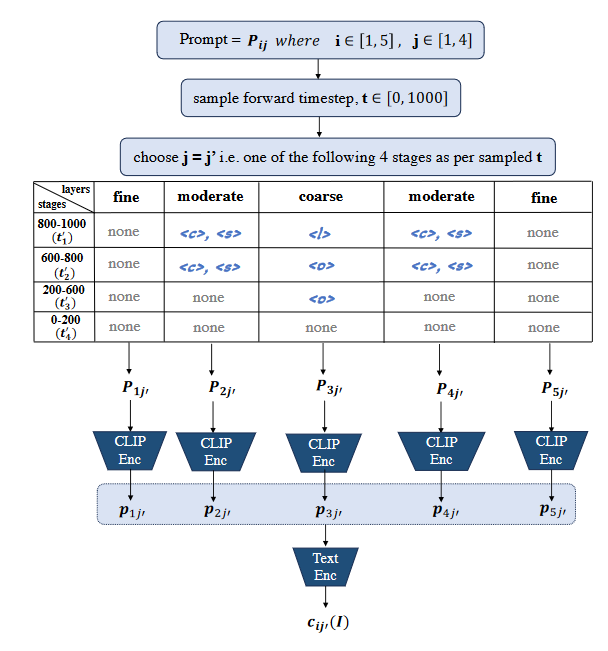
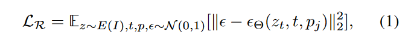
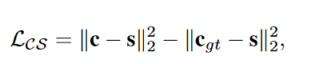
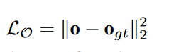
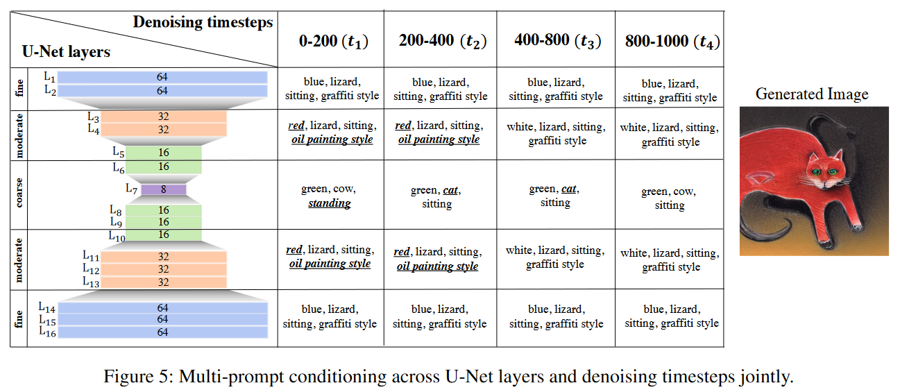
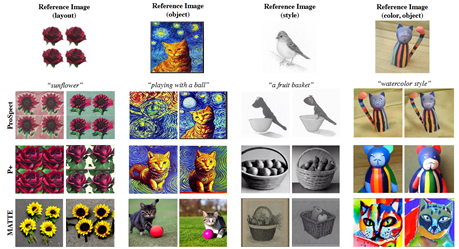
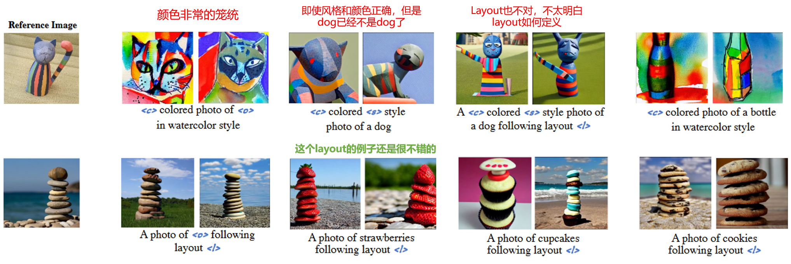

  

## In a word
本文提出了一种反转给定图像的多种sub-concept或者attribution的方法。能够实现四类token的反转，分别是：**color, style, object, layout**

>**注: 在本文中，把Standing、Sitting成为layout**

## Motivation

* 对于诸如Dreambooth、CustomDiffusion等古老的方法来说，他们都只能将给定的reference图反转成一个token，无法反转感兴趣的子属性或者子概念。
* 后续出现的P+，Prospect这两篇工作，分别从Unet的不同层，Inference期间的不同的时间阶段出发，实现子属性的inversion。作者认为这两篇工作都不是很全面，应该结合时间步阶段和Unet的网络层，更全面的inversion子属性或者子概念。

## Method

  

方法其实比较简单，只需要在不同层，不同的降噪阶段，分别注入token。接下来就是优化。
优化的损失有三种，第一个就是重建损失，也就是降噪损失：

  

第二个是color和style的解耦损失：

  

我们的直觉是通过确保学习到的表示 < c > 尽可能接近 c_gt 的表示来推进这个过程，同时也确保两者与 s 的距离相等。这个过程自然地使得 < c > 的表示靠近颜色的CLIP特征空间（因此与 < s > 的表示不同）。

第三个是layout和object的解耦损失：

  

## Insight

  

  
This passage summarizes observations from an image generation experiment involving different conditional settings—color, style, object, and layout. The key findings are:

- **Color & Style**: Specific color or style adjustments at various layers or stages didn't impact the generated image significantly. Color and style seemed mainly captured during initial denoising stages and across moderate layers.
- **Object Semantics**: Despite specifying different objects (e.g., cat, cow) in initial and later stages, the resulting image consistently showed a cat. Object semantics were primarily captured across middle denoising stages and coarse layers.
- **Layout Features**: Altering layout aspects after the first denoising stage had minimal impact on the posture of the generated cat, indicating layout was predominantly captured in the initial denoising stage and specific resolution layers.

In summary, variations in conditions appeared to influence different image features differently. Color and style were predominantly captured during initial denoising stages and moderate layers, object semantics across middle and coarse layers, while layout features were primarily captured in the initial stages and specific resolution layers.

## Results

  

  

## More
其他相关的文章

* [[04_Resources.02_Paper.Notes.Textual Inversion.P+ Extended Textual Conditioning in Text-to-Image Generation]]
* [[04_Resources.02_Paper.Notes.Textual Inversion.ProSpect Expanded Conditioning for the Personalization of Attribute-aware Image Generation]]

## Tags
#subconcept-inversion