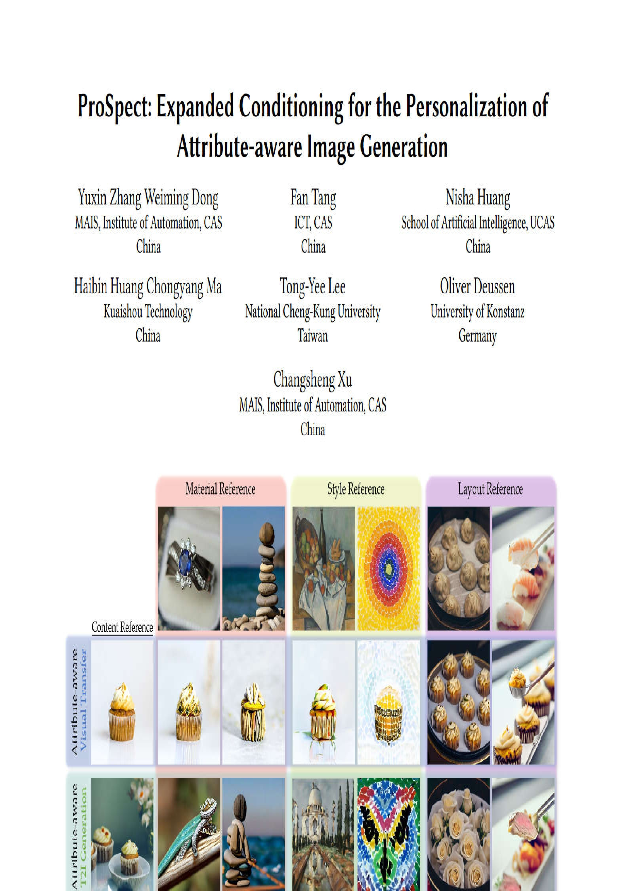
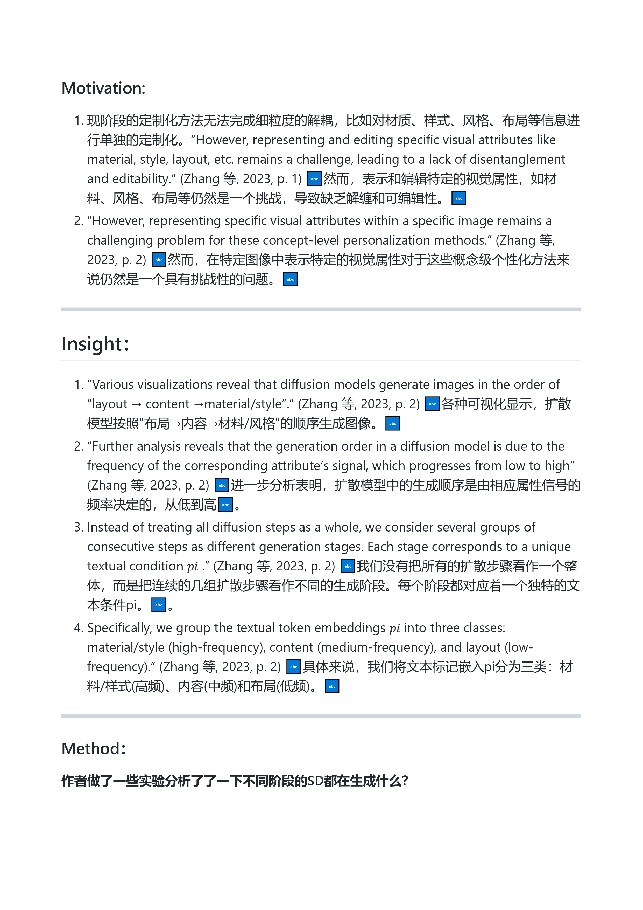
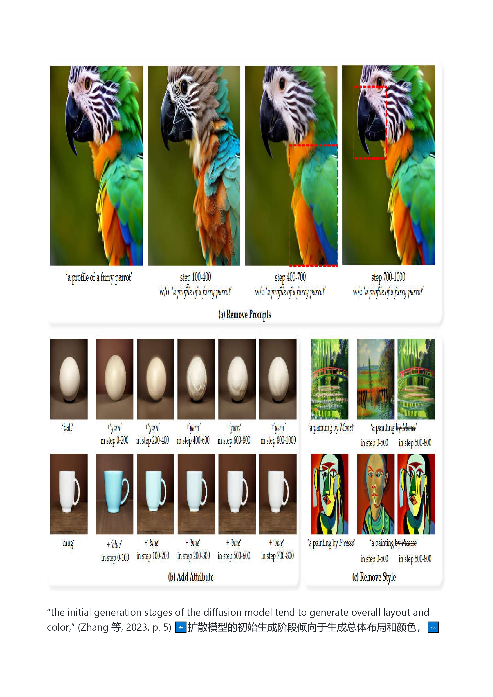
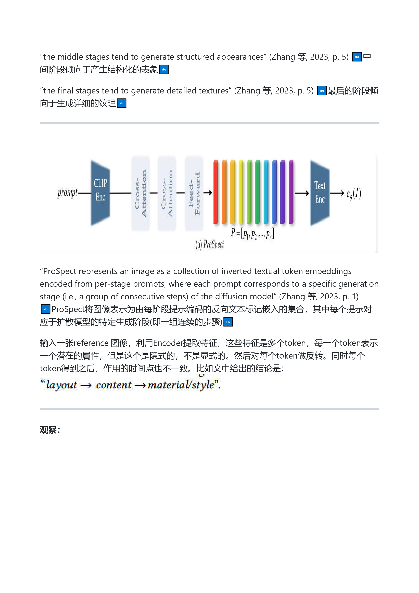
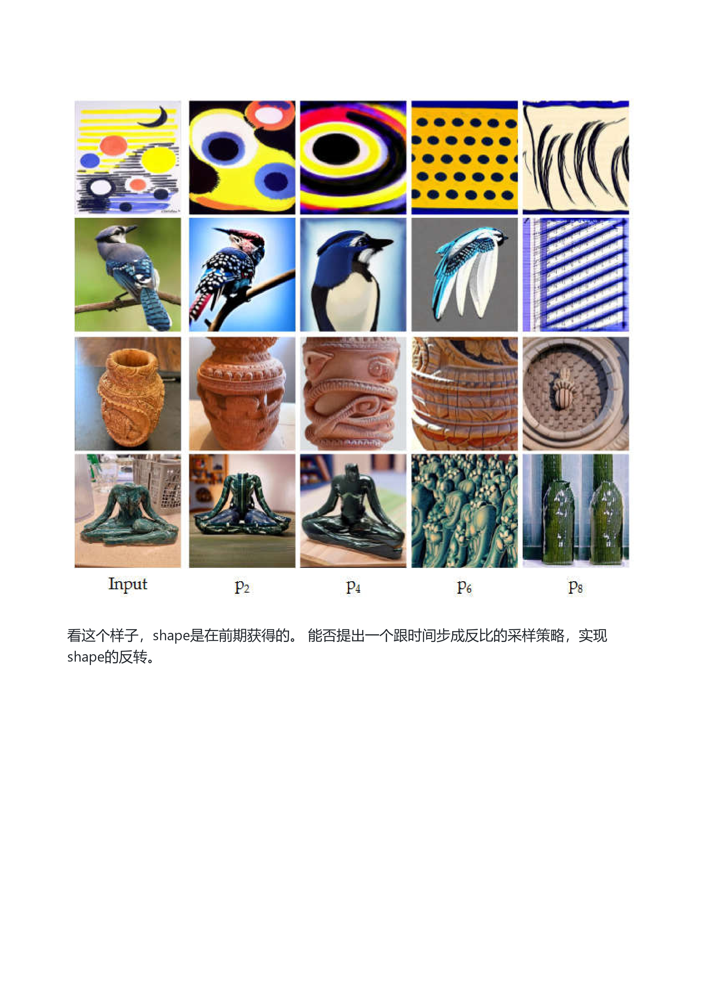

## Reference

[[04_Resources.02_Paper.Notes.Textual Inversion.P+ Extended Textual Conditioning in Text-to-Image Generation]]

[[04_Resources.02_Paper.Notes.Textual Inversion.An Image is Worth Multiple Words Multi-attribute Inversion for Constrained  Text-to-Image Synthesis]]

## Tags
#subconcept-inversion