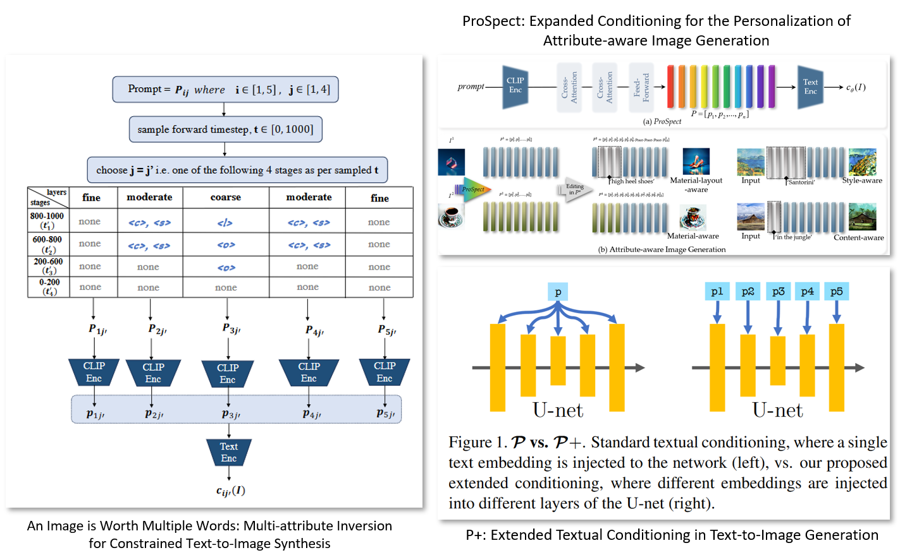
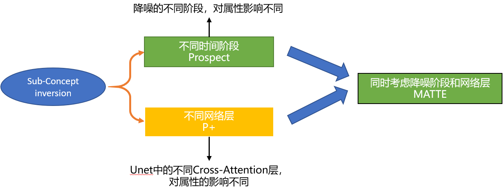
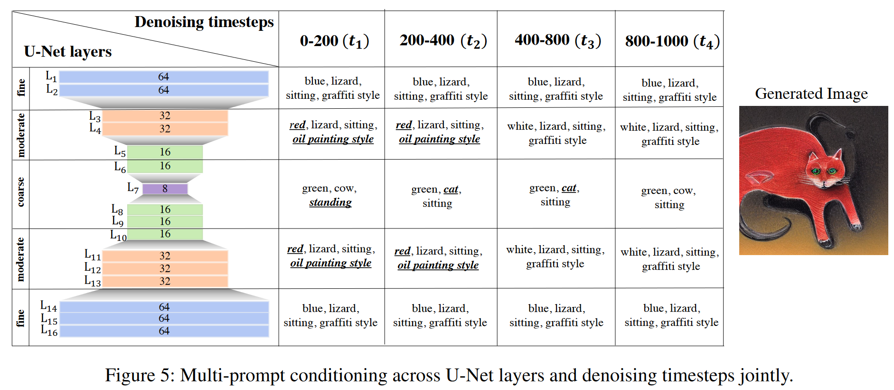
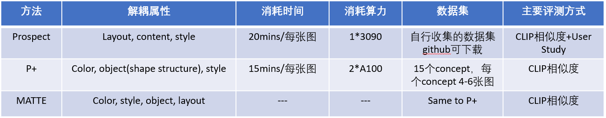

## Sub-Concept Inversion工作总结

  

> **本次工作总结，共涉及上述三篇文章。**

### **什么是Sub-Concept Inversion?**

对于传统的Textual Inversion来说，给定一张或多张Reference Images，网络需要学习一个token的embedding，从而表示当前的参考图（be like）。**而Sub-Concept Inversion指的是，利用多个token，反转Reference Image中的子属性，主要包括style，color，object，layout等。**

### **现阶段Sub-Concept Inversion的主流工作及技术路线**

目前共包括三篇工作：
* P+: Extended Textual Conditioning in Text-to-Image Generation，2023-07-15
* ProSpect: Expanded Conditioning for the Personalization of Attribute-aware Image Generation，ACM MM 2023
* MATTE：An Image is Worth Multiple Words: Multi-attribute Inversion for Constrained Text-to-Image Synthesis，AAAI2024

三个工作之间的关系如下图所示：

  

**在Prospect中，该工作认为：**

* the **initial generation stages** of the diffusion model tend to generate **overall layout** and **color**
* the **middle stages** tend to generate **structured appearances**
* the **final stages** tend to generate **detailed textures**

**在P+中，该工作认为：**

* **object: coarse层**

* **pose或者latout：coarse层**

* **color 或者 style：moderate层**

**在MATTE中，一切都被汇总成一张表：**

  

### **这些方法的详细比较**

  

### **这些工作的缺点和问题**

* 无论是按照时间步换分子阶段，还是按照Cross-Attention Layers划分不同的层阶段，都是一个经验性的操作，比较繁琐，同时一旦划分不得当，效果就会很差。
* 对于单张图像的inversion时间还是比较长，目前来看，最快的是P+，在A100的加持下，能够达到15min搞定一张图。我们的方法目前来看，只需要3min左右。
* 这些论文定义的shape和我们定义的shape是不一致的。我们是用mask衡量的。这些工作都还是大致的shape或者structure。

