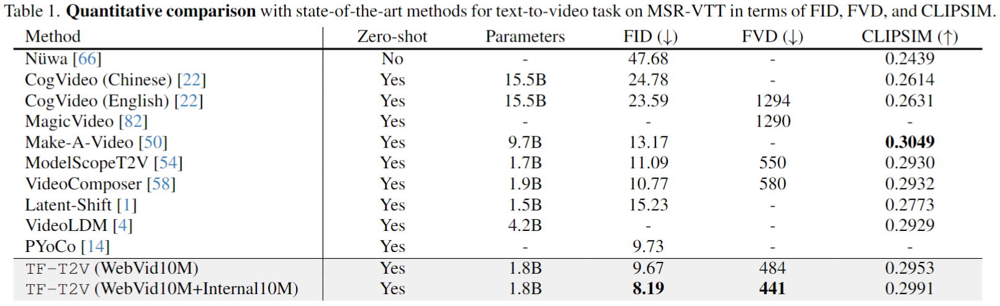

## In a word

  

这是一篇出发点很不多的文章！利用现成海量的图文数据来弥补视频文本配对数据的缺失。从而实现高质量的文本引导的视频生成。

## Motivation
对于现阶段Video Diffusion Model的发展来说，视频文本数据与图像文本数据相比，数量较少，分辨率和质量较低。但是收集和标注这样的视频数据，是一件费时费力的事情。

因此，本文提出**能否利用Text-free的高质量Video数据**训练，实现高质量的Text引导的视频生成。

## Method

  

在讲述方法前，需要明白为什么需要Text-Video 成对数据呢？道理非常简单，如果我们需要**使用文本引导的视频生成，就需要利用文本数据和visual数据建立联系，实现text-visual connection**。

如果没有Text标注怎么办呢？我们可以把Video Generation拆解成Content和Motion。Motion的学习需要有时序信息，而Content并不需要时序信息。因此，这篇论文将该过程拆解成了两个branch，分别是Content branch和Motion branch。

* Content branch的学习则是利用大量高质量的Image-text pairs数据进行学习，这个过程与基本的T2I Diffusion Model训练过程基本一致。
* Motion branch的目的是为了学习时序motion信息，而不需要关注内容信息。因此，这个分支的训练就可以利用Text-free videos数据进行训练。观察到，这个分支的输入是加噪的视频帧输入，然后条件输入的一张图像，取自该视频帧中center frame作为提示。
* 值得注意的是，上下两个分支是参数共享的。这样的话，既可以学习到来自视频的motion信息，又可以学习到text-image的交互信息。

一旦训练好之后，便可以利用右侧的Inference Stage进行视频生成。

## Results

  

  

  

  

## Tags

#video_editing
#video_generation
#Video