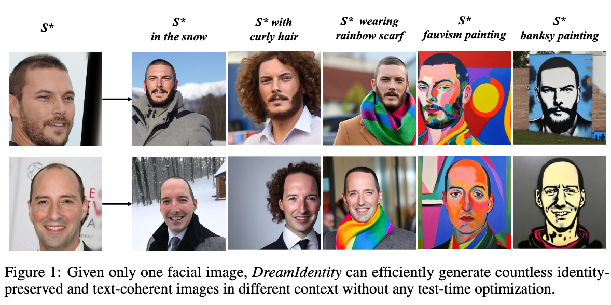
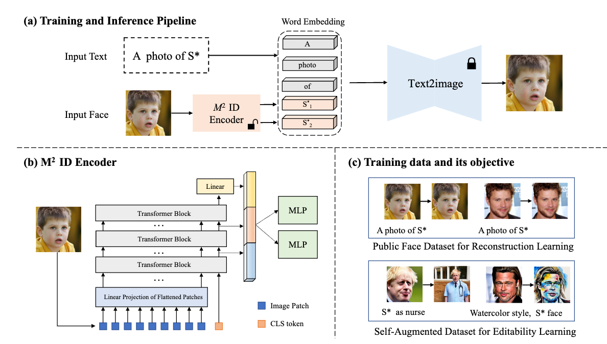
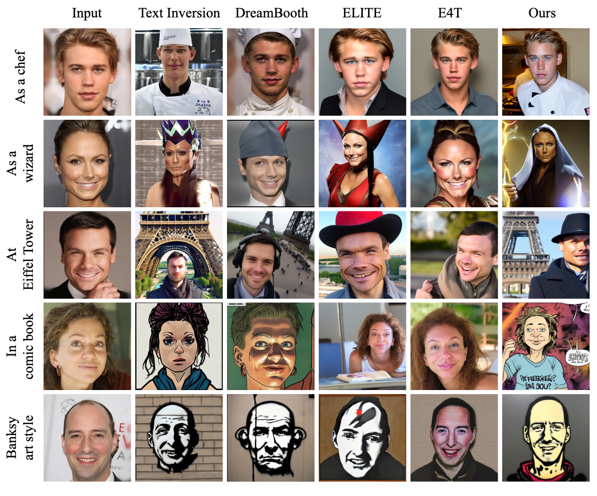

## In a word

  

本文还是主要做给定人脸图像下的定制化内容生成，主要从两个方面去解决这个问题：
* 更丰富的face encoder
* 更一致的数据对构造

整体来看，这篇论文的解题思路和PhotoMaker基本类似。

## Motivation

之前的encoder-based的定制化方法，都没办法实现身份保持和高编辑能力的平衡。因此，这篇工作从两个方面解决上述问题。

## Method

  

* 首先，作者不再使用CLIP encoder作为特征提取器，而是选择了在Face dataset上预训练过的ViT来提取特征，同时提取多尺度的特征，最终得到多个embedding。

* 其次，作者观察到，如果都是用相同的图像作为目标，来执行重建损失的话，那就有些不一致。因此，作者就直接搞了个数据生成的方法，也很简单，原理就是利用SD能够理解名人。具体步骤如下：
  * 先生成一张名人的脸
  * 利用一个edited prompt来生成一张新的图像，作为edited image
  * 这样就得到了source face，edited prompt，edited image。
  * 然后基于这些构造的数据进行训练

## Insight

* 通用的encoder不够细致，对于表示人脸来说。
* 当前定制化的路线，参考和目标是一张图，有些不合适。

上述这两点，在PhotoMaker中也有体现。

## Results

  

## Tags

#人脸 #定制化 