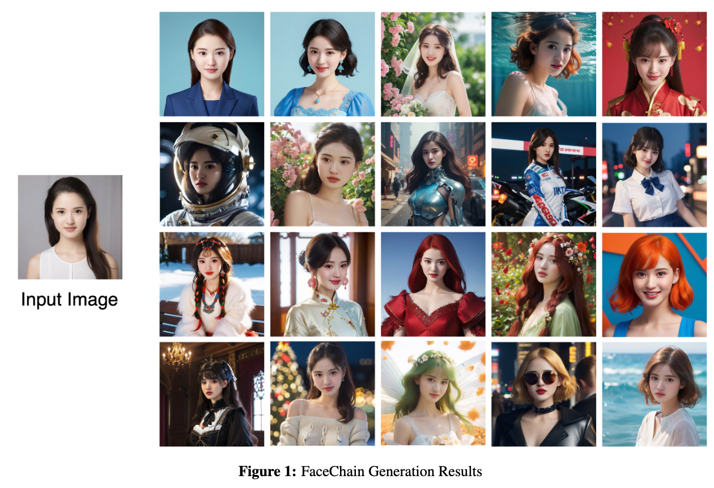
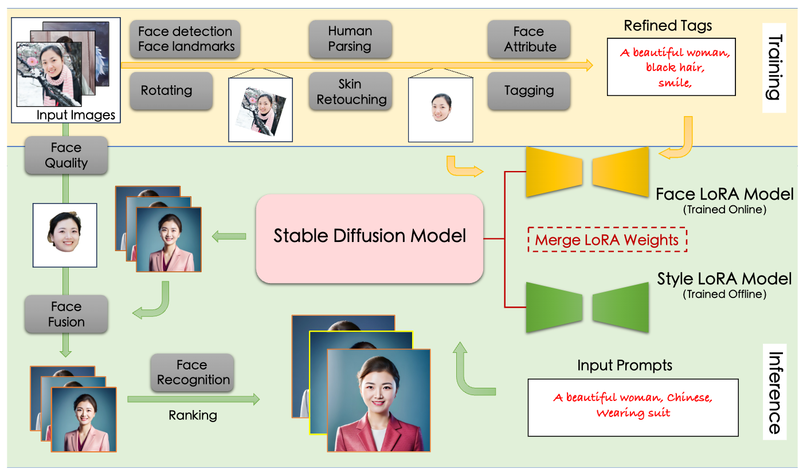

## In a word

  

本质上还是Style+人脸的定制化，不过这篇工作是利用LoRA来实现的。一个Style Lora，一个人脸lora。Style Lora提起训练号。而人脸LoRA则是用户上传图像，在线训练好的。然后就可以merge两个LoRA，生成特定Style下的人脸图像。

## Method

  

## Insight

本文对于人脸的Identity的保持，利用的LoRA路线。

## Results

## More

## Tags