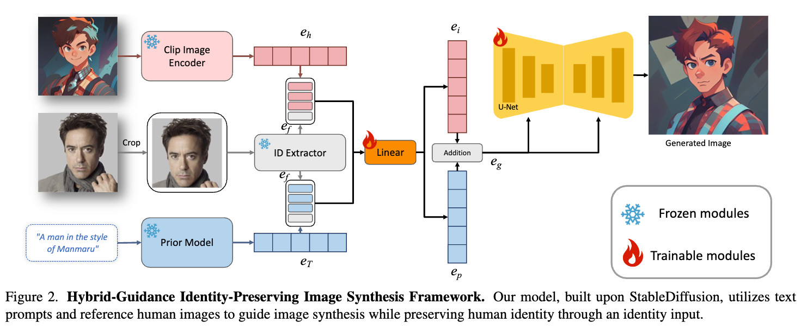
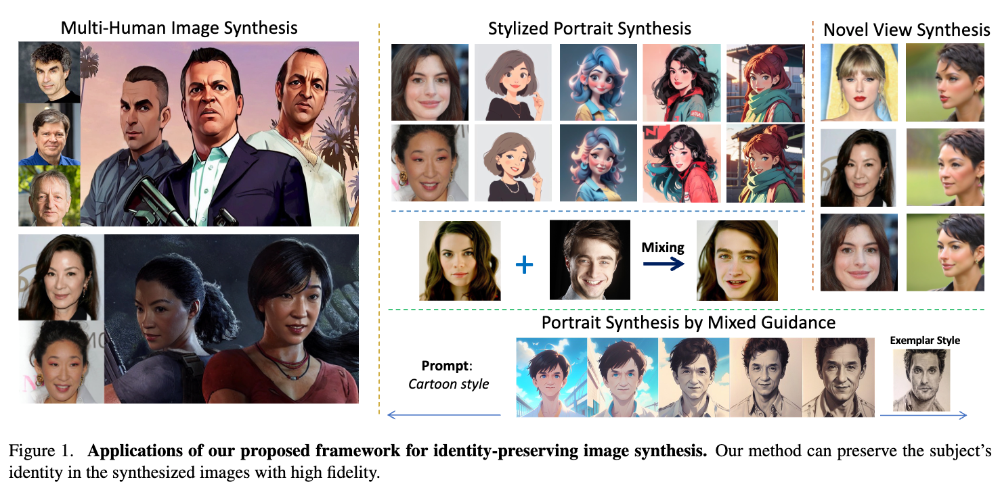

## In a word

FaceStudio这篇论文其实本质上，还是在利用多模态强化的embedding来实现人脸身份的定制化生成。

## Method

  
（注意上图为推理示意图）

方法也比较简单，主要分为以下几个步骤：
* 作者首先利用mask，提取非人脸区域，作为style content的内容输入，提取的人脸图像作为identity content的内容输入。
* 然后分别提取embedding 
  * 文本由CLIP encoder提取
  * 人脸图像由Arcface提取
  * style embedding由CLIP提取
    * 上述三个特征会融合一下，然后过linear, 最后融合加权。注入到Unet中。

其实就没了，然后就是大规模的图像数据进行训练了。

## Insight

* 提升identity，多模态的embedding融合很重要
* 不过这篇论文的style内容居然用非人脸区域的图像，感觉不是很严谨啊。

## Results

  

## Tags

#人脸 #定制化