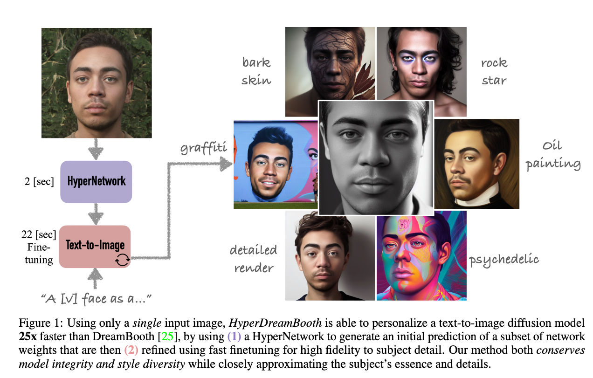
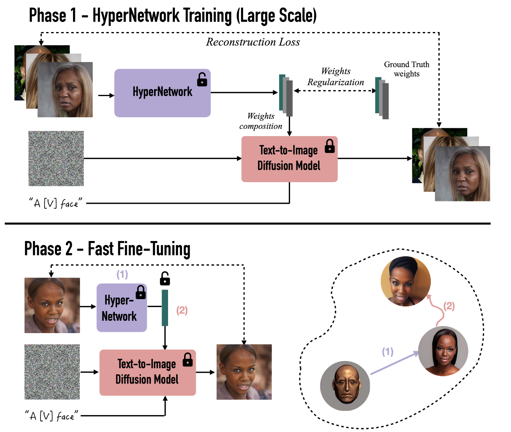
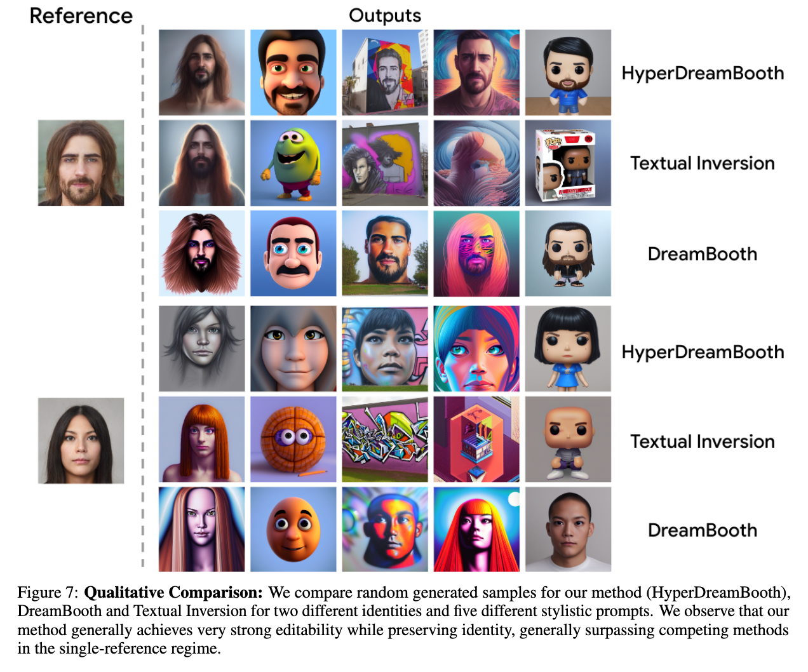

## In a word

  

这篇论文其实就是提出了一个基于LoRA改进版本的Dreambooth，能够快速、低存储的实现人脸图像的定制化。

## Motivation

之前的Dreambooth方法，需要长时间的微调，并且ckpt的存储空间也比较大。因此，后续就有人设计了LoRA+Dreambooth的改进版本，但是这篇论文提出了更加快速、低存储的方案。

## Method

  

方法主要就是两个阶段：
* 第一个阶段：在CelebA-HQ数据集上，针对每个身份ID，训练一个轻量级LiLoRA（r=1），得到每个身份ID的预训练的权重
* 第二个阶段：超网络的作用是从单张人脸参考图像预测LiLoRA的初始始权重，这里包括UNet的交叉注意力和自注意力层，以及text Encoder自注意力层和前馈层。通过两个损失函数进行监督，一个常规的扩散损失函数，另一个是L2损失函数，即以第一阶段训练的轻量级LiLoRA为监督信息。
* 第三个阶段：快速微调，给定一张人脸参考图，根据超网络预测LiLoRA的初始权重，合并到基础模型，然后使用高秩LoRA进一步微调，即Rank Relaxation，以提高生成图像的逼真度。

## Insight

* 给我的感觉就是，不在使用Tuning的方法，而是利用HyperNet的预训练权重，这样的方法就很快，因为只需要single forward pass，不需要微调。所以这一点保证了速度。但是保证不了精度和fidelity。
* Li LoRA，进一步分解LoRA，能够进一步降低存储的cost，但是也保证不了精度和fidelity。
* 最后，还是要用LoRA做一次微调，只不过在上述基础上，微调步骤很少。所以不浪费时间，但是提升了精度和fidelity。

## Results

  

## Tags

#人脸 #定制化 #lora #hypernetork