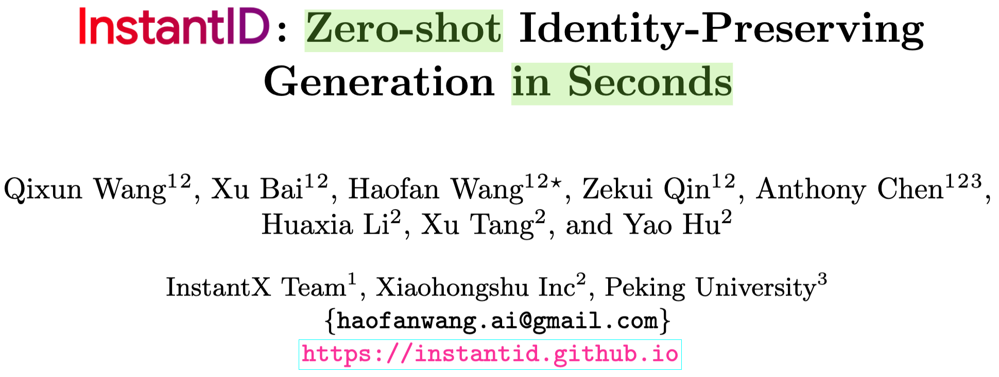
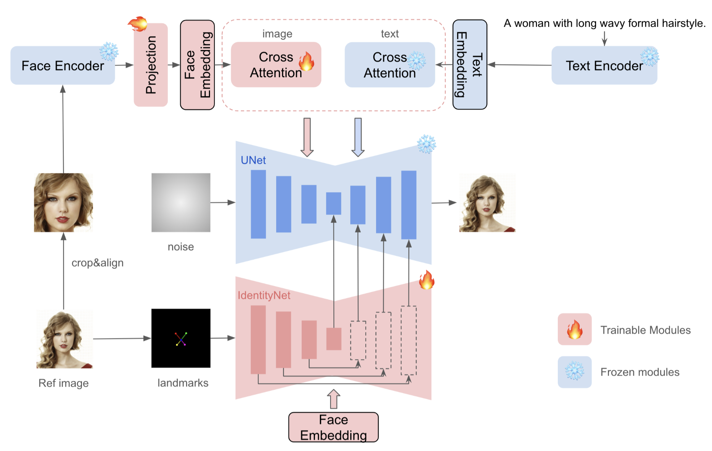

## In a word

  

这篇论文探讨了如何在人脸定制化生成的时候，实现高保真度。作者通过替换信息更加稠密的Face embedding，同时引入ControlNet魔改的IdentityNet，来实现Identity信息的完美注入。

## Motivation

之前的定制化方法，比如Dreambooth或者LoRA等，这些方法都需要大量的微调，其他的基于Encoder的方法也无法实现高保真的身份信息的保存。因此，作者提出了一种，仅仅需要单张human参考图像，就可以实现身份信息的完美保存的定制化生成方法。

## Method

  

该方法的核心组件如下：
* 上分支：作者利用了专用的Face Encoder来提取精细的人脸特征，同时，对于得到的人脸特征，经过projection之后，得到最终的Face Embedding。之后，作者引入了IP-Adapter的核心架构，也就是Adapter based cross-attention. 细节来看，作者这里采用了一个结耦的Cross-attention来专门处理Image embedding信息。
* 下分支：作者利用了ControlNet的架构，来实现Identity embedding的注入。这里的做法也很简单，首先作者基于human图像，提取了5个关键点，作为spatial information注入。其次，Face embedding也将注入到IdentityNet中，之后的过程和ControlNet类似。唯一的不同，就是没有注入文本信息，而文本信息是在adapter中使用的。
* 作者也论述了为什么仅仅使用五个关键点：
  * IdentityNet没有使用复杂的OpenPose面部关键点，而是只使用了五个关键点（两只眼睛、一个鼻子、两只嘴巴）作为条件输入。这样做的原因是，InstantID训练时使用的是真实世界的人像照片，而不是精确裁剪的面部图像。在真实场景中，面部可能只占据图片的一小部分，精确的关键点检测比较困难。同时，简化的空间控制有助于减少对面部形状或嘴巴闭合等冗余信息的过度强调，保持了图像的可编辑性。
* 为什么在IdentityNet中不使用Text prompt：
  * IdentityNet在交叉注意力层中不再使用文本提示，而是完全依赖于面部嵌入作为条件。这样做的目的是让网络专注于与身份相关的表示，不受面部和背景的一般描述的影响。这样，生成的图像可以更准确地反映个体的身份特征，而不是被文本描述中的一般性内容所干扰。

## Results

  

在huggingface上，本人也实测了一下，效果是真的好！

## Tags

#定制化
#face

