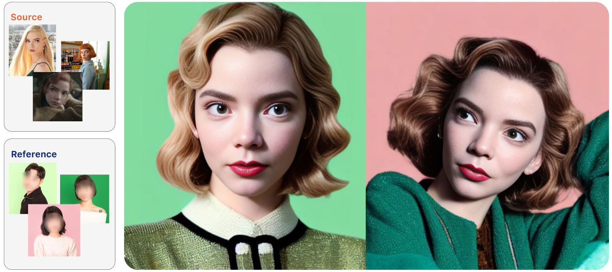
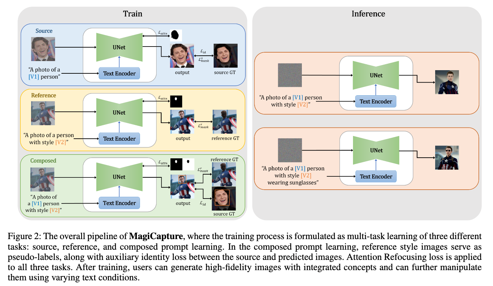
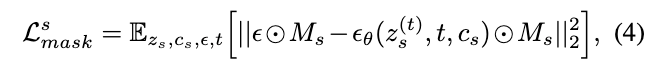
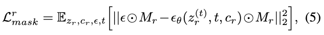
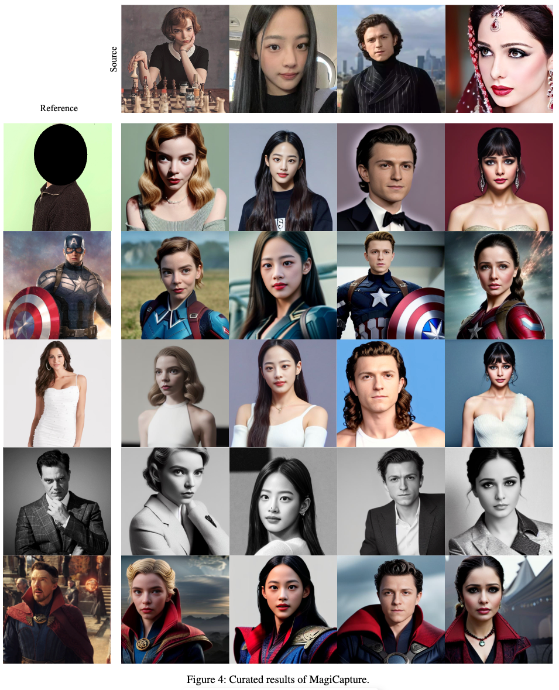

## In a word

  

文本利用了多阶段的Tuning策略，实现了Subject（人脸）和Style两种概念的组合定制化生成。

## Motivation

* 现有的方法无法实现商业可用级别的高清人脸定制化

这篇论文从这一点出发做了一些尝试。

## Method

  

本文的方法也比较简单，所使用的Trick都比较常见。方法共分为三个阶段：
* Source-level Tuning
* Reference-level Tuning
* Composed-level Tuning

首先看Source-level Tuning，这个过程很简单，输入多张参考图，然后不断的tuning 去学习[V1]的embedding。这个学习过程中，使用mask来限制噪音compare的loss的约束。

  

接下来是Reference-level Tuning，这个过程主要用来学习style的token表示，也就是[V2]，只不过在这个tuning过程中，作者引入了LoRA。当然也是用mask来约束噪音学习的区域，也就是非人脸区域。

  

然后就是composed-level Tuning，这个过程就是将两个token表示结合起来，一起学习，因此主要解决的就是二者之间不要耦合。做法比较简单，分别用mask得到人脸区域和style区域，然后分别建立损失即可。

最后就是推理阶段：推理阶段作者也引入了类似于P2P中的cross-attention map操作，也就是用mask来约束map的区域。只不过作者用的思想是：应该令非人脸区域的attention map接近于0，而人脸区域不一定要是1（因为网络传递的过程中，最优的map value不一定是1）这样可以使得推理结果更加准确，减少耦合。

## Insight

如何解决耦合问题？
* 使用Mask来分别限制和区分，训练和推理都用
  
LoRA的作用是什么？
* 不改变模型参数，保留模型的生成能力
* 引入一组小参数，能够学习到更多的细节信息。

## Results

  

## Tags
#人脸 #定制化 #多阶段 #耦合 #LoRA