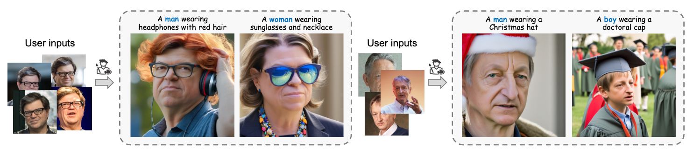
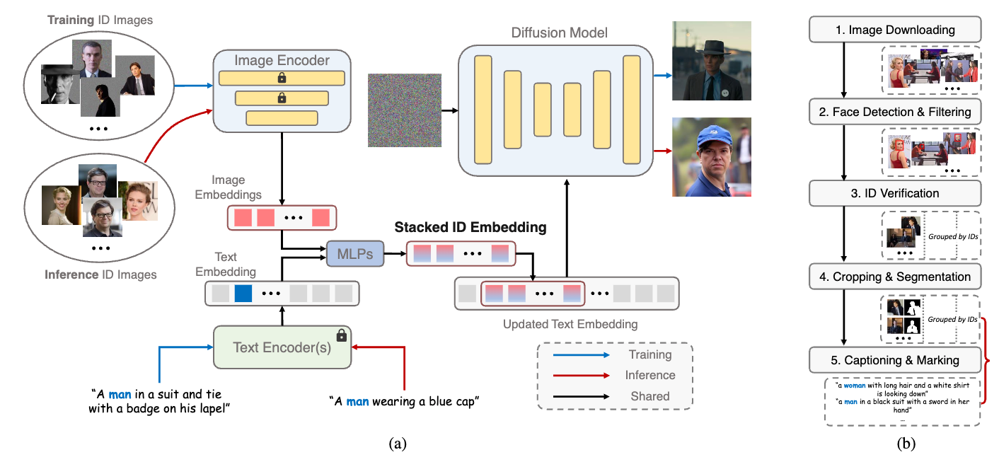
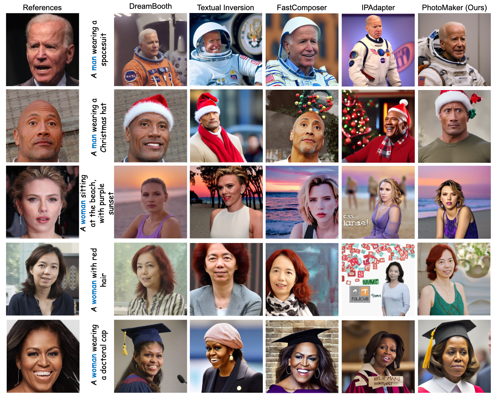

## In a word

  

本文提出了真实人脸图像的定制化方法，主要的出发点是：利用多张参考图像提取一个stacked ID embedding，这个embedding更加丰富，更能保持人脸的身份信息。

## Motivation

之前的人脸定制化方法存在以下问题：
* tuning的时间过长
* 无法实现高保真的身份生成
* 文本的控制不够灵活

因此，作者提出了他们的方法，PhotoMaker，来解决这些问题。

## Method

  

首先，作者提出了两个主要的insight：
* 之前的定制化方法，输入的参考图和目标图都是同一张图，这样就可能导致网路学习到和身份无关的特征，只能得到一些不相关的特点，比如姿态之类的。这样比较影响edit能力。
* 如果只依靠单张图像，来提取ID的信息，可能不够充分。

针对上述问题呢，作者提出了两个不同的trick:
* 输入的参考图和最终的目标图不是一样的，有助于学习身份信息
* 输入多张参考图，从而提取由多张参考图embedding组合而成的stacked ID embedding，可以更加丰富身份信息。 

之后就是注入网络的cross-attention layer，进行训练即可。不过需要注意的事，这个工作，并没有直接finetuning整个网络，而是为每个cross-attention layer引入LoRA，只去训练LoRA的权重，这样做的目的是保留原始模型的权重，不伤害其能力。

PS：LoRA对于身份信息保持，提高一致性真的很有效，目前来看。

## Results

  

## Tags

#人脸 #PhotoMaker #定制化 #lora

