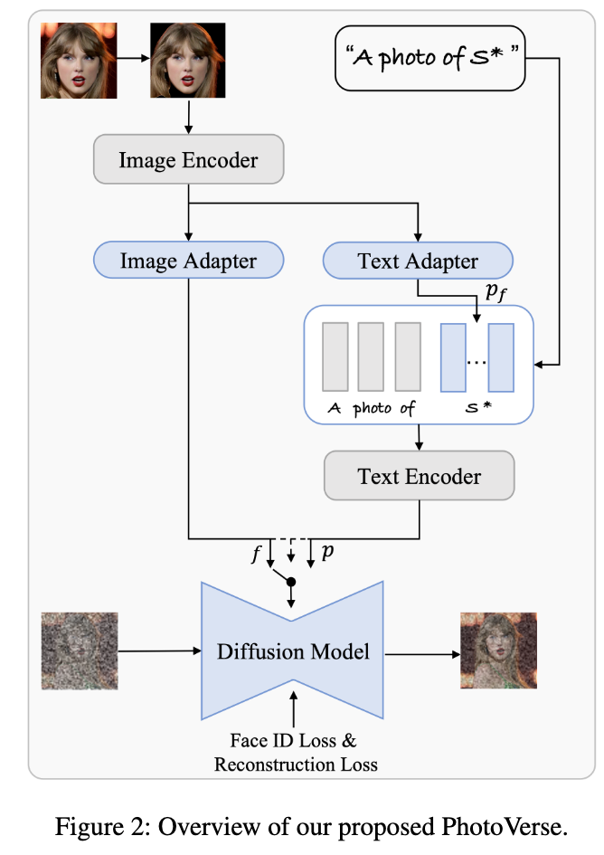
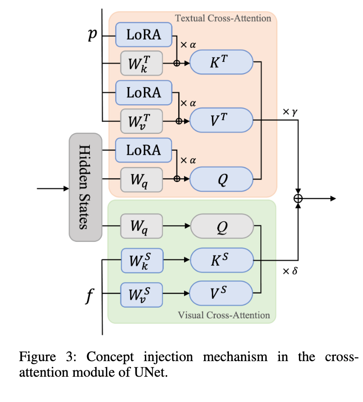
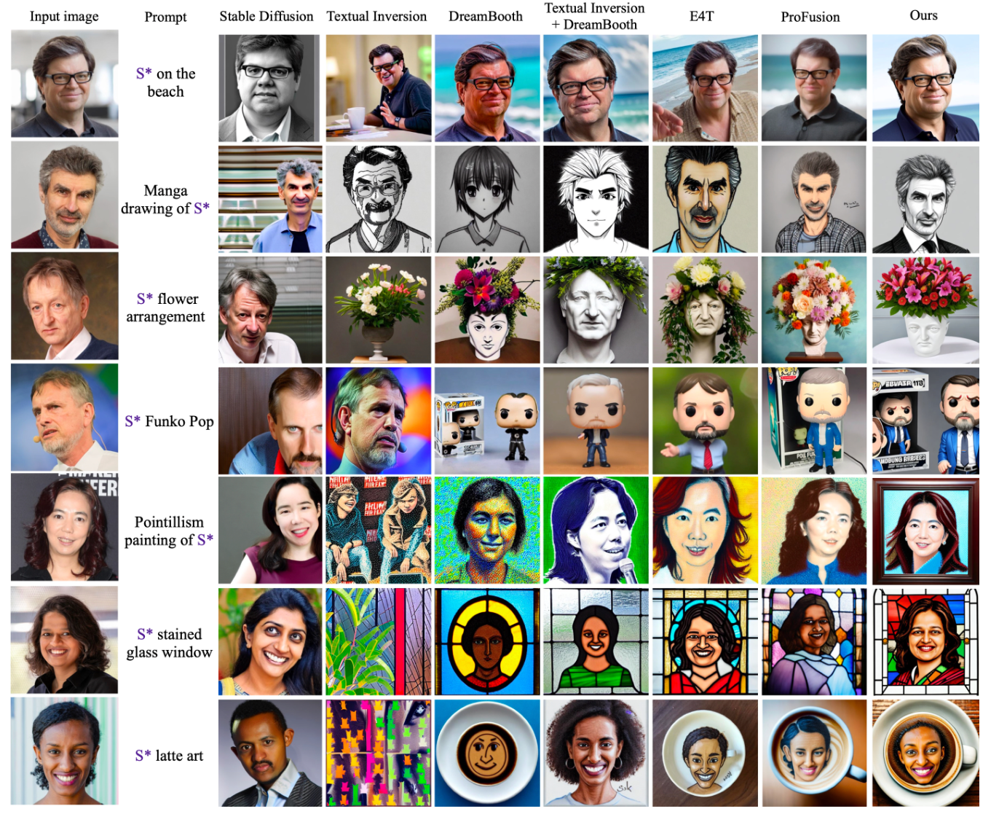

## In a word

这篇论文本质上是通过引入更丰富的identity embedding，来提升人脸定制化的fidelity，通过大量的数据的训练，完成对adapter的训练，实现encoder-based一次性生成，不需要tuning。

## Motivation

之前的方法存在一些问题，比如：
* tuning的时间过长
* fidelity不好
* edit能力也比较差

## Method

  

这篇论文的方法是非常简单的：
* 引入了多模态的embedding，来提升对identity的表示能力
* 引入了FaceID loss，来辅助训练。

  

如何注入多模态的embedding呢？
* 首先对于文本embedding，采用了LoRA来注入。
* 而对于图像的embedding，直接注入。
* 最后，二者的attention输出，要做融合。

上述操作针对attention-layer。

## Insight

* ideatity的表征方式很重要，细节要丰富
* 还是要有lora，引入lora对于提升人脸细节很有帮助。

## Results

  

## Tags

#人脸 #定制化