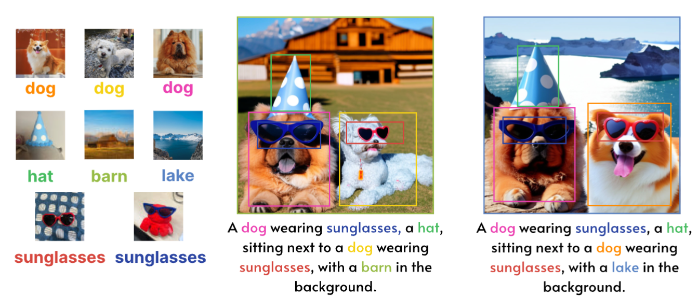
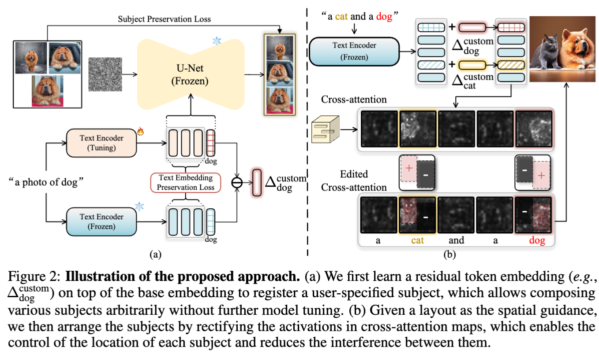
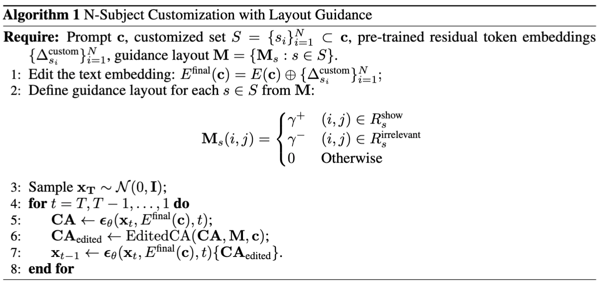
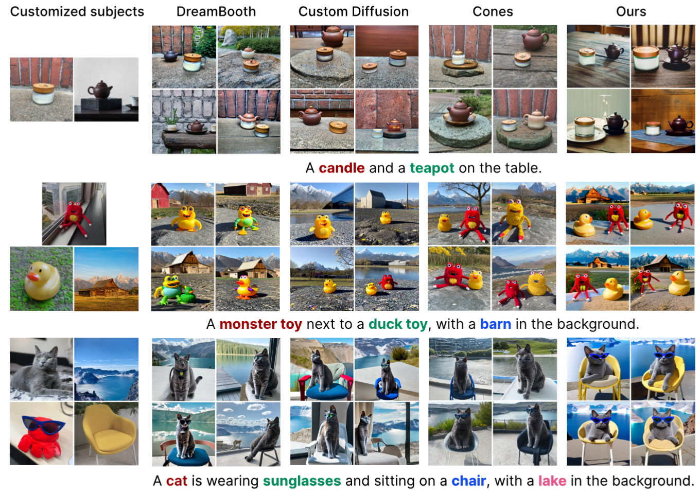
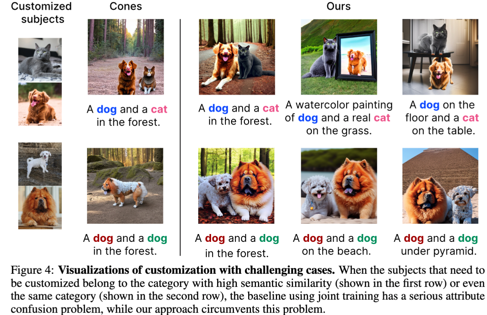
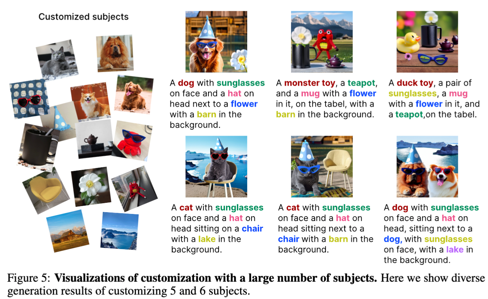

## In a word

  

本文是由DAMO研究院推出的一篇关于**多物体概念定制化生成**的工作。其核心是提出了Concept Text token residual embedding的学习方法，同时利用Layout作为约束，实现多物体的概念定制化生成。

## Motivation

在以往的多物体定制化生成研究中，存在以下的limitations：

* 以Custom Diffusion为代表的先驱工作，需要对每一个concept都训练一个模型，这样的话存储开销较大。
* 不同的concept在组合定制的时候，会出现互相干扰的问题。

针对上述问题，作者分别提出了两个对应的trick，详见method。

## Method

  

本文的方法非常简单，共有两个设计：
* **Subject Text Token Embedding Residual Learning**：其目的是为每一个subject concept学习一个残差文本embedding，这样的话对于每个concept，都只需要存储仅仅几kb的token residual embedding。存储非常高效。
* **Layout guidance**：这一步的目的是约束多物体生成的位置，防止互相遮挡或者概念丢失。总体来说，就是利用人为指定的layout作为约束，修正cross-attention map。

具体的推理细节：

  

## Results

  
  
  

## More
[[04_Resources.02_Paper.Notes.多概念定制化.Mix-of-Show: Decentralized Low-Rank Adaptation for Multi-Concept Customization of Diffusion Models]]

## Tags
#定制化  #多概念
