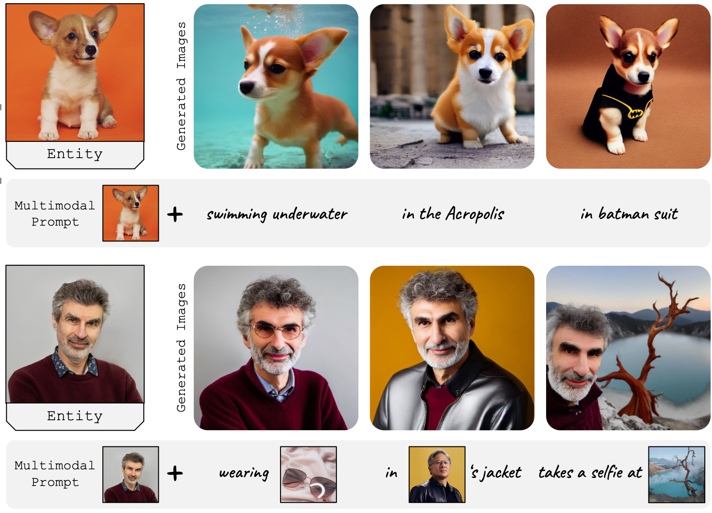
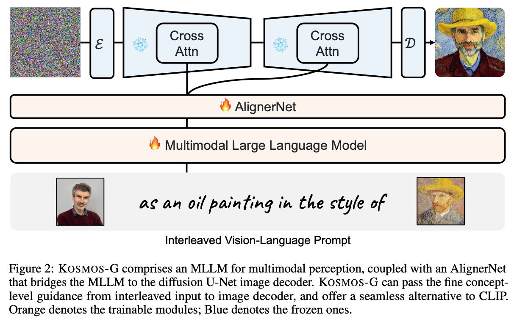
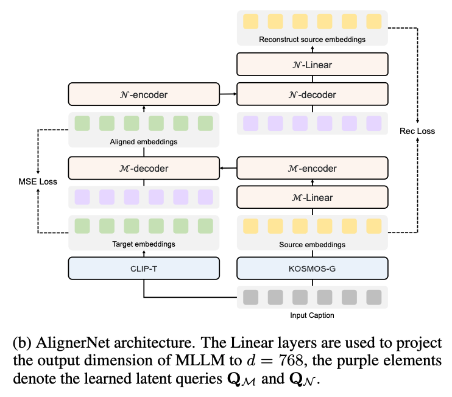
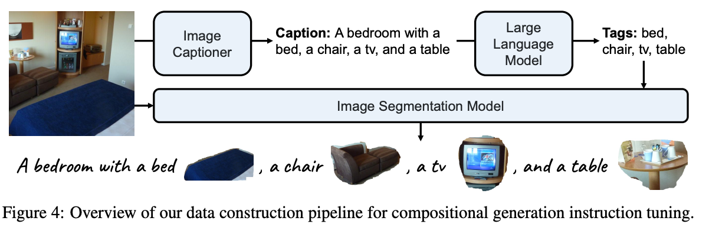
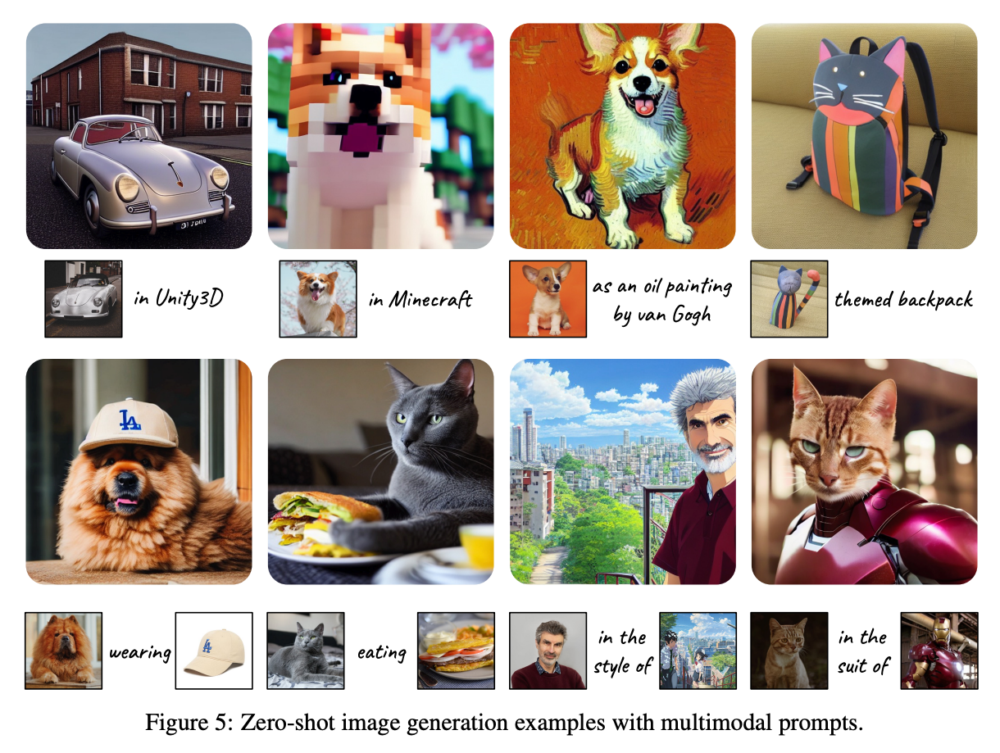

## In a word

  

这篇论文提出了一个不需要tuning的定制化方法，可以处理多个概念。不过整个做法来看，就是通过大量数据的训练将MLLM替换掉SD中的CLIP，这样就可以同时输入图像和文本，进行生成。

## Motivation

现阶段多概念参考下的定制化生成研究的并不是很深入。这篇论文从MLLM的角度出发，将图像都视为语言的一部分，利用MLLM替换CLIP，完成图像和语言联合指导的定制化生成。

## Method

  

这篇论文的方法非常简单，主要分成三个阶段：
* 第一阶段：自监督训练MLLM，输入包括图像和文本，利用Next token预测来学习，目的是使的训练后的MLLM能够同时理解图像和文本的embedding。
* 第二阶段：训练AlignerNet，目的是通过训练将MLLM的文本embedding空间和CLIP的文本embedding空间进行对齐，使的MLLM的输出可以直接被UNet利用。
* 第三阶段：联合训练，最后还要在composition dataset上进行联合微调即可。

AlignerNet的结构如下：

本质上就是一个Transformer encoder + Transformer decoder。

  

Composition Dataset的构造过程如下所示：

  

## Results

  

## Tags

#多概念定制化 #MLLM #CLIP #定制化生成