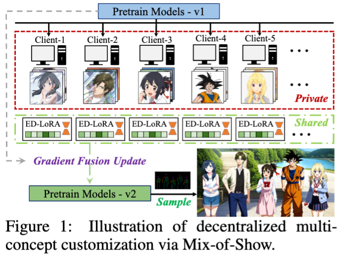
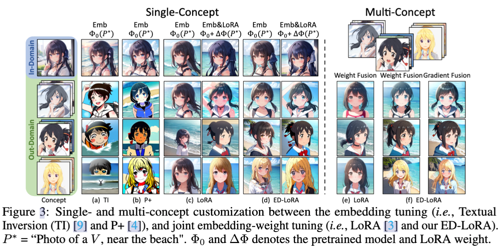
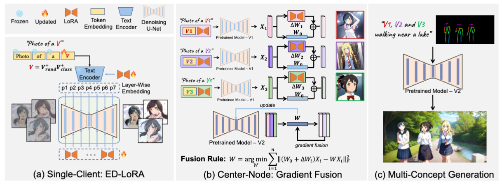
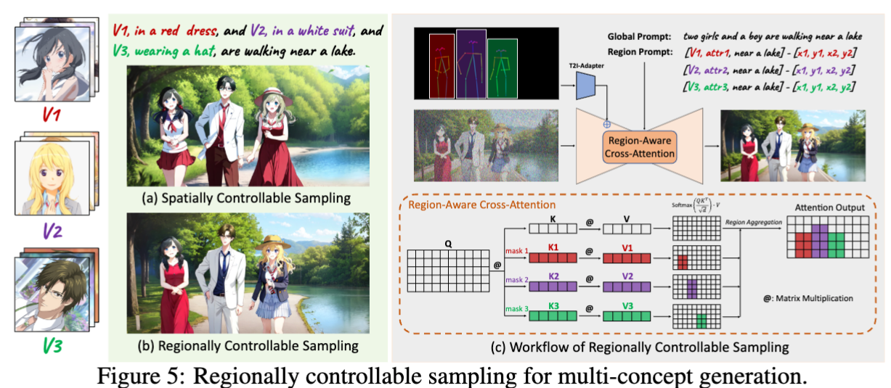
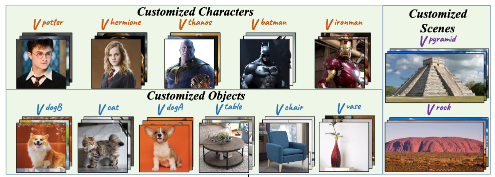
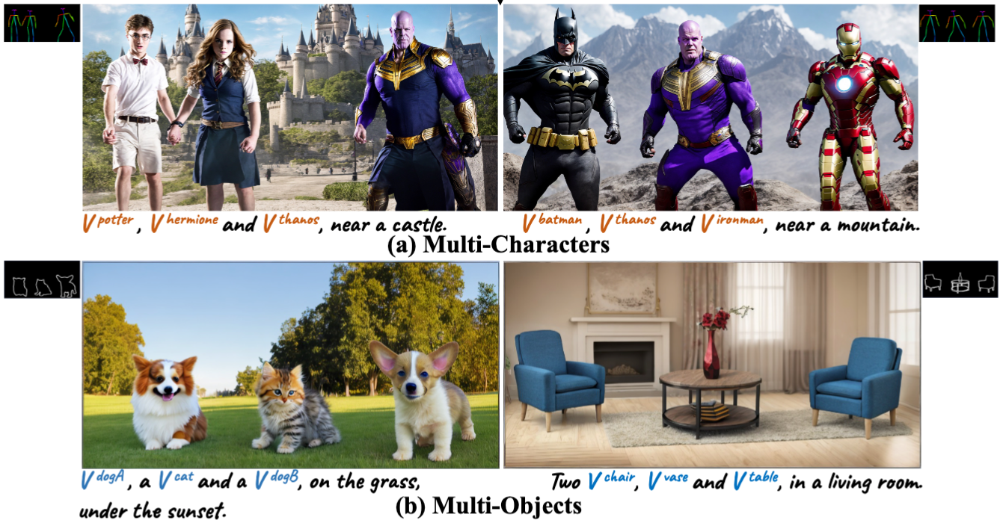
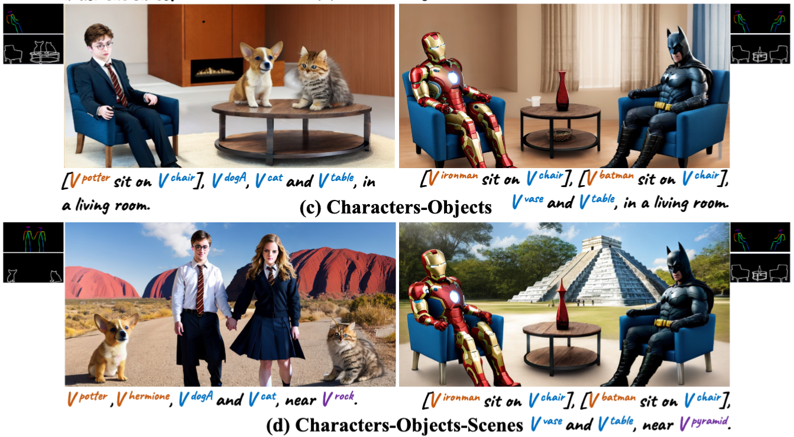

## In a word

  

本文是发表在NIPS 2023的一篇关于**多概念定制化**的工作。主要团队来自于腾讯和新国大。核心思想是提出了高效融合多个LoRA tuned的single concpet model，来实现多个概念的组合定制化生成。

## Motivation

现阶段多概念定制化生成的主要问题有以下两个：
* **概念矛盾**：指的是多个概念的学习会出现互相矛盾的情况。
* **身份丢失**：当多个概念进行融合的时候，往往会丢失某些concept。

本文分别从上述两个问题出发，提出了一种新的多概念定制化方法——Mix-of-Show。

## Method

首先作者团队分析了，text token embedding和LoRA weights在概念学习上的不同倾向。如下图所示：

  

相关结论如下：
* 根据a，b列，可以发现Textual Inversion和P+的token embeding倾向于学习in-domain的concept，而对于没见过的concepts，则无能为力。
* 根据c，d列，可以发现token embedding仅能补货域内的concept，当配合使用LoRA weights时，可以补充学习out-of-domain的concept。这说明，LoRA本质上还是学到了concept identity。
* 根据e列，当多个concept的LoRA进行融合的时候，往往会出现concept identity的丢失。

根据上述观察，作者提出了几个改进的措施：

  

  

* **embedding decomposed LoRA (ED-LoRA)**：其实这个点核心就是利用了P+的思路，使用多个embedding注入，增强embedding的表达能力。
* **Gradient Fusion**：相比如传统的加权融合，梯度融合可以更好地保留不同concept的特征。
* **regionally controllable sampling**：这个trick的目的是避免属性绑定错误或者是丢失一些物体。核心就是利用物体的mask，重构cross-attention map。

## Results

  

  

  

## Related Work

* CONES V2
* Custom-Diffusion
* SVDiff

## Tags

#paper_idea
#定制化
#多概念