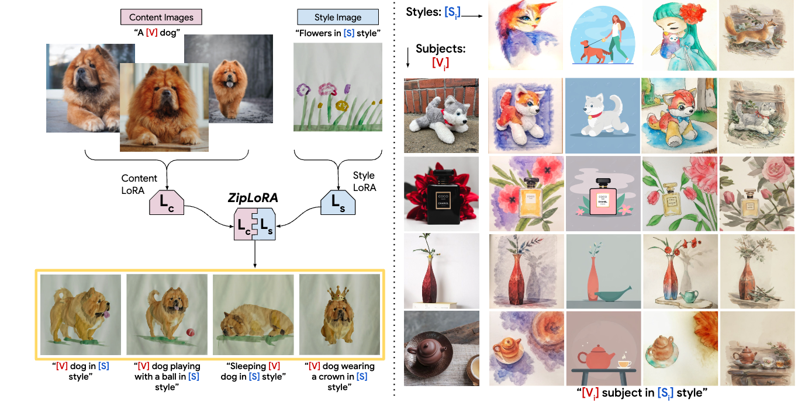
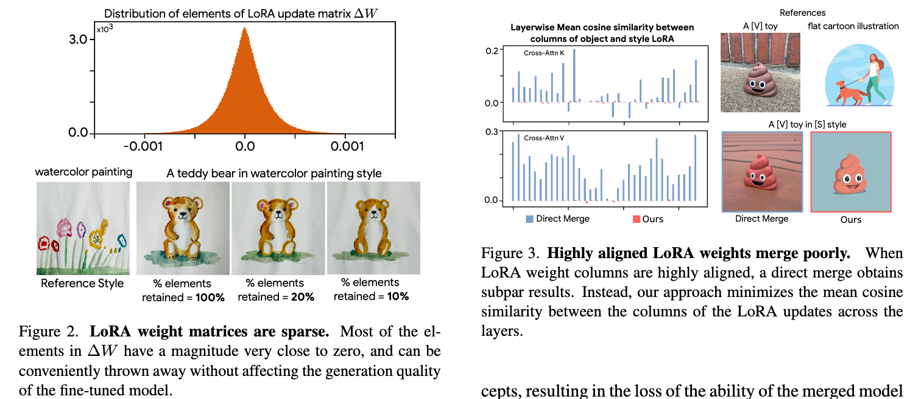
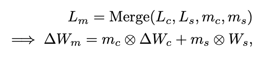
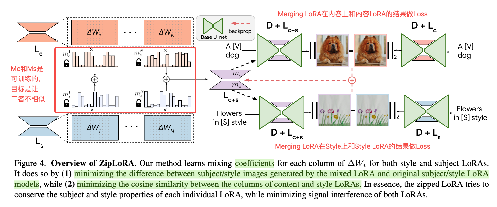
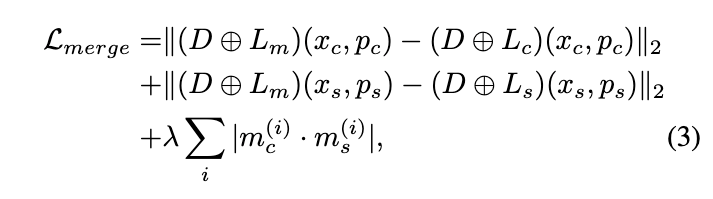
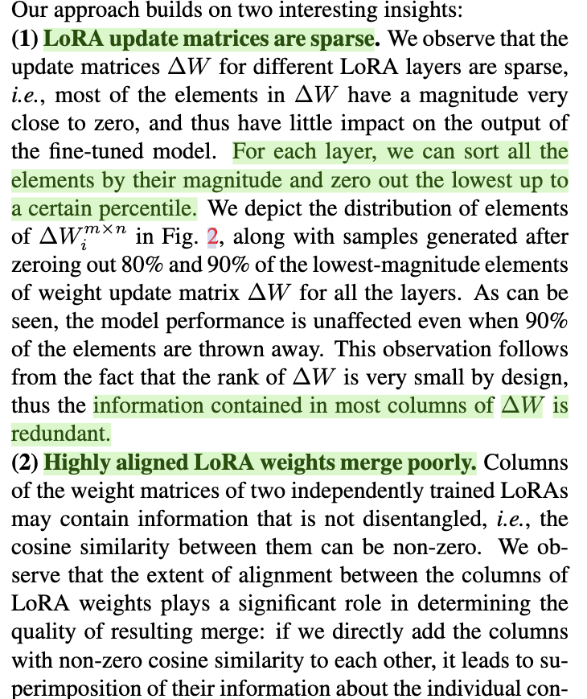
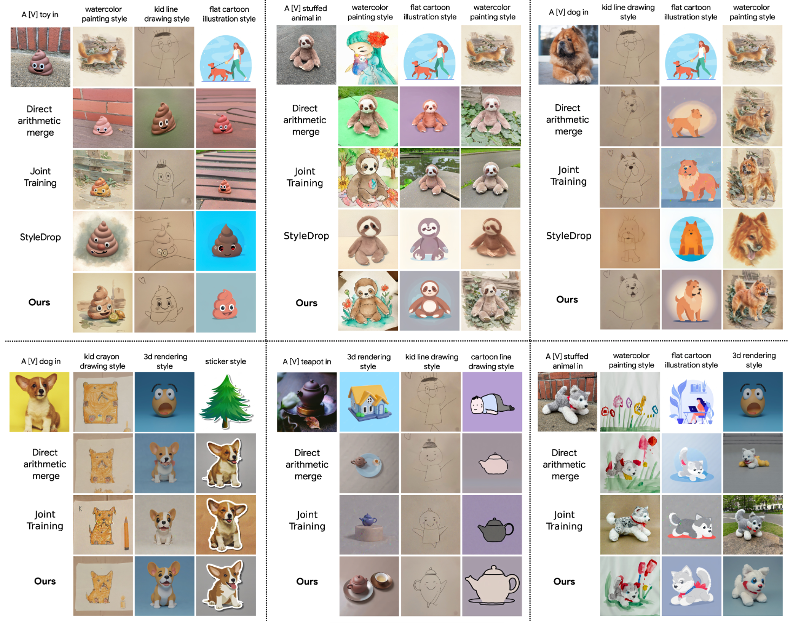

#! https://zhuanlan.zhihu.com/p/686535112
---
id: 2nyhs456n7l91di9da9jpmq
title: ZipLoRA
desc: ''
updated: 1710212124273
created: 1710211349493
---

## In a word

  

这篇论文通过分析两个LoRA在Merging的时候，出现的问题，通过设计一种以降低两个LoRA权重相似度的方式，来实现给定任意图像subject在任意图像style下的定制化生成。

## Motivation

如何实现Any Subject in Any Style的定制化生成？以前的方法可以分别训练一个Subject LoRA和一个Style LoRA，然后将两个LoRA合并，得到定制化的图像。但是，这种方法存在两个问题：

1. 两个LoRA的权重相似度高，合并的时候会出现矛盾，但是style和content的学习打折扣。
2. 合并两个LoRA的过程需要耗费大量的时间和资源。

因此，作者提出了一种新的方法，通过设计一种以降低两个LoRA权重相似度的方式，来实现给定任意图像subject在任意图像style下的定制化生成。

## Method

  

作者先是分析两个insight，即：

1. 如图左所示，作者发现LoRA中大多数的weight的update都是0，这说明影响LoRA或者使得LoRA work的权重只有少部分。
2. 如图右所示，作者发现Content和Style对应的LoRA weight之间，大多数都是高度align的。如果直接merge的话，高度对齐的weight会使得生成的图像质量不好。但是如果降低权重之间的相似度的话，就可以使得生成的图像质量更好。

因此，作者围绕上述两个insight，提出了一种新的方法：

  

作者为两个lora分别创建一个可学习的权重系数，通过广播机制进行相乘。接下来看方法架构图：

  

  

## Insight

  

## Results

  

## Tags

#多概念定制化