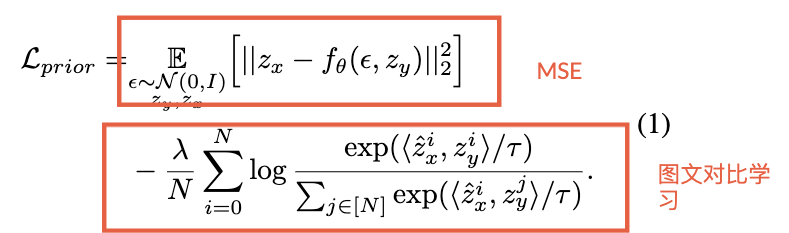

## In a word

  

本篇论文是定制化生成领域中，一篇比较不一样的工作。他不是用tuning-based或者encoder-based的方法。而是采用了类似于DALLE和Kandinsky中的text embedding 到图像embedding的映射，然后使用映射得到的img embedding去生成图像即可。

## Motivation

之前的定制化方法无论是基于Tuning的还是基于Encoder的，都会涉及到一个Diffusion Unet参与计算，这样的话，速度就很相对慢一些。
这篇工作呢，直接去学习文本到图像 embedding间的映射，这个映射学到后，就可以对任何文本得到img embedding，然后用img embedding去生成图像。这样的话，速度就会快很多。

## Method

  

这个方法也是比较简单，只有一个地方需要训练。

* 首先作者构造了很多图文数据对，用来训练mapping function。
* 然后作者训练了一个mapping function，目标是将文本embedding映射到图像embedding。这里所用的损失函数，一个是MSE，一个是图文对比学习loss。
  *   
* 一旦这个mapping function训练好了，那么给定任何一个文本，都可以得到其对应的图像embedding，然后我们可以用这个embedding输入至Kandinsky的decoder中，直接生成目标图像。

## Results

  

  

## Tags
#多概念定制化
