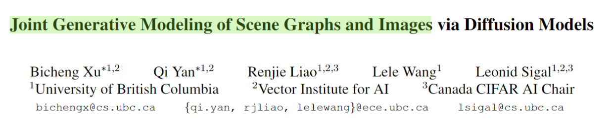
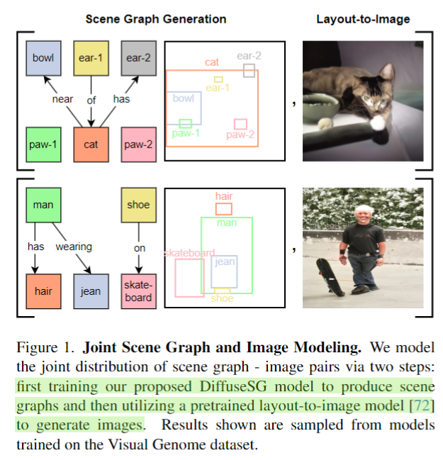

## Joint Generative Modeling of Scene Graphs and Images via Diffusion Models

  

  

这篇论文的标题很是吸引人，**Joint Generative Modeling of Scene Graphs and Images**。但是我读了Introduction发现并不是，这篇工作只是将场景图和图像的联合生成，分成了两步来做。第一步就做无条件的场景图生成；有了场景图，接下来利用预训练好的Layout2Image模型生成自然图像。

但本质上来说，这篇工作只是在做无条件的异构graph生成，这我就兴趣不大了。**很是好奇如何实现联合生成场景图和自然图像。**
#paper_idea

