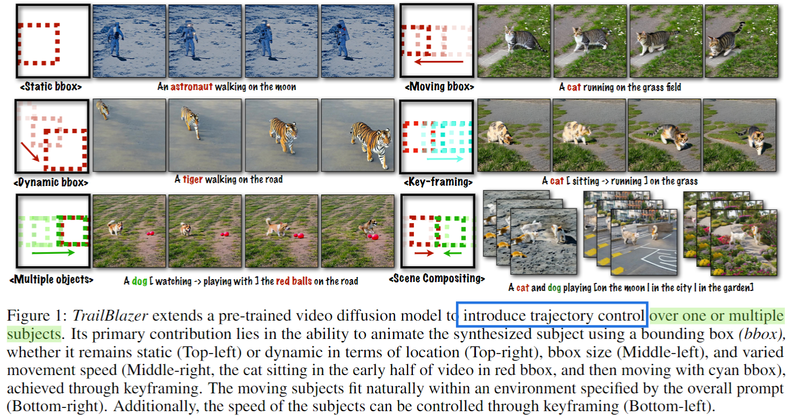
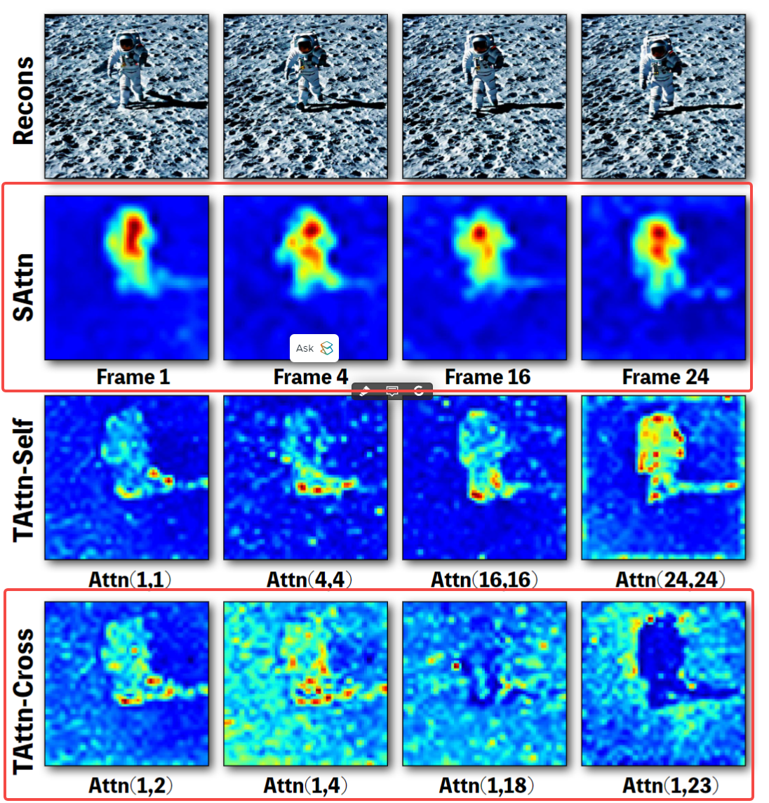

这篇论文实现了通过Bbox来控制视频中物体的运动轨迹。同时该方法不需要训练，微调，或者是test-time的优化。

  

该篇论文的主要做法有些类似于Prompt2Prompt。本质就是通过编辑attention map来实现运动轨迹的可控。

那因为是视频生成，所以Attention map主要包括两个方面：
* Spatial Cross Attention
* Temporal Cross-Frame Attention

那如何修改这两个Attention Map呢？首先可以看一下下图：

  

主要看红色的bbox中得内容：
* 对于Spatial Cross Attention（SAttn）来说，可以发现每一帧的前景内容还是比较突出的
* 对于Temporal Cross-Frame Attention（TAttn-Cross）来说，相邻帧之间的前景关系是非常强的，但是如果帧之间的距离太远，则会出现背景相似度较高。

基于上述观察，作者就设计了两个Attention Map的修改方法。

* 首先对于这两Attention Map的修改都是在采样前期进行的。
* 因为作者利用了Bbox来指导视频运动，因此，对于SAttn来说，只需要让bbox内部的attention map增大，而削弱bbox区域外的attention map。
* 而对于TAttn-Cross来说，作者的做法是在临近帧上增强bbox内部的attention map。而对于相隔较远的帧，则是减弱bbox内部的attention map。

