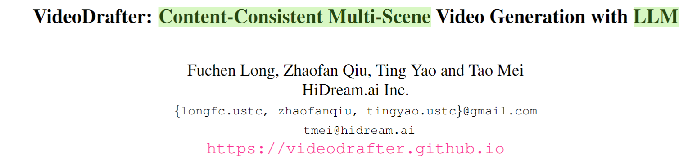
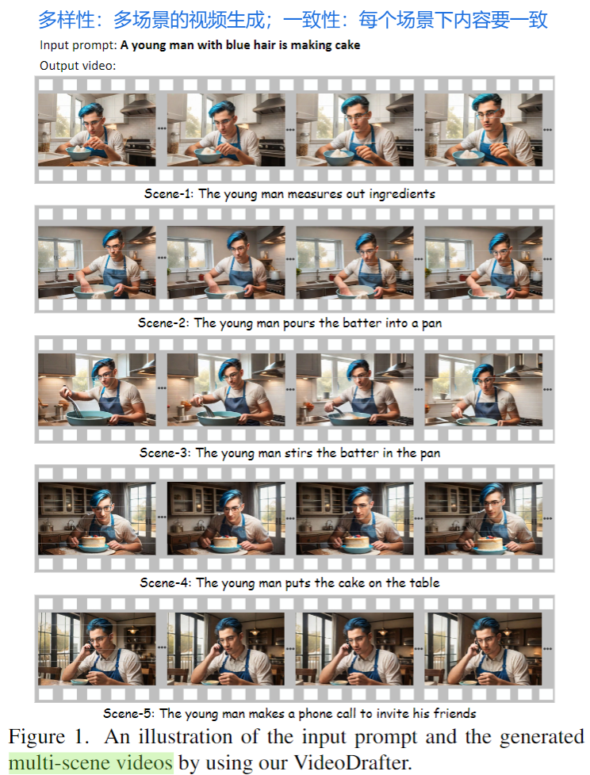
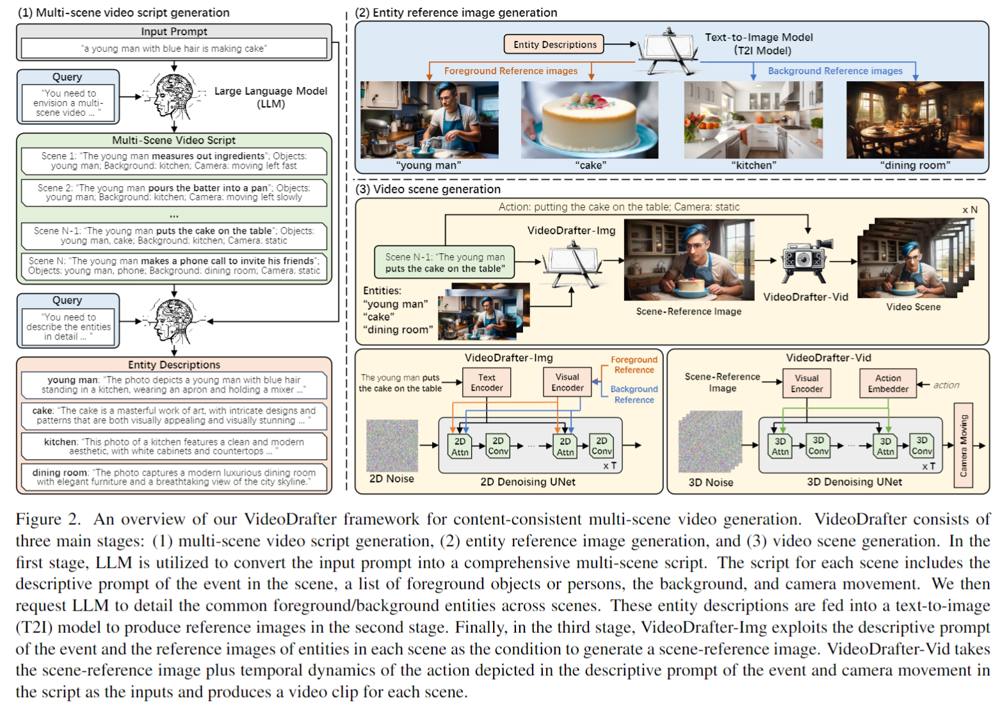

  

  

这篇论文目的是生成内容一致的多场景的视频生成。当前的方法更多的是关注单场景的视频生成，所谓单场景，指的是单一视频内容事件+单一视频背景。

整体来说，这篇论文的做法比较常规，更像是一个system的做法。

  

如上图所示，具体来说，包括如下步骤：

* 利用LLM将单个文本提示转换成描述多个场景的文本描述。
* 利用LLM生成场景文本中实体的细节描述
* 基于实体的细节描述，利用STable Diffusion模型生成对应的实体图像
* 基于上述实体图像和场景描述，生成一张当前视频的参考图像。
* 基于上述参考图像，输入action描述，生成对应的视频。

