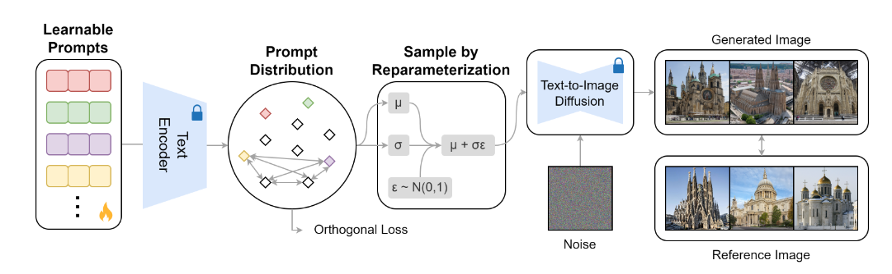
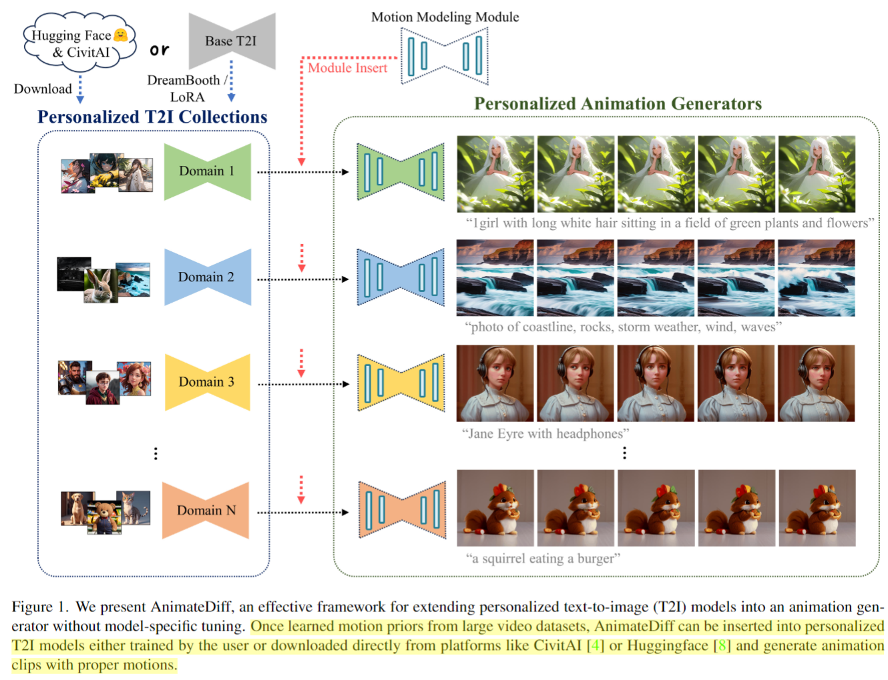

## 2023年12月25日

### Tuning-Free Inversion-Enhanced Control for Consistent Image Editing
#垃圾

  

  

这个论文通过给定几张参考图像，然后学习参考图像的learnable prompts，最终得到当前参考图的分布。然后可以从分布中进行采样，实现文本配合的定制化生成。但是这个有个问题，就是这种distribution只是学到了给定图像的大概或者共同的内容。整体还是偏向于风格学习。

### Tuning-Free Inversion-Enhanced Control for Consistent Image Editing
#垃圾

  

核心思想和MasaCtrl不都一样吗，这篇论文到底在论述什么？
这篇论文说 MasaCtrl会有一些伪影出现，这个就有点挑刺了。
MasaCtrl (Cao et al. 2023), achieve consistent editing without fine-tuning any part of the model, but it may introduce artifacts in real-image editing scenarios, and its performance is largely constrained by DDIM reconstruction quality

作者认为，DDIM Inversion的时候，得到的每一步的噪音和sampling的时候的噪音是不太一致的，存在误差，因此造成了伪影的出现。因此，作者直接把特定步的DDIM Inversion的self attention k, v 拿下来，copy给sampling的对应步。（这个MasaCtrl有什么区别？）

## AnimateDiff: Animate Your Personalized Text-to-Image Diffusion Models without Specific Tuning
#有点东西
#idea

  

图像可动画领域的工作，根据Related Work，可能是第一篇做这个领域的工作。他的核心思想就是不要重新微调SD，而是在大量视频数据上去训练一个新的adapter module。让其学习到video的motion prior。之后就可以把预训练好的adapter module随意的插到任意版本的SD上。

## UniHuman: A Unified Model For Editing Human Images in the Wild
#有点东西

  

  

这个工作是把Human Image Editing中的三种任务**重塑姿势、虚拟试穿和文本引导编辑**统一起来联合训练。

## Emage: Non-Autoregressive Text-to-Image Generation
#有点东西

  

这个架构很简单，但是文章还没完全完成。展示的图片效果也一般，而且数量也很少。

## FineMoGen: Fine-Grained Spatio-Temporal Motion Generation and Editing
#有点东西

  

这个工作做了一个本文引导的人体动作序列生成和编辑的工作，支持细粒度的操作。主要贡献就是一个Spatio-Temporal Mixture Attention (SAMI)模块。
此外，我看还收集了一个数据集，**HuMMan-MoGen dataset, which consists of 2,968 videos and 102,336 fine-grained spatio-temporal descriptions。**

## A Two-stage Personalized Virtual Try-on Framework with Shape Control and Texture Guidance
#有点东西

  

做的事情挺有意思，就是给定原图，再给一张参考图像的衣服，然后你可以解耦这个衣服的shape或者是texture，给应用到原图上，就OK了。

但是架构图画的好复杂，不想读了。

  

## High-Fidelity Diffusion-based Image Editing
#有点东西

  

这个工作的初衷是说Diffusion Model在Denoising的时候，会由于马尔科夫链的存在，导致错误的累加。因此，editing的效果都缺乏保真度。

作者的做法也比较简单，就是直接用一个Encoder去编码原图图像信息，然后在合适的Diffusion层注入。不过注入的方式有些不一样，他是选择利用这个Encoder来预测Diffusion Model中卷积核权重的offset。这个就有点和E4T类似了。

## A Recipe for Scaling up Text-to-Video Generation with Text-free Videos
#有点东西

  

这个工作有点意思，就是说如何利用大量的没有文本标注的Video数据，来实现视频的合成和生成。
作者就是将这个过程建模成两个分支，一个分支就是学Appearance，这个就完全可以利用图文来学。另外一个分支学motion或者temporal dynamic的信息，这个可以利用Text-free Video数据来学。

## Semantic Guidance Tuning for Text-To-Image Diffusion Models
#有点东西

  

这个图有点意思，之前text2image生成中存在alignment很差的问题。这篇论文把prompt解析成不同的concept，然后利用多个concept之间的score，对目标prompt进行约束。

## LangSplat: 3D Language Gaussian Splatting
#一般

  

基于Gaussian Splatting，做Text到3Dspace的query。