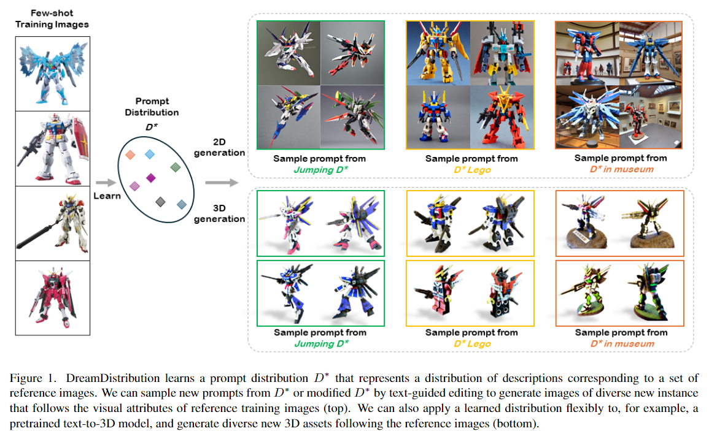
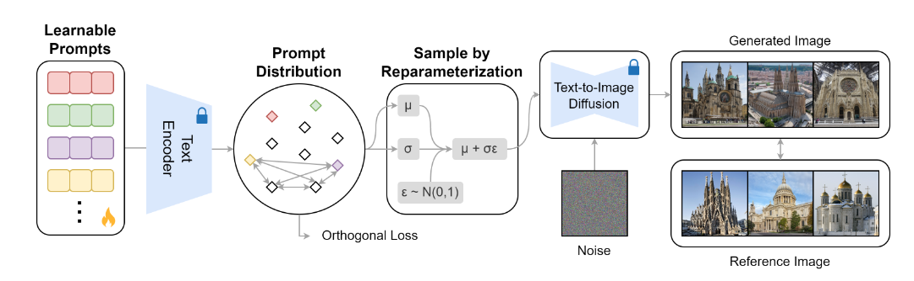
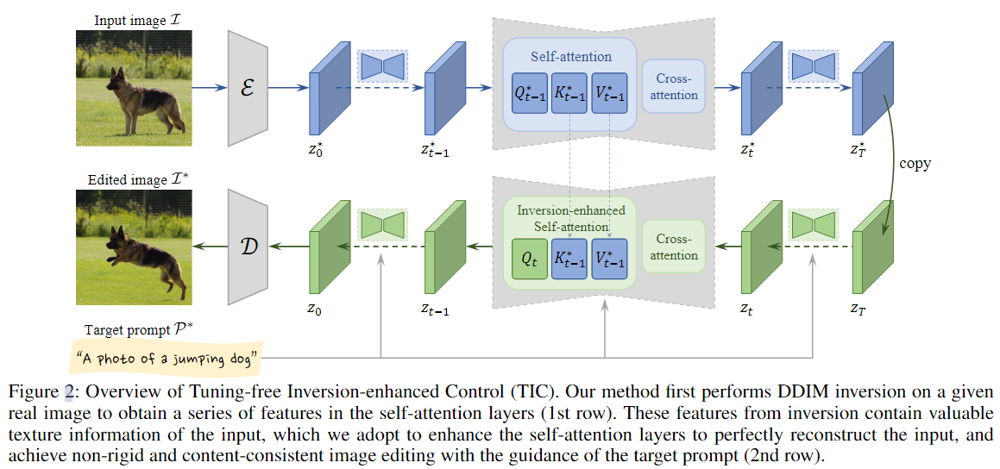
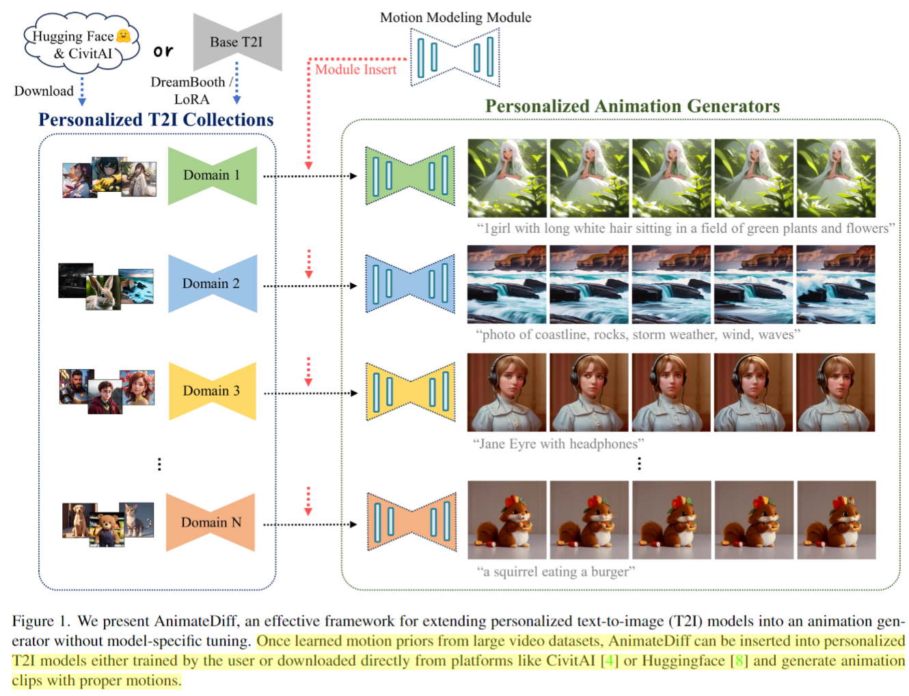

## 2023年12月25日

### Tuning-Free Inversion-Enhanced Control for Consistent Image Editing
#垃圾

  

  

这个论文通过给定几张参考图像，然后学习参考图像的learnable prompts，最终得到当前参考图的分布。然后可以从分布中进行采样，实现文本配合的定制化生成。但是这个有个问题，就是这种distribution只是学到了给定图像的大概或者共同的内容。整体还是偏向于风格学习。

### Tuning-Free Inversion-Enhanced Control for Consistent Image Editing
#垃圾

  

核心思想和MasaCtrl不都一样吗，这篇论文到底在论述什么？
这篇论文说 MasaCtrl会有一些伪影出现，这个就有点挑刺了。
MasaCtrl (Cao et al. 2023), achieve consistent editing without fine-tuning any part of the model, but it may introduce artifacts in real-image editing scenarios, and its performance is largely constrained by DDIM reconstruction quality

作者认为，DDIM Inversion的时候，得到的每一步的噪音和sampling的时候的噪音是不太一致的，存在误差，因此造成了伪影的出现。因此，作者直接把特定步的DDIM Inversion的self attention k, v 拿下来，copy给sampling的对应步。（这个MasaCtrl有什么区别？）

## AnimateDiff: Animate Your Personalized Text-to-Image Diffusion Models without Specific Tuning
#有点东西
#idea

  

图像可动画领域的工作，根据Related Work，可能是第一篇做这个领域的工作。他的核心思想就是不要重新微调SD，而是在大量视频数据上去训练一个新的adapter module。让其学习到video的motion prior。之后就可以把预训练好的adapter module随意的插到任意版本的SD上。

