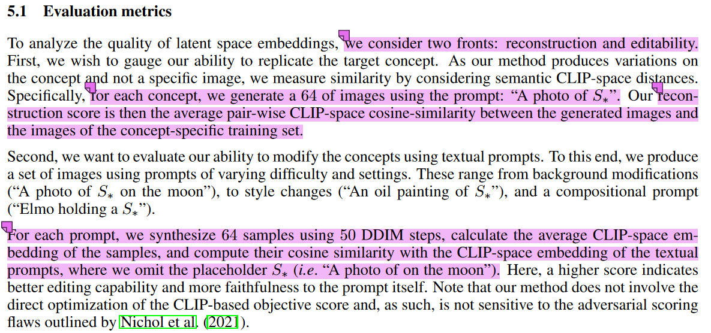

## **内容概要**

本文档主要是统计整理定制化生成领域的benchmark，具体包括使用的dataset，评价方法，评价指标等。

## **数据集**

## **评价指标**

## **细节表**

|                                                工作                                                | 数据集                                                                                                                                                                                                             |                                                                                                               评价指标                                                                                                               |
| :--------------------------------------------------------------------------------------------------: | -------------------------------------------------------------------------------------------------------------------------------------------------------------------------------------------------------------------- | :-------------------------------------------------------------------------------------------------------------------------------------------------------------------------------------------------------------------------------------: |
|                                         Textual Inversion                                         | [自行收集的小规模数据集](https://drive.google.com/drive/folders/1d2UXkX0GWM-4qUwThjNhFIPP7S6WUbQJ)                                                                                                                 |                                    CLIP-img2img-similarity    CLIP-img2text-similarity                                        |
|                                             Dreambooth                                             | 在Unsplash自行收集的数据，共有30个subject                                                                                                                                                                          | CLIP-I：CLIP-I is the average pairwise cosine similarity between CLIP embeddings of generated and real images。  DINO:is the average pairwise cosine similarity between the ViTS/16 DINO embeddings of generated and real images |
|                                               ELITE                                               | we use the testset of OpenImages as our training dataset. It contains 125k images with 600 object classes                                                                                                          |                                                                                            评估真实图像和生成图像之间的CLIP-I，CLIP-T，KID                                                                                            |
|                                          Custom-Diffusion                                          | 自行收集的数据，Images taken from UnSplash                                                                                                                                                                         |                                                                                            评估真实图像和生成图像之间的CLIP-I，CLIP-T，KID                                                                                            |
|                                                E4T                                                | FFHQ, CelebA-HQ, LSUN-Cat, WikiArt                                                                                                                                                                                 |                                                                                         反转时间，评估真实图像和生成图像之间的CLIP-I，CLIP-T                                                                                         |
|                                           UMM-DiffusionA                                           | LAION-400M                                                                                                                                                                                                         |                                                                                                              无定量实验                                                                                                              |
|                                              Revision                                              | ReVersion Benchmark                                                                                                                                                                                                |                                                                                                              User Study                                                                                                              |
|                                           Taming Encoder                                           | CelebA，LSUN-dog                                                                                                                                                                                                   |                                                                                            评估真实图像和生成图像之间的CLIP-I，CLIP-T，KID                                                                                            |
|                                            InstantBooth                                            | 自行收集的人和猫的数据                                                                                                                                                                                             |                                                                                        估真实图像和生成图像之间的CLIP-I，CLIP-T，Face distance                                                                                        |
|                                        Continual Diffusion                                        | ImageNet-R, Celeb-A HQ,Google Landmarks dataset v2                                                                                                                                                                 |                                                                                                 average accuracy, average forgetting                                                                                                 |
|                                   Controllable Textual Inversion                                   | 自行收集。The dataset is collected from publicly available datasets including ImageNet, iNaturalist 2018 [39], IP102 [41], together with 1000 webcrawled data collected according to the keywords                  |                                                                                                          FID and R-precision                                                                                                          |
|                                             Perfusion                                             | we used concepts from previous papers: 6 concepts from CD, 2 from TI, and 3 from or similar to DB, for a total of 11 personalization concepts                                                                      |                                                                                                       same to Textual Inversion                                                                                                       |
|                                            FastComposer                                            | We create a subject-augmented image-text paired dataset to train our model                                                                                                                                         |                                                                                  Identity Preservation，Prompt Consistency，Total Time，Peak Memory                                                                                  |
|                A Neural Space-Time Representation for Text-to-Image Personalization                |                                                                                                                                                                                                                    |                                                                                                                                                                                                                                       |
|                                           BLIP-Diffusion                                           | we follow BLIP-2 [12] and pretrain the model on 129M image-text pairs, including 115M image-text pairs from LAION [28] with CapFilt [29] captions, COCO [30], Visual Genome [31] and Conceptual Captions [32, 33]. |                                                                                                         CLIP-I，CLIP-T，DINO                                                                                                         |
|                                           Break-A-Scene                                           | COCO                                                                                                                                                                                                               |                                                                                Automatic prompt similarity, automatic identity similarity, User Study                                                                                |
|                                            Custom-Edit                                            | we use CLIP-retrieval [3] to retrieve 200 images and their captions from the LAION                                                                                                                                 |                                                                                                            CLIP-I，CLIP-T                                                                                                            |
|                                     negative-prompt inversion                                     | COCO                                                                                                                                                                                                               |                                                                                                              PSNR，LPIPS                                                                                                              |
|                                             PHOTOSWAP                                             |                                                                                                                                                                                                                    |                                                                                                            CLIP-I，CLIP-T                                                                                                            |
|                    Concept Decomposition for Visual Exploration and Inspiration                    | 自行收集的数据                                                                                                                                                                                                     |                                                                                                                  无                                                                                                                  |
|                        Inversion-based Style Transfer with Diffusion Models                        |                                                                                                                                                                                                                    |                                                                                                                                                                                                                                       |
|                                                ViCo                                                | 自行收集的数据                                                                                                                                                                                                     |                                                                                                         CLIP-I，CLIP-T，DINO                                                                                                         |
|                                       Hard Prompts Made Easy                                       | LAION，MS COCO，Celeb-A，Lexica.art                                                                                                                                                                                |                                                                                                                                                                                                                                       |
|                                                SuTI                                                | 自行收集的数据                                                                                                                                                                                                     |                                                                                                         CLIP-I，CLIP-T，DINO                                                                                                         |
|                                               Face0                                               | 自行收集的数据                                                                                                                                                                                                     |                                                                                                                                                                                                                                       |
|                                               SVDiff                                               |                                                                                                                                                                                                                    |                                                                                                                                                                                                                                       |
|          Domain-Agnostic Tuning-Encoder for Fast Personalization of Text-To-Image Models          | ImageNet-1K and Open-Images datasets                                                                                                                                                                               |                                                                                                       same to Textual Inversion                                                                                                       |
|                                                 P+                                                 | 自行收集的数据                                                                                                                                                                                                     |                                                                                                         CLIP-I，CLIP-T，DINO                                                                                                         |
| Subject-Diffusion: Open Domain Personalized Text-to-Image Generation without Test-time Fine-tuning | 自己构造的数据，comprises 76 million open-domain images and 222 million entities                                                                                                                                   |                                                                                                         CLIP-I，CLIP-T，DINO                                                                                                         |
|                                             DreamEdit                                             | 自己收集的数据 DreamEditBench                                                                                                                                                                                      |                                                                                                                                                                                                                                       |
|                                    Viewpoint Textual Inversion                                    |                                                                                                                                                                                                                    |                                                                                                                                                                                                                                       |
|              DreamCom: Finetuning Text-guided Inpainting Model for Image Composition              | We also construct a new dataset named MureCom well-tailored for this task                                                                                                                                          |                                                                                                         CLIP-I，CLIP-T，DINO                                                                                                         |
|                                Multi-Concept Prompt Learning (MCPL)                                | To evaluate this task, we assembled datasets of multi-concept images featuring a total of 16 categories of object-level concepts.                                                                                  |                                                                                                                                                                                                                                       |
