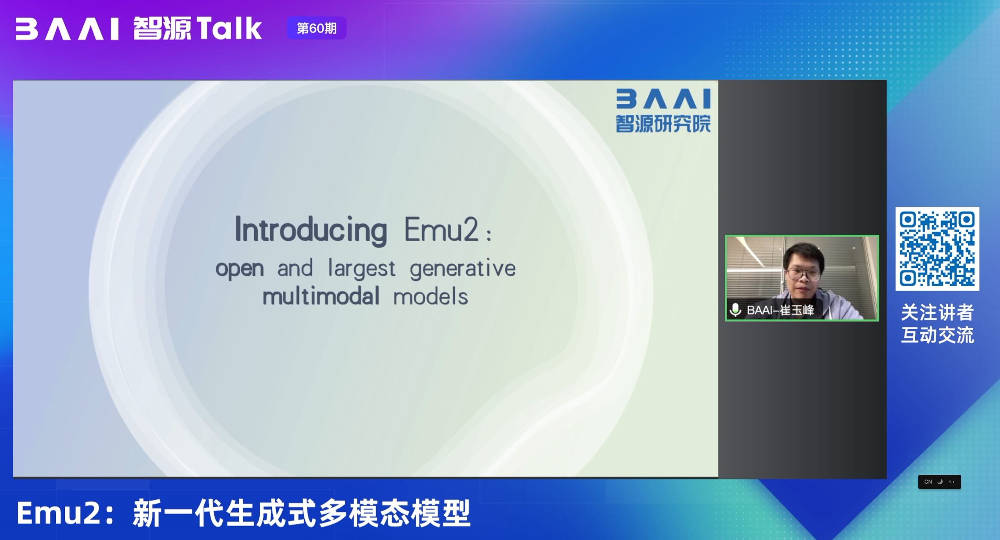

---
id: 3v38ydfyu88q5bf73qvqeuo
title: 智源Talk-Emu2 新一代生成式多模态模型
desc: ''
updated: 1703657987134
created: 1703656845423
---

  

在生成式的预训练方式上预训练：

  

  

  

  

  

  

上下文能力还不错。

  

  

  

  

  

  

  

  

  

  

  

  

  

  

  

  

  

这个例子有意思。修改prompt链条

  

  

  

  

  

  

  
